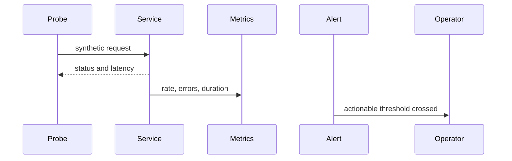

# Monitoring — Junior

Track whether the service is reachable, correct, fast enough, and within resource limits. Health endpoints should distinguish process liveness from readiness to serve.

Use dashboards for trends and alerts for required action. Include deployment markers so regressions can be compared with change.

## Test yourself

1. How do liveness and readiness differ?
2. What does a synthetic check reveal?
3. Why should deployment markers appear?
4. What action follows your alert?

Continue to [`middle.md`](middle.md).
