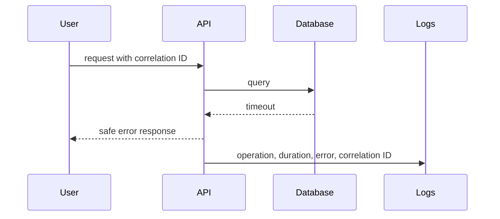

# SRE and Reliability — Junior

An **SLI** (service level indicator) measures actual behavior — request latency, error rate, availability. An **SLO** (service level objective) is the target you hold that SLI to — "99.9% of requests succeed in under 300ms." Define both from the user's actual journey, not from what's easiest to measure.

## First response to an incident

1. **Identify user impact** before anything else — what's broken, for whom, how badly.
2. **Stop unsafe changes** — pause deploys or risky operations that could make things worse mid-incident.
3. **Follow the runbook** for the alert that fired, if one exists.
4. **Communicate facts, not guesses** — "error rate is at 12%, investigating" beats a premature theory.
5. **Verify recovery from the user path**, not just from the dashboard going green — a metric can recover while the actual user journey is still broken.

## Choose the right signal for the question

| Signal | Answers | Example question |
|---|---|---|
| **Logs** | What happened, for one discrete event | "What was the exact error for request `abc-123`?" |
| **Metrics** | Aggregate behavior over time | "What fraction of requests failed in the last 5 minutes?" |
| **Traces** | Where a single request spent its time, across services | "Which downstream call made this request slow?" |
| **Profiles** | Where a process spent CPU, memory, or I/O | "What's actually consuming 80% of this container's CPU?" |

Reach for the signal closest to your question — a metric can't tell you which specific request failed; a log line can't tell you the aggregate error rate.

## Capture enough context to reproduce

For any failure, capture: the exact error, timestamp, deployed version, input that triggered it, environment, and a correlation ID (request ID, job ID) that ties it to everything else that happened for that same request. Reproduce the smallest failing case and read the *complete* stack trace before theorizing — see [Debug-Thinking — Junior](../../engineering-thinking/08-debug-thinking/junior.md) for the hypothesis-testing method this evidence feeds into.

## Protect user data in telemetry

Never log passwords, tokens, or unnecessary personal data — logs and traces are often less access-controlled than the primary database, and a debugging convenience is not worth a data leak. Return safe, generic messages to users while preserving full diagnostic context internally.

## Test yourself

1. What user outcome should the SLI represent, and why not infrastructure uptime directly?
2. Which signal (log, metric, trace, profile) answers "where did this request wait?"
3. Why verify recovery from the user path instead of trusting the dashboard alone?
4. What must never enter a log line, even for debugging convenience?

Continue to [`middle.md`](middle.md).
