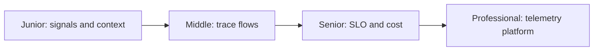
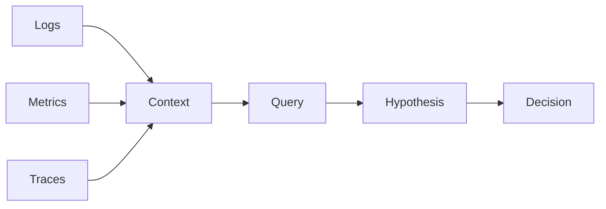

# Production Observability

> Ask new questions of a running system by preserving connected, trustworthy evidence about its internal behavior.

| Level | Guide | You are done when |
|---|---|---|
| Junior | [Connect signals](junior.md) | You can follow one request through logs, metrics, and traces. |
| Middle | [Instrument boundaries](middle.md) | You can propagate context and choose useful telemetry. |
| Senior | [Operate observability](senior.md) | You can balance SLO evidence, sampling, cardinality, and cost. |
| Professional | [Build a telemetry platform](professional.md) | You can govern schemas, pipelines, tenancy, and reliability. |

## Practice rule

Instrument decisions and boundaries with consistent context; do not collect fields merely because they may be useful someday.

## Related

- [Monitoring](../monitoring/README.md)
- [SRE & Reliability](../sre-reliability/README.md)
