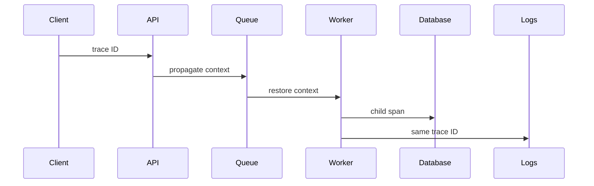

# Observability — Junior

Logs describe events, metrics summarize populations, and traces connect work across boundaries. Use correlation and trace IDs so the signals tell one story.

Record operation, outcome, duration, and safe identifiers. Avoid secrets and unbounded values in metric labels.

## Test yourself

1. Which signal shows aggregate error rate?
2. How does context cross a queue?
3. What makes a metric label unsafe?
4. Which event needs structured context?

Continue to [`middle.md`](middle.md).
