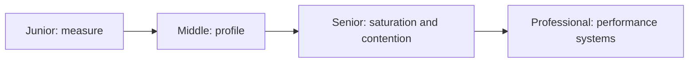
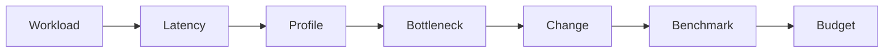

# Production Performance

> Measure the user-visible bottleneck, understand its resource mechanism, and prevent regression with budgets.

| Level | Guide | You are done when |
|---|---|---|
| Junior | [Measure before optimizing](junior.md) | You can build a repeatable baseline and identify a hotspot. |
| Middle | [Use profiles and benchmarks](middle.md) | You can connect CPU, allocation, I/O, and contention to latency. |
| Senior | [Protect performance under load](senior.md) | You can reason about queues, tails, concurrency, and budgets. |
| Professional | [Operate performance capability](professional.md) | You can govern benchmarking, profiling, capacity, and regressions. |

## Practice rule

State workload, metric, baseline, hypothesis, and success threshold before changing code.

## Related

- [Estimation](../estimation/README.md)
- [Monitoring](../monitoring/README.md)
