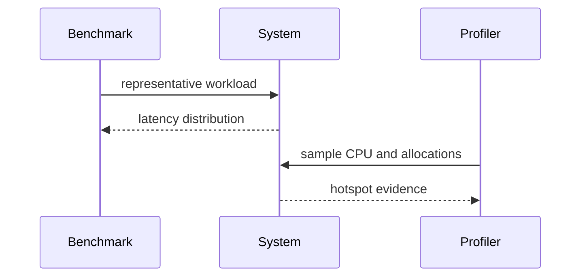

# Performance — Junior

Measure representative latency and throughput with warmup, stable inputs, and repeated runs. Report distributions, not one fast run.

Optimize the dominant cost: algorithm, I/O, serialization, allocation, or network. Verify correctness and rerun the same benchmark. A microbenchmark cannot prove whole-system improvement.

## Test yourself

1. What makes a workload representative?
2. Why report p95 or p99?
3. Which profile matches allocation pressure?
4. How do you prove the change helped users?

Continue to [`middle.md`](middle.md).
