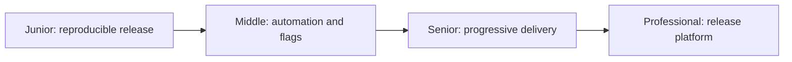
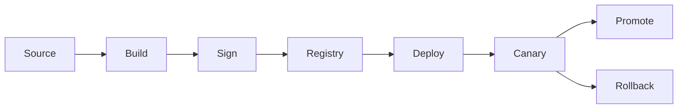

# Production Release

> Move one traceable artifact through controlled exposure with evidence, rollback, and supply-chain integrity.

| Level | Guide | You are done when |
|---|---|---|
| Junior | [Ship a traceable artifact](junior.md) | You can version, build, verify, and roll back a release. |
| Middle | [Automate delivery](middle.md) | You can use registries, flags, and release automation safely. |
| Senior | [Design progressive delivery](senior.md) | You can protect compatibility, provenance, and rollout. |
| Professional | [Operate release systems](professional.md) | You can govern fleet-wide delivery and supply-chain risk. |

## Practice rule

Build once, identify immutably, promote the same artifact, and exercise rollback before relying on it.

## Related

- [Testing](../testing/README.md)
- [Monitoring](../monitoring/README.md)
