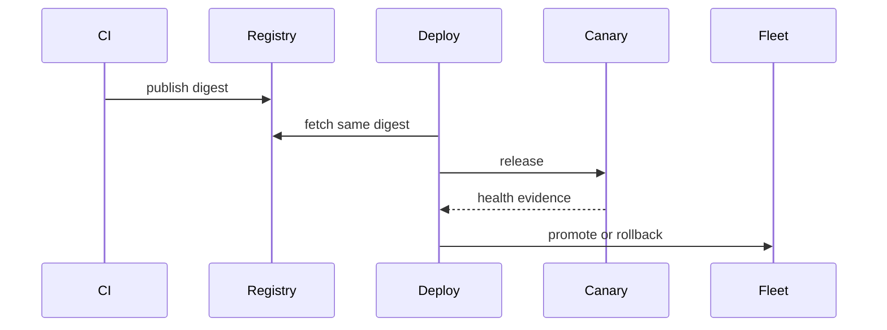

# Release — Junior

Record version, source commit, build, dependencies, configuration, migration, and verification. Publish immutable artifacts and release notes that explain user impact.

Rollback application code only when data and contract changes remain compatible. Know the difference between rollback and roll-forward.

## Test yourself

1. Why promote the same artifact?
2. What identifies it immutably?
3. When is rollback unsafe?
4. What proves release health?

Continue to [`middle.md`](middle.md).
