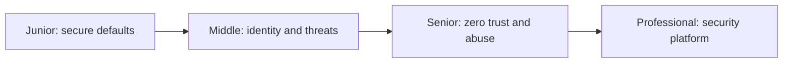
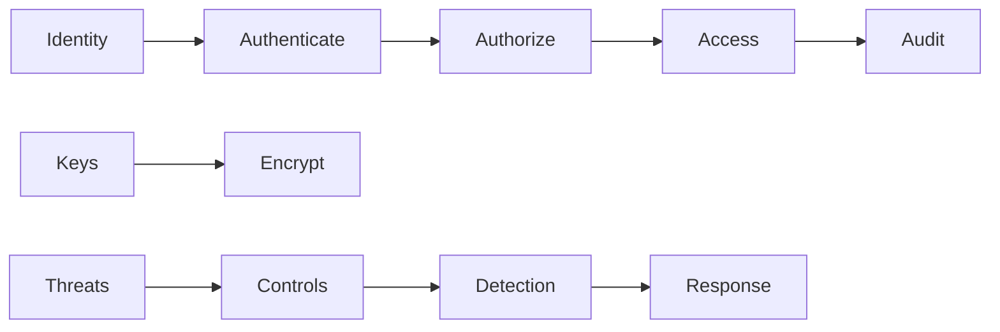

# Security at Scale

> Reduce attack paths through explicit identity, least privilege, encryption, abuse controls, and verified supply chains.

| Level | Guide | You are done when |
|---|---|---|
| Junior | [Protect one service](junior.md) | You can manage secrets, authentication, authorization, and safe transport. |
| Middle | [Threat-model boundaries](middle.md) | You can design tokens, PKI, KMS, and abuse controls. |
| Senior | [Secure a system](senior.md) | You can apply zero trust, supply-chain controls, and layered defense. |
| Professional | [Build security capability](professional.md) | You can govern identity, keys, policy, detection, and response at scale. |

## Practice rule

Authenticate identity, authorize every action, minimize privilege, and assume every boundary can be abused.

## Related

- [Data Privacy](../data-privacy/README.md)
- [Release](../release/README.md)
