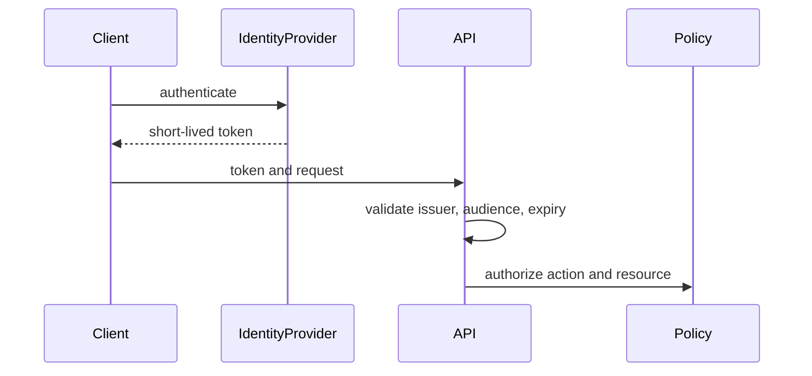

# Security at Scale — Junior

Never store secrets in source or logs. Use TLS, validate input, parameterize queries, authenticate callers, and authorize the requested resource—not only the endpoint.

## Test yourself

1. How do authentication and authorization differ?
2. Which token claims require validation?
3. Where should secrets live?
4. What information must not enter errors?

Continue to [`middle.md`](middle.md).
