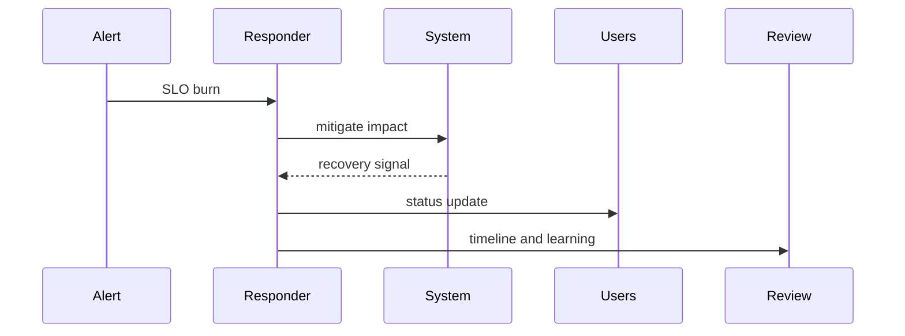

# SRE and Reliability — Junior

An SLI measures behavior; an SLO sets the target. During an incident, identify user impact, stop unsafe changes, follow the runbook, communicate facts, and verify recovery from the user path.

## Test yourself

1. What user outcome should the SLI represent?
2. How do you prove recovery?
3. Why separate fact from hypothesis?
4. Which toil should be recorded?

Continue to [`middle.md`](middle.md).
