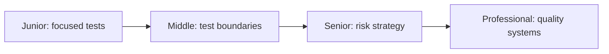
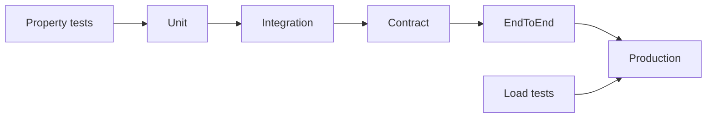

# Production Testing

> Choose the cheapest trustworthy evidence for each failure, from local logic to contracts, load, and production behavior.

| Level | Guide | You are done when |
|---|---|---|
| Junior | [Test behavior](junior.md) | You can test normal, edge, and failure behavior reliably. |
| Middle | [Test boundaries](middle.md) | You can choose doubles, integration, contract, and acceptance tests. |
| Senior | [Design a risk strategy](senior.md) | You can cover compatibility, load, data, and production risk. |
| Professional | [Build quality capability](professional.md) | You can govern test architecture, environments, and feedback. |

## Practice rule

Start from the failure you need to detect, then choose the lowest test level that can detect it faithfully.

## Related

- [Release](../release/README.md)
- [Chaos Engineering](../chaos-engineering/README.md)
