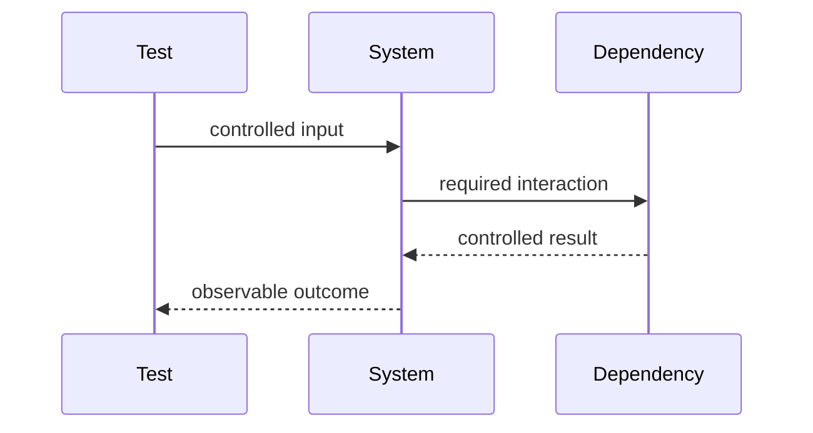

# Testing — Junior

Write tests around observable behavior. Use arrange, act, assert; name the scenario; cover normal, boundary, and expected failure cases.

Use a fake for a simple working dependency, a stub for fixed responses, and a mock only when the interaction itself is the contract. Control time, randomness, and shared state to prevent flakiness.

## Test yourself

1. What behavior does your assertion prove?
2. When is a mock appropriate?
3. Which uncontrolled input makes the test flaky?
4. What important failure remains untested?

Continue to [`middle.md`](middle.md).
