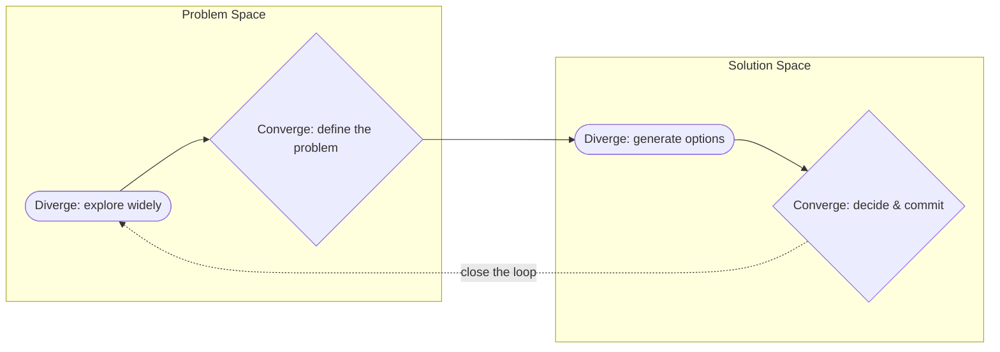

# Problem-Solving

> Problem-solving runs as a double diamond: diverge to see the real problem, converge to name it — then diverge to generate solutions, converge to commit to one. Each stage below routes to the sub-skill built for it.

## Which sub-skill, at which stage

| Diamond | Stage | Sub-skill | Reach for it when... |
|---|---|---|---|
| Problem Space | **Diverge** — explore | [Systems Thinking](systems-thinking/) | You need the whole-system view — feedback loops, second-order effects, where the problem actually originates — before you blame one part. |
| Problem Space | **Diverge** — explore | [Critical Thinking](critical-thinking/) | You need to separate what the evidence actually shows from what's just an assumption, a fallacy, or a confident guess. |
| Problem Space | **Diverge** — explore | [Debug-Thinking](debug-thinking/) | Something that used to work is now broken — you need to reproduce it on demand and read the evidence before naming a cause. |
| Problem Space | **Converge** — define | [First-Principles Thinking](first-principles-thinking/) | You need to decompose the mess into named, checkable parts, strip away inherited assumptions, and state the real constraint in one precise sentence. |
| Solution Space | **Diverge** — generate | [First-Principles Thinking](first-principles-thinking/) | You need more than the first, safest, most familiar option on the table — generate several structurally different recombinations, including from an unexpected angle, before picking one. |
| Solution Space | **Converge** — decide | [Critical Thinking](critical-thinking/) | You need to compare the candidate options by evidence and trade-off, not by whichever was proposed first or loudest. |
| Solution Space | **Converge** — decide | [Systems Thinking](systems-thinking/) | You need to check whether the fix you're about to commit to creates a new problem elsewhere before you ship it. |
| Solution Space | **Converge** — decide | [Debug-Thinking](debug-thinking/) | You need to state the fix as a falsifiable, measurable prediction and canary it concurrently against the unfixed path before rolling out to everyone. |
| Cross-cutting | **Close the loop** | [Metacognition and Learning](metacognition-and-learning/) | After acting, to check whether your reasoning actually worked and feed that answer into the next diverge. |

Every sub-skill folder above uses the same three-guide progression: **Problem** (what it solves, how the mechanism works) → **Mistake** (when it pays off, and the mistakes that collapse it) → **Best Practise** (the repeatable pattern).

## Worked example: "Checkout success rate dropped 12% after last release"

- **Diverge, Problem Space** — [Systems Thinking](systems-thinking/) to map everything that changed system-wide and where a small change could amplify; [Critical Thinking](critical-thinking/) to separate "the deploy caused this" (a claim) from what the logs and metrics actually show (the evidence); [Debug-Thinking](debug-thinking/) to reproduce the failure on one specific request and bisect the last release's commits or the call chain to find where the timeout was actually introduced.
- **Converge, Problem Space** — [First-Principles Thinking](first-principles-thinking/) to decompose "checkout" into its real steps (cart → payment → confirmation), find which step's numbers moved, and state the constraint precisely — "payment step timeout went from 2s to 9s, card users only" — instead of "checkout is broken."
- **Diverge, Solution Space** — [First-Principles Thinking](first-principles-thinking/) to generate more than the obvious "just roll back" — a timeout bump, a retry, a feature flag, a provider fallback, a redesigned payment call — before converging on one, instead of shipping the first idea.
- **Converge, Solution Space** — [Critical Thinking](critical-thinking/) to weigh rollback vs. fix by evidence and cost, not by which idea came first; [Systems Thinking](systems-thinking/) to check the fix doesn't push the same timeout problem onto another step; [Debug-Thinking](debug-thinking/) to state the fix as "p99 back under 3s for 1 hour," canary it concurrently against the unfixed path, and confirm that specific signal before rolling out to everyone.
- **Close the loop** — [Metacognition and Learning](metacognition-and-learning/) to ask what would have caught this before release, and carry that answer into the next diverge.

---

> Pair this page with [Craftsmanship](../README.md) when the reasoning needs to become code, tests, architecture, or an operational system.
