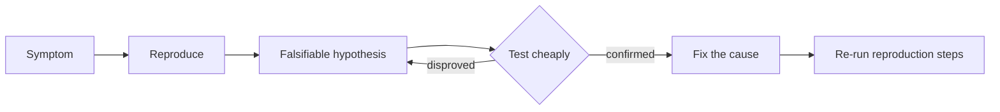

# Debug-Thinking — Problem

**What it is:** turning "it's broken" into a falsifiable hypothesis, a trigger you can reproduce on demand, and a fix you can prove closed the gap between what you expected and what actually happened — instead of guessing and hoping the change worked.

## The mechanism: reproduce, hypothesize, test, verify

- **Reproduce it on demand.** A bug you can't trigger reliably, you can't verify you fixed. Finding the smallest input and steps that trigger it every time is normally where debugging starts — it's the step everything else depends on.
- **State expected vs. actual precisely.** Not "it's broken" — a specific expected output next to the specific actual one.
- **Read the evidence before theorizing.** The stack trace or log names a file, a line, an exception. Read it before guessing.
- **Form exactly one falsifiable hypothesis, stated as a card.** A guess that no observation could disprove isn't a hypothesis — it's just a feeling with a technical vocabulary. Barry O'Reilly's Hypothesis-Driven Development template, adapted for a bug: **We Believe** `<this is the cause>` — **We Will Have Confidence To Proceed When** `<this specific observation>`. Naming the confirming or disproving observation before you test it is what keeps the result honest; decide what "confirms it" only after you already have the result, and you'll always find a way to see what you expected.
- **Test it as cheaply as possible.** One log line, one breakpoint, one assertion — enough to prove or disprove the hypothesis, not a rewrite.
- **If the failure surface is too large to reason about directly, bisect it.** Cut the space that could contain the fault in half, check which half still reproduces the failure, repeat — this is the same move whether you're narrowing a commit range, a call chain, or a data pipeline.
- **Fix the cause, not the symptom.** A `try/catch` that silences the error is the bug wearing a disguise.
- **Verify by re-running the exact reproduction steps from the first move.** If you can't re-run them, you haven't actually verified anything. If the fix is going to production at real scale, verify it there too: roll it out to a random slice of traffic concurrently with the unfixed path — not last week vs. this week — and confirm the specific signal the hypothesis predicted before rolling out to everyone.

## Worked example: "Profile picture upload sometimes fails with a 500 error"

- **Reproduce:** a 6MB JPEG fails every time; a 2MB JPEG always succeeds. Reproducible, not intermittent — the trigger is file size.
- **Expected vs. actual:** expected a `413 Payload Too Large` for files over 5MB, per the API spec. Actual: a bare `500` with no useful message.
- **Read the evidence:** the stack trace points at `image_processor.py:47`, inside `resize(file)`, with a `MemoryError`.
- **Hypothesis (as a card):** **We Believe** the 5MB size check runs *after* the file is already loaded into memory for resizing. **We Will Have Confidence To Proceed When** a log line printed before the resize call shows the file was already read into memory before any size-rejection code ran.
- **Test cheaply:** one log line before the resize call, printing the file size. Upload the 6MB file — the log fires before any size-rejection code runs, confirming the order.
- **Fix the cause:** move the size check before the file is read into memory — reject at the boundary, not after doing the expensive work.
- **Verify:** re-upload the 6MB file — now returns `413`, not `500`. Re-upload the 2MB file — still succeeds, so the working case wasn't broken by the fix.

## Evaluate before you call it done

- **Reproducible** — can you trigger it on demand, not just "it happened once"?
- **Falsifiable** — is there an observation that could have proven your hypothesis wrong?
- **One variable at a time** — did you change exactly one thing before re-testing?
- **Cause, not symptom** — does the fix explain the specific evidence you found, not just make the error message go away?
- **Verified** — did you re-run the original reproduction steps, not just eyeball the code?
- **Verified at scale, if it applies** — if this fix ships to real traffic, did you confirm it with a concurrent, randomized canary instead of a before/after comparison?

Continue to [Mistake](mistake.md).
