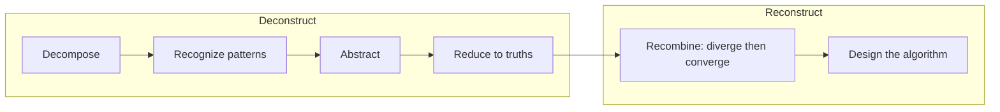

# First-Principles Thinking — Problem

**What it is:** a basic truth is a fact that can't be deduced from anything else — Aristotle called it "the first basis from which a thing is known." First-principles thinking means reducing a problem to those truths, then building a solution back up from them, instead of copying the nearest existing solution.

## The mechanism: deconstruct, then reconstruct

**Deconstruct** — break the thing down past its current shape, down to the parts and truths it's actually made of.

- **Decompose** — split it into smaller parts you can reason about on their own, ignoring what it's currently assembled *as*.
- **Recognize patterns** — look across the parts for what repeats: the same role showing up more than once, regardless of which object it came from.
- **Abstract** — keep the general role each pattern plays, discard which specific object it happened to belong to.
- **Reduce to truths** — keep asking what's actually true about each abstracted part until you hit a fact you can check — a measurement, a law, a raw material cost — not a habit or precedent.

**Reconstruct** — recombine the truths (or cheaper/better substitutes for them) into something new.

- **Recombine** — before settling on one reassembly, diverge: generate more than one way the truths could go back together, judging none of them yet. Then converge: score the candidates against the actual goal, instead of shipping the first recombination that comes to mind. Edward de Bono coined **lateral thinking** for the move that makes this diverge step productive instead of circular — attacking the recombination from an unexpected angle instead of the most obvious path. Two of his techniques help when the obvious recombination just reproduces the old form: **random entry** (force a connection between the truths and something unrelated) and **provocation** (state an extreme version of the goal and walk the answer back to something feasible).
- **Design the algorithm** — turn the winning recombination into an ordered, unambiguous set of steps someone could actually execute: a clear start, a clear end, every step between.

## Worked example: Boyd's snowmobile

Military strategist John Boyd used this thought experiment. Take three unrelated things: a motorboat with a skier behind it, a military tank, and a bicycle.

- **Decompose:** motorboat → motor, hull, skis. Tank → treads, armor plates, a gun. Bicycle → handlebars, wheels, gears, a seat.
- **Recognize patterns:** across all three, some parts give propulsion (motor, treads), some give grip on a surface (skis, treads, wheels), some give steering and a place to sit (handlebars, seat).
- **Abstract:** discard which vehicle each part came from — keep only the role it plays: propulsion, surface-traction, steering, seating.
- **Reduce to truths:** traveling over snow needs propulsion, plus traction that doesn't depend on a smooth road or open water, plus steering, plus somewhere to sit. Nothing about "boat," "tank," or "bike" is actually required.
- **Recombine — diverge:** the same four truths could go back together more than one way: floats + motor + wheels (an amphibious buggy), a single broad ski + motor (a snow scooter), or treads + motor + skis + handlebars + seat. Boyd's exercise is itself a **random entry** move — forcing a connection between three unrelated objects is what surfaces more than the first, obvious reassembly.
- **Recombine — converge:** for "travel over ordinary snow, off-road, with a rider," treads-plus-skis beats floats (wrong terrain entirely) and beats a single ski (worse stability) — it wins against the actual goal, not because it was the first combination considered.
- **Design the algorithm:** mount the treads to a chassis → attach the motor to drive the treads → mount skis at the front → attach handlebars to the skis → add a seat behind them.

Deconstructed and rebuilt this way, the parts add up to a snowmobile — something none of the three original objects was designed to be.

## Reasoning from first principles vs. reasoning by analogy

- **Analogy:** "we do it this way because that's how it's done elsewhere / how it's always been done here."
- **First principles:** "what do we actually know for certain is true, and what can we build from just that?"

Elon Musk applied this to rocket costs: a finished rocket was quoted at $65M. Instead of accepting that as the price of doing business, he asked what a rocket is actually made of — aerospace-grade aluminum, titanium, copper, carbon fiber — and priced those raw materials on the commodity market. They came to about 2% of the quoted price. That gap is what SpaceX was built to close.

## Optimize the function, not the form

Deconstructing correctly means separating the **function** (what the thing actually needs to do) from the **form** (the shape it currently happens to have). Reconstruction only works if you rebuilt from the function, not from a nicer-looking version of the old form.

## Evaluate before you call it done

- **Reduced** — did you actually reach truths you can't break down further, or did you stop at "common knowledge"?
- **Patterned, not padded** — did you confirm a pattern actually repeats across parts before abstracting it, or call something a pattern after seeing it once?
- **Diverse before decided** — did you generate more than one recombination before picking, or ship the first one that came to mind?
- **Rebuilt** — did you recombine those truths into an actual, ordered solution, or just list facts and stop?
- **Executable** — could someone else actually carry out the algorithm's steps: a clear start, a clear end, and a plan for when a step fails?
- **Cheaper/better** — does the reconstructed version genuinely beat the thing it replaces, on the goal that mattered?

Continue to [Mistake](mistake.md).
