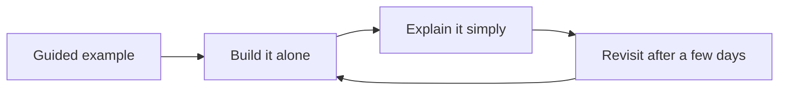

# Metacognition and Learning — Problem

**What it is:** turning a new idea — a language feature, a pattern, an algorithm — into something you can actually build with, not just something that sounds familiar because you've read about it once. Feeling like you understand something and actually being able to use it are two different things, and the gap between them is exactly what good learning habits close.

## The four steps, in order

- **Start from a guided example if the idea is truly new to you.** Follow one tutorial or worked example step by step, and understand *why* each step happens. Research on how people learn (cognitive load theory) found that beginners learn better from a fully worked-out example than from being told "go figure it out" — you don't yet have anywhere to hang the new idea in your head, so a guide gives you the shape first.
- **Then build something small on your own, with no copy-paste.** Close the tutorial and build a tiny version of the same idea yourself. This forces you to pull the idea back out of your own head instead of just recognizing it on the page — and testing yourself like this (called retrieval practice) is the single best-supported way to learn something so it sticks, backed by more research than almost any other study method.
- **Explain it in plain words, like you're teaching someone who's never heard of it.** This is the Feynman technique: say the idea out loud in simple words, no jargon. The exact spot where you stumble, or reach for a fancy term instead of a plain one, is your real gap — not a vague "I should review this more."
- **Come back to it again after a few days, not just once.** Spreading your practice out over time (spaced practice) beats a single cram session, even though revisiting it later feels slower and harder in the moment than just rereading your notes.

## A worked example

**The new idea:** async/await, for an engineer who has only written step-by-step, blocking code before.

- **Guided example:** follow one short tutorial that fetches two web pages using `async`/`await`, line by line, until you understand why `await` only pauses the current piece of code — not the whole program.
- **Build it alone:** without looking back at the tutorial, write a small script that reads three files at once and prints how long that took compared to reading them one at a time.
- **Explain it simply:** explain out loud — to a teammate, or to nobody — what actually happens when two `await` calls run "at the same time" on one thread. Plain words: "it starts the first slow thing, and while that's waiting, it goes and starts the second slow thing instead of just sitting there." If you reach for "the event loop schedules a coroutine" instead of that plain sentence, you've found your gap.
- **Revisit it a week later:** without notes, explain what would happen if you waited for the two calls one after another instead of starting both first. If the speed difference still makes sense unaided, it stuck.

## Check your work before you call it learned

- **Guided first, if it was new** — did you follow a real example before trying it alone, instead of guessing blind?
- **Built without copying** — did you actually produce a small version yourself, not just watch someone else build it?
- **Explained in plain words** — can you say it simply, or does it fall apart the moment you drop the jargon?
- **Revisited later** — did you come back and test yourself again after a few days, not just once right after learning it?

Continue to [Mistake](mistake.md).
