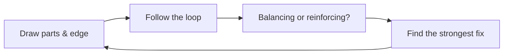

# Systems Thinking — Problem

**What it is:** looking at the parts of a system, how they connect, and the loops those connections make — instead of looking at one part on its own. Donella Meadows said a system needs three things: parts, connections between them, and a purpose. The bug you actually see is almost never where the real problem lives. The real cause is usually hiding in a connection, somewhere else in the loop.

## The four steps, in order

- **Draw the parts and the edge of the system.** Name the real pieces (`CheckoutService`, `PaymentGateway`, `RetryQueue`). Decide what's inside — things you can change — and what's outside — things you don't own but still need to think about.
  - You can't change how `PaymentGateway` works inside. But it still slows down under load, and that matters. Don't treat it as a magic box that always just says "success."
- **Follow the loop.** Look for the spot where something that comes *out* of the system later goes back *in* again. Most systems with retries, caches, or queues have one of these loops somewhere.
- **Name the kind of loop.** Meadows called them two things: a **balancing loop** settles down on its own, like a thermostat — it pushes toward a target and stops (an autoscaler adding servers, then removing them once load drops). A **reinforcing loop** keeps making things worse on its own, with nothing built in to stop it — it only stops when something outside it breaks.
- **Find the strongest place to make a change.** Not every fix is equally strong. Meadows ranked these from weak to strong: changing a plain number (a timeout, a retry count) is a weak fix. Changing the *rule* the loop follows is a much stronger fix — it changes the shape of the loop, not just its speed.

## A worked example

**The problem:** checkout errors jump from 0.3% to 8% during a busy Friday.

- **Draw it:** `CheckoutService` (yours) calls `PaymentGateway` (not yours, has limited slots) to charge the card. If that call times out after 3 seconds, `CheckoutService` puts the request in `RetryQueue` and tries again.
- **Follow the loop:** more traffic → more charge requests → `PaymentGateway` gets busier → it gets slower → requests start timing out → each timeout adds a retry → the retry is one more request → `PaymentGateway` gets even busier. Around it goes.
- **Name it:** this is a reinforcing loop — nothing stops it on its own. Retries pile on exactly when the gateway can least handle more load, and the loop only breaks when something outside it gives way, like the gateway running out of slots, or traffic finally dropping.
- **Find the strongest fix:** raising the retry count is a weak fix — it's just a bigger number, and it can make a reinforcing loop worse, not better. A stronger fix is a rule: cap how many retries can be in flight at once, so once the gateway looks overloaded, the system stops piling more requests onto it.

The errors show up inside `CheckoutService`'s code — but that code isn't actually broken. The real problem is the loop between retries and an overloaded gateway.

## Check your work before you call it done

- **Right-sized boundary** — not so big you can't see the whole loop ("the whole system"), not so small the loop closes outside it (one function).
- **Loop actually traced** — can you draw the arrows all the way around, back to where you started?
- **Named with real evidence** — do you know it's balancing or reinforcing because you checked whether something stops it, not because you guessed from one moment in time?
- **Fix matches the loop** — did you change the rule (strong fix) instead of just a number (weak fix), given how bad the loop actually is?

Continue to [Mistake](mistake.md).
