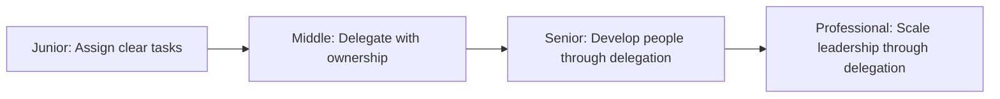
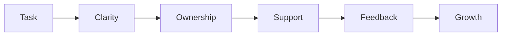

# Delegation

> Assign work to others in a way that builds capability, maintains accountability, and preserves your ability to lead. Delegation is not abdication; it is teaching through responsibility.

| Level | Guide | You are done when |
|---|---|---|
| Junior | [Assign clear tasks](junior.md) | You can give someone a task with clear success criteria and know when it's done. |
| Middle | [Delegate with ownership](middle.md) | You can hand off a task and let someone own the outcome, while staying informed. |
| Senior | [Develop people through delegation](senior.md) | You can choose tasks that stretch people, provide the right support, and build capability. |
| Professional | [Scale leadership through delegation](professional.md) | You can build a team that operates independently, makes good decisions, and grows into leadership. |

## Practice rule

Clarity on what done looks like, ownership of the outcome, and regular feedback are non-negotiable. Everything else is a trade-off between speed and growth.

## Related

- [Ownership](../ownership/README.md)
- [Meeting](../meeting/README.md)
- [Problem Solving](../problem-solving/README.md)
