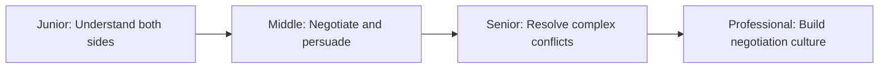
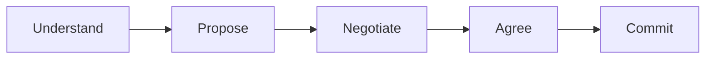

# Negotiation and Debate

> Negotiate effectively, handle conflict, and convince people by understanding their perspective and finding mutual benefit. Debate ideas, not people.

| Level | Guide | You are done when |
|---|---|---|
| Junior | [Understand both sides](junior.md) | You can understand what the other person wants and why, and find common ground. |
| Middle | [Negotiate and persuade](middle.md) | You can negotiate effectively, convince people, and know when to say yes and no. |
| Senior | [Resolve complex conflicts](senior.md) | You can resolve conflicts across teams, handle high-stakes negotiations, and guide others. |
| Professional | [Build negotiation culture](professional.md) | You can establish norms for healthy debate, teach negotiation skills, and measure negotiation health. |

## Practice rule

Understand before you persuade. Find mutual benefit, not victory. Debate ideas, not people. Say no clearly, say yes with conditions.

## Related

- [Communication](../communication/README.md)
- [Delegation](../delegation/README.md)
- [Meeting](../meeting/README.md)
