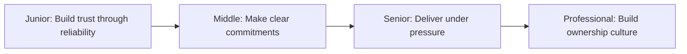
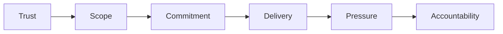

# Ownership

> Own your work by building trust, making clear commitments, defining scope, and delivering under pressure. Ownership means being accountable for outcomes, not just effort.

| Level | Guide | You are done when |
|---|---|---|
| Junior | [Build trust through reliability](junior.md) | You can say yes/no clearly, define scope, and communicate progress honestly. |
| Middle | [Make clear commitments](middle.md) | You can negotiate scope, estimate accurately, and commit to outcomes you can deliver. |
| Senior | [Deliver under pressure](senior.md) | You can maintain quality under pressure, make trade-offs, and protect your team. |
| Professional | [Build ownership culture](professional.md) | You can establish norms for ownership, accountability, and sustainable delivery. |

## Practice rule

Before saying yes, write down: what you're committing to, what you're not committing to, your assumptions, your risks, and when you'll know if you're on track. Update this as reality changes.

## Related

- [Communication](../communication/README.md)
- [Negotiation and Debate](../negotiation-and-debate/README.md)
- [Delegation](../delegation/README.md)
