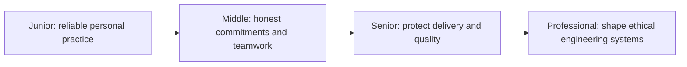
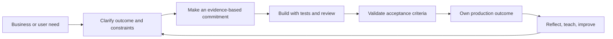

# Engineering Professionalism

> Professionalism means taking responsibility for the promises, quality, risks, and human consequences of engineering work—even when pressure makes shortcuts attractive.

Professionalism is not formality, seniority, or never making mistakes. It is a repeatable way of behaving when other people depend on your work:

- say **no** to unsafe or impossible requests and explain the evidence;
- say **yes** only when the commitment is understood and achievable;
- keep quality controls when deadlines tighten;
- estimate with uncertainty rather than manufacturing confidence;
- protect focus and communicate changing priorities;
- agree on acceptance criteria before implementation;
- collaborate without hiding conflict or responsibility;
- grow capability through mentoring and apprenticeship;
- protect users, colleagues, society, and the public interest.

## Choose a level

| Level | Guide | You are done when |
|---|---|---|
| Junior | [Build reliable personal habits](junior.md) | You can surface uncertainty, keep small commitments, test your work, and ask for help early. |
| Middle | [Commit and collaborate responsibly](middle.md) | You can negotiate scope, estimate in ranges, define acceptance, and improve team delivery. |
| Senior | [Protect outcomes under pressure](senior.md) | You can manage risk, disagreement, incidents, quality, and mentoring across a system. |
| Professional | [Create professional engineering systems](professional.md) | You can align incentives, governance, ethics, delivery, and learning across teams. |

## Practice rule

Before accepting work, write the outcome, constraints, uncertainty, evidence needed for completion, and conditions that would require renegotiation. A professional commitment includes communication when reality changes.

## Related

- [Problem-Solving](../02-problem-solving/README.md)
- [Critical Thinking](../04-critical-thinking/README.md)
- [Metacognition and Learning](../10-metacognition-and-learning/README.md)
