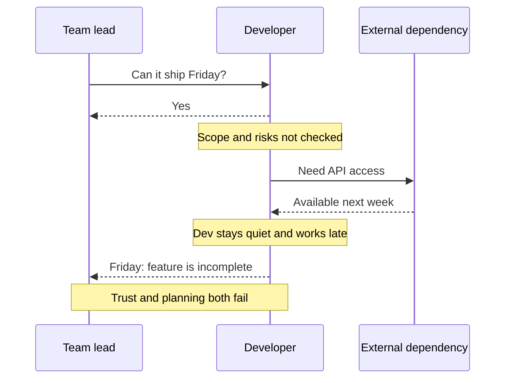

# Engineering Professionalism — Junior

At junior level, professionalism begins with one question:

> Can teammates trust what I say about my work, its quality, and what I do not yet know?

## Reliability starts with visibility

Being professional does not mean solving everything alone. It means making progress and risk visible. When blocked, communicate:

- the intended outcome;
- what you tried and observed;
- the exact point where your understanding stops;
- the next experiment you propose;
- when the blocker threatens the commitment.

“It does not work” transfers the investigation to someone else. A concise evidence report helps another engineer join the reasoning.

## The naive approach: promise first, discover later

A junior engineer is asked, “Can this be ready Friday?” Wanting to appear capable, they answer yes before reading the code, defining acceptance, or identifying dependencies.

The problem is not that the first estimate was wrong. Estimates are uncertain. The professional failure was hiding uncertainty and waiting until the deadline to renegotiate.

## A safer personal workflow

1. Restate what “done” means.
2. Inspect the relevant code and dependencies.
3. Split the work into small outcomes.
4. Give a range and name assumptions.
5. Add tests or acceptance checks while building.
6. Share progress at meaningful checkpoints.
7. Raise new evidence immediately.

Example:

> “I can commit to a working upload flow by Friday if the storage credentials arrive today. Validation and migration are separate risks. I will confirm after a two-hour investigation and update you by 3 PM.”

## Quality under pressure

Do not silently remove tests, reviews, security checks, or rollback protection to preserve a date. Ask which scope can move. A smaller safe result is more professional than a larger result whose risk is hidden.

## Time and focus

Keep one explicit priority list. Finish or consciously pause work before starting another task. Reserve uninterrupted blocks for complex work and communicate when interruptions change delivery.

## Acceptance is observable

Replace “feature completed” with evidence: tests pass, acceptance examples work, monitoring exists, documentation is updated, and the reviewer or user can verify the result.

## Test yourself

1. How would you respond to a deadline before understanding the work?
2. What should a useful blocker report contain?
3. Which quality controls must not disappear silently under pressure?
4. Turn “done” for a password-reset feature into observable acceptance criteria.

Continue to [`middle.md`](middle.md).
