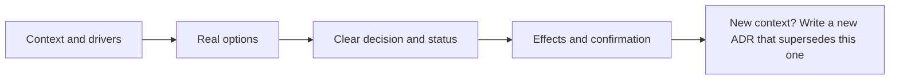

# Architecture Decision Records (ADR) — Problem

**What it is:** an Architecture Decision Record (ADR) is a small, versioned file that tells a future teammate: “given these facts and options, we chose this path; these are its consequences.” It records **one** architecture choice that matters to the system, rather than every implementation detail.

## The problem it solves

Engineering decisions often happen in a ticket comment, a call, or a pull request. The code later shows *what* the team built, but not why it chose that shape or what cost it accepted. A new teammate then has two bad options: leave the choice alone without understanding it, or change it without knowing what it protected. Michael Nygard created ADRs to keep that missing context in small records that are easy to read and keep current ([Documenting Architecture Decisions](https://cognitect.com/blog/2011/11/15/documenting-architecture-decisions)).

An ADR is useful when a choice affects one or more of these things:

- The system’s structure or the boundary between components.
- A quality target such as reliability, security, availability, privacy, or performance.
- A shared dependency, data contract, API, library, or delivery practice.
- More than one team, or a choice that will be expensive to undo.

AWS lists structure, non-functional requirements, dependencies, interfaces, and construction techniques as common ADR scope ([AWS Prescriptive Guidance](https://docs.aws.amazon.com/prescriptive-guidance/latest/architectural-decision-records/adr-process.html)). Do not create one for a local refactor that is safe to reverse and does not set a shared direction.

## The mechanism: the CODE Record

Use a short **Context–Options–Decision–Effects** record. Add a status so readers know whether the choice is still being discussed or already agreed.

- **Context** — state the facts, constraints, and decision drivers. Name the problem without arguing for an option yet.
- **Options** — list the real paths the team considered. A reader needs enough detail to understand why the rejected options lost.
- **Decision** — write one clear sentence in active voice: “We will use … because …” Mark it `Proposed`, `Accepted`, `Rejected`, or `Superseded`.
- **Effects** — record the good, bad, and neutral results; then name how the team will check the choice and what would make it worth revisiting.

MADR uses the same basic shape: context, options, decision outcome, consequences, and confirmation ([MADR template](https://adr.github.io/madr/)).

## Worked example: reliable cancellation events

The team is adding self-service order cancellation. Once an order is cancelled, fulfillment must stop shipping and payments must start a refund. Those services listen for an `OrderCancelled` event.

The team needs to decide how the order service sends that event. This is not a choice to hide inside a pull request: it changes reliability, service boundaries, retry behavior, and work for two other teams.

### Context

- The order must be marked cancelled before fulfillment acts on it.
- A network failure after the database update must not silently lose the event.
- Retrying must not create two refunds or two fulfillment actions.
- The customer-facing cancellation request should not wait for every downstream service to finish.

### Options

| Option | Why it was considered | Main cost |
|---|---|---|
| Call fulfillment and payments during the request | Immediate response from dependencies | The user request becomes tightly coupled to their availability. |
| Update the database, then publish the event directly | Simple code path | A process failure between the update and publish can lose the event. |
| Use a transactional outbox | Save the cancellation and a pending event in the same database transaction; a relay publishes and retries it | Needs a relay, monitoring, and consumers that handle a repeated event safely. |

### Decision

> **ADR-017: Use a transactional outbox for order-cancellation events.**
>
> **Status:** Accepted. We will store the cancellation and its pending event together, then publish the event asynchronously. We chose this because the cancellation state and the intent to notify downstream services must not split during a failure.

### Effects and check

- **Good:** a committed cancellation always has an event waiting to be delivered.
- **Cost:** delivery can happen later and may happen more than once, so fulfillment and payments must make repeated handling safe.
- **Confirmation:** integration tests prove that a cancellation creates its outbox event in the same transaction; a dashboard alerts when an event remains pending too long; code review checks consumer idempotency.
- **Revisit trigger:** reconsider the relay design if delivery volume, delay, or operations cost no longer meets the team’s agreed target.

The ADR now gives the next engineer a direct answer to “why do we have an outbox and idempotent consumers?” It is a record of the decision, not a tutorial for implementing every table, retry, and handler.

## ADR versus an RFC

| Artifact | Main question | State after the team agrees |
|---|---|---|
| RFC | “What should we do, and which proposal wins?” | It can describe the discussion and proposal. |
| ADR | “What did we choose, given which context and trade-offs?” | It records the accepted choice and becomes part of the decision log. |

An ADR may link to the RFC, ticket, experiment, design, or pull request that supplied evidence. It should still make the chosen direction understandable on its own. Microsoft specifically advises keeping a record concise and factual rather than turning it into a design guide ([Microsoft Learn](https://learn.microsoft.com/en-us/azure/well-architected/architect-role/architecture-decision-record)).

## Sources

- [Michael Nygard — Documenting Architecture Decisions](https://cognitect.com/blog/2011/11/15/documenting-architecture-decisions)
- [AWS Prescriptive Guidance — Architectural decision record process](https://docs.aws.amazon.com/prescriptive-guidance/latest/architectural-decision-records/adr-process.html)
- [MADR — Markdown Architectural Decision Records](https://adr.github.io/madr/)
- [Microsoft Learn — Maintain an architecture decision record](https://learn.microsoft.com/en-us/azure/well-architected/architect-role/architecture-decision-record)

Continue to [Mistake](mistake.md).
