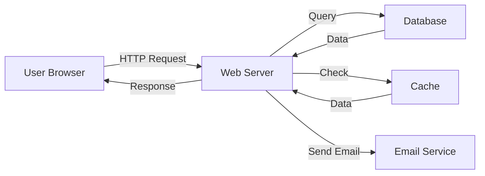

# High-Level Design — Junior

Identify the major components of your system and describe what each one does. A component is a cohesive unit that handles one responsibility: a web server, a database, a message queue, a cache.

## The mental model

A system is made of components. Each component:
- Has a clear responsibility
- Receives input (requests, events, data)
- Processes that input
- Produces output (responses, events, data)

Draw a box for each component. Draw arrows to show how data flows between them.

## Step-by-step method

1. List the major pieces of your system (web server, database, cache, message queue, etc.).
2. For each component, write one sentence describing its responsibility.
3. Draw boxes for each component.
4. Draw arrows showing how data flows between components.
5. Label each arrow with what data moves (requests, responses, events, etc.).

## Small example: Simple web application

**Components:**
- **Web Server:** Handles HTTP requests from users, returns HTML/JSON responses
- **Database:** Stores user data, products, orders
- **Cache:** Stores frequently accessed data to reduce database load
- **Email Service:** Sends confirmation emails to users

**Data flow:**
```
User Browser → Web Server → Database
                    ↓
                  Cache
                    ↓
              Email Service
```

**Diagram:**



## Common beginner mistakes

1. **Too many components:** Start with major pieces only. Don't include every library or utility.

2. **Unclear responsibilities:** "Handles stuff" is not a responsibility. "Validates user input and stores it in the database" is clearer.

3. **Missing data flow:** You draw components but don't show how data moves between them.

4. **Mixing levels of abstraction:** Don't mix "Web Server" with "JSON Parser" in the same diagram. Keep it at the same level.

5. **Forgetting external systems:** If your system uses a payment gateway or email service, include it in the diagram.

## Hands-on checklist

For each component, verify:

- [ ] Can you describe its responsibility in one sentence?
- [ ] Do you know what data it receives and produces?
- [ ] Do you know which other components it talks to?
- [ ] Is it at the same level of abstraction as other components?
- [ ] Could you explain it to a non-technical person?

## Test yourself

1. What is a component?
2. How do you decide if something should be a separate component?
3. Why is data flow important in a high-level design?
4. What is the difference between a component and a library?

Continue to [`middle.md`](middle.md).
