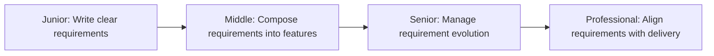
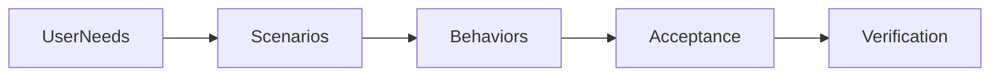

# Functional Requirements

> Translate user needs into testable system behaviors. Functional requirements define what the system does; non-functional requirements define how well it does it.

| Level | Guide | You are done when |
|---|---|---|
| Junior | [Write testable requirements](junior.md) | You can describe what the system does in observable, unambiguous terms. |
| Middle | [Compose features from requirements](middle.md) | You can break down complex user needs into implementable, testable behaviors. |
| Senior | [Manage requirement evolution](senior.md) | You can anticipate change, set boundaries, and contain scope creep. |
| Professional | [Align requirements with delivery](professional.md) | You can decompose requirements into reversible increments and track progress. |

## Practice rule

Separate what the system does from how well it does it. Avoid implementation details in requirements. Make acceptance criteria observable and measurable.

## Related

- [Non-Functional Requirements](../non-functional-requirements/README.md)
- [High-Level Design](../high-level-design/README.md)
- [Low-Level Design](../low-level-design/README.md)
