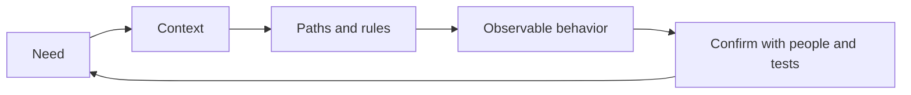

# Functional Requirements — Problem

**Functional requirements say what a product must do in a way people can observe.** They describe the user action, the rule that applies, and the result. Microsoft makes the same distinction: functional requirements describe what a product or service should do; non-functional requirements describe how it should operate ([Microsoft Learn](https://learn.microsoft.com/en-us/azure/devops/cross-service/manage-requirements?tabs=agile-process&view=azure-devops)).

This is daily product work, not a system-design interview. A request can arrive as a short ticket, a support issue, a design review comment, or a question while you are coding. Your job is to turn that signal into behavior the product owner, designer, tester, support team, and engineer all mean in the same way.

## The problem: a request is not a behavior

Imagine a support trend leads to this ticket:

> “Let customers cancel an order themselves.”

It sounds small, but it does not say:

- Which customer can cancel: the buyer, an account admin, or support staff?
- Which order states allow it: paid, being packed, shipped, delivered?
- What happens to payment, stock, fulfillment, and the confirmation shown to the customer?
- What should a customer see when cancellation is no longer allowed?
- Which related work is deliberately not part of this change?

If each person silently answers those questions differently, the code can be correct and the feature can still be wrong.

## The Need-to-Behavior Loop

Use this loop whenever a request affects product behavior.

1. **Capture the need** — preserve the request, its source, and the reason it matters. Do not mistake the first sentence for a complete specification.
2. **Find the context** — identify the actor, their goal, the current workflow, and evidence such as a support example, analytics, policy, or existing behavior.
3. **Walk the behavior** — describe the normal path, alternate paths, and failure paths from the user action to an observable result.
4. **Name rules and boundaries** — make the business rules, decisions, dependencies, and out-of-scope cases visible. Assign each open decision to a person who can answer it.
5. **Confirm the behavior** — write a short story and acceptance criteria, then ask the people who need to agree whether it matches what they meant.
6. **Keep the record current** — update the ticket and tests when a decision changes; a requirement is useful only while it matches the work being delivered.

IIBA describes elicitation as drawing out, exploring, and identifying information relevant to a change. That work can use direct conversation, research, or experiments; it must then be checked for gaps and shared understanding ([IIBA Core Standard](https://www.iiba.org/globalassets/standards-and-resources/core-standard/iiba-core-standard.pdf)). The loop is a lightweight way for an engineer to do that work as part of delivery.

## Worked example: self-service order cancellation

### 1. Capture the need

- **Signal:** support receives repeated requests from customers who made a mistake just after paying.
- **Problem to solve:** customers must contact support for a change they could safely make themselves.
- **Do not assume:** that every paid order can be cancelled, or that “cancel” always means “refund immediately.”

### 2. Find the actor and goal

Write the smallest user-focused statement that explains both the action and the reason:

> **As a customer with a paid order that has not started shipping, I want to cancel it myself so that I can correct a mistake without waiting for support.**

GOV.UK recommends that a user story state the actor, what they need, and why; the goal helps a team decide whether the user need was actually met ([Writing user stories](https://www.gov.uk/service-manual/agile-delivery/writing-user-stories)).

### 3. Walk the behavior before choosing code

- A customer opens an order that is eligible for cancellation and sees **Cancel order**.
- The customer chooses a reason and confirms.
- The order becomes **cancelled**; the customer sees the cancellation result and refund status; fulfillment is told not to ship it.
- A customer opens an order already handed to the carrier and does not see a cancellation action. They instead see the supported next step, such as contacting support or starting a return after delivery.
- A customer submits the action twice because the first page is slow. They see the recorded result, not two cancellations or two refunds.
- If a refund cannot be completed yet, the order shows that cancellation succeeded but the refund is pending, with a clear next state for support to follow.

These are required product outcomes. They do **not** choose a database, queue, endpoint shape, or payment-provider API.

### 4. Make rules and boundaries explicit

| Decision | Agreed behavior |
|---|---|
| Eligibility | A customer can cancel only their own paid order while it is still in `processing`. |
| Cancellation result | The order is cancelled, a refund is requested, and fulfillment is told to stop. |
| Too late | An order already handed to a carrier uses the existing support/return path. |
| Repeat request | Repeating the same cancellation shows the first result and never creates another refund. |
| Out of scope | Partial item cancellation and cancellation of cash-on-delivery orders are separate requests. |

The specific decisions may differ in your product. The important part is that the rule, owner, and boundary are written down before a developer invents them in code.

### 5. Confirm with acceptance criteria

Acceptance criteria are the observable outcomes used to check that a service has met the user need ([GOV.UK](https://www.gov.uk/service-manual/agile-delivery/writing-user-stories)). For this request, the team can agree on:

- It is done when an eligible customer can cancel their own paid order from its details page.
- It is done when the cancelled order records the reason, stops fulfillment, and shows the cancellation and refund state to the customer.
- It is done when an ineligible order does not offer self-service cancellation and points the customer to the correct next step.
- It is done when a repeated cancellation attempt leaves one cancellation and one refund request.

The ticket is now small enough to estimate, test, and review without pretending every future detail is known.

## Where this happens during normal engineering work

- **Ticket triage:** capture the raw need and link the support case, design, or product decision that caused it.
- **Backlog refinement:** walk the workflow with product, design, QA, and any team that owns a dependent behavior.
- **Before estimation:** separate known behavior from unanswered questions. Estimate only after uncertainty is visible.
- **While coding:** when a missing rule appears, pause to get a decision instead of letting an accidental code path become policy.
- **Before merge and release:** make tests and review comments point back to the agreed behaviors.
- **After release:** turn new support cases into evidence that a rule, path, or boundary needs correction.

## Sources

- [IIBA Core Standard — Elicitation and Collaboration](https://www.iiba.org/globalassets/standards-and-resources/core-standard/iiba-core-standard.pdf)
- [GOV.UK — Writing user stories](https://www.gov.uk/service-manual/agile-delivery/writing-user-stories)
- [Microsoft Learn — Requirements Management for Agile Teams](https://learn.microsoft.com/en-us/azure/devops/cross-service/manage-requirements?tabs=agile-process&view=azure-devops)

Continue to [Mistake](mistake.md).
