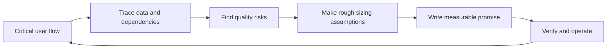

# Non-Functional Requirements — Problem

**What they are:** non-functional requirements describe the quality and limits a feature must meet while it performs its function. A functional requirement says, “an account owner can request an order export.” A non-functional requirement says how quickly, safely, privately, reliably, and visibly that export must work—and the rough traffic, data, and cost limits that can make those promises possible or impossible.

This is daily feature work, not a one-time capacity-estimation exercise. A small change can add a sensitive data flow, a critical dependency, or a new on-call failure mode even when its happy path is simple.

## The problem it solves

“Make exports fast and secure” is useful intent, but it cannot guide a trade-off, a test, or an incident response. Without a clearer agreement, a team can ship an export that works in a demo but:

- makes a customer wait without knowing whether it is still running;
- leaks one organisation's data to another;
- keeps a sensitive file longer than policy allows; or
- fails overnight with no useful signal for the person on call.

The goal is not to list every possible quality attribute. It is to find the few quality risks that matter for the user flow being changed. [Google SRE recommends choosing a small number of measures for the functionality most critical to users](https://sre.google/workbook/implementing-slos/); [Microsoft likewise starts reliability targets with the business importance of user and system flows](https://learn.microsoft.com/en-us/azure/well-architected/reliability/metrics).

## The mechanism: Quality-Risk Loop

1. **Name the critical flow.** Write who is trying to do what, and what “good” feels like to them. Do not begin with a database, cache, queue, or vendor.
2. **Trace the change.** Follow the data, dependencies, permissions, background work, and people who will operate the feature. A simple click may create a file, call a third party, and page someone later.
3. **Ask what can go wrong.** Look through five lenses: performance, reliability, security, privacy, and operability. Ask for the user impact and the tolerated loss or delay, not just a technical preference.
4. **Make a short sizing sketch when scale can change the answer.** Write the demand, busiest window, payload, retained data, copies, and price assumptions. Do the rough arithmetic before choosing a component or promising a deadline.
5. **Turn risk into a promise.** State the flow, condition, measure, threshold, time window, and owner. This makes “fast” or “safe” something the team can test and monitor.
6. **Choose evidence before build.** Decide what proves the promise: an acceptance test, an access-control test, a retention check, a dashboard, an alert, a load test, or a recovery exercise.
7. **Release, observe, and revise.** Production use, support cases, incidents, and changed policies reveal new facts. Update the promise rather than leaving it frozen in the first ticket.

## Five lenses for one feature

| Lens | Questions to ask before choosing a solution |
|---|---|
| **Performance** | What wait is acceptable at the user-facing step? What happens at a busy time or with a large valid request? |
| **Reliability** | What counts as success? How long may the flow be unavailable? What recovery time or data loss is acceptable after a failure? |
| **Security** | Who may start, view, change, or download this? What misuse must be blocked and recorded? |
| **Privacy** | What personal or sensitive data enters, leaves, or remains? Which policy, consent, retention, or legal constraint changes the answer? |
| **Operability** | How will the team know the flow is degraded? Who owns the alert, and what safe first action can they take? |

[OWASP asks teams to collect protection needs for data assets and compile functional and non-functional security requirements](https://top10.owasp.org/2025/0x03_2025-Establishing_a_Modern_Application_Security_Program/). [NIST similarly starts privacy work by identifying data processing, privacy risks, values, and legal requirements](https://www.nist.gov/privacy-framework/using-privacy-framework-11). These are questions to answer with the right product, security, privacy, support, and operations partners—not facts an engineer should guess alone.

## Back-of-the-envelope sizing: make scale visible early

A **back-of-the-envelope estimate** is a short calculation with named, rounded assumptions. It is not a request to design a fleet of servers, and it is not an interview exercise. In normal feature work, it helps an engineer ask the questions that can change scope: “Does this deadline fit the expected load?”, “How long will the files exist?”, and “What capacity or cost needs a product decision?”

[Google SRE recommends these calculations as a sanity check for likely performance, bottlenecks, and capacity; it explicitly calls out disk, RAM, bandwidth, and concurrent work](https://sre.google/static/pdf/nalsd-workbook-letter.pdf). The same source says that a rough estimate does **not** replace load testing. Keep the math simple, show its inputs, and mark what must be measured before launch.

| Thing to size | Plain calculation | Question it exposes |
|---|---|---|
| **Requests** | `requests in busiest window ÷ seconds in that window` | Which operation needs the highest RPS or QPS? |
| **Payload bandwidth** | `requests per second × bytes per request` | Can the API, worker, storage, and network move the data in time? Calculate input and output separately. |
| **In-flight work** | `requests per second × average seconds spent working` | How many jobs, connections, or records may exist at once? |
| **Stored data** | `items per day × average item size × retention days × stored-copy factor` | Does retention, replication, or backup make storage or deletion work material? |
| **Rough cost** | `estimated usage × current provider rate` | Which cost line needs a decision: storage, requests, compute, data transfer, or copies? |

**RPS** and **QPS** both mean “per second” rates; teams often say RPS for API requests and QPS for queries or storage operations. The important part is the named operation and boundary. One user action can create a job, poll its status, read source data, write a file, and download it—so it has more than one rate. [A Google SRE case study tracks average, peak, and total traffic separately and sizes for expected peaks when that matters](https://sre.google/workbook/slo-engineering-case-studies/). A cache, CDN, queue, or retry can also change the rate seen by the next component; [Google's storage guidance shows a 99% cache-hit rate reducing one million viewer requests to 10,000 origin QPS](https://docs.cloud.google.com/storage/docs/best-practices-media-workload?hl=en).

## Worked example: “Let account owners export orders to CSV”

A product ticket says: “Let account owners export the last 90 days of their organisation's orders to CSV.” The functional behavior is clear enough to begin discussion. The quality work makes the delivery safe to operate.

| Lens | Evidence to gather | Example of a draft promise, after agreement |
|---|---|---|
| Performance | Typical and largest export; when users need the file; expected busy periods | The request is acknowledged within 2 seconds, and a 90-day export is ready within 10 minutes at the agreed peak. |
| Reliability | What support does after a failure; whether retry can duplicate work; tolerated recovery and data loss | At least 99.5% of eligible export jobs produce one complete file within 10 minutes over 30 days; a failed job is safe to retry. |
| Security | Organisation roles; access patterns; likely abuse; audit needs | Only an authorised owner can request or download that organisation's file; an unauthorised attempt is denied and recorded. |
| Privacy | Fields allowed in the file; data policy; retention; applicable legal advice | The file includes only approved fields for the requested period and is removed after the agreed retention period. |
| Operability | Queue and failure signals; on-call owner; first recovery action | The team can see created, completed, and failed jobs by organisation; a sustained failure rate alerts the named owner with a runbook. |

The numbers above are examples, not universal targets. They become requirements only after the people who own the user outcome, risk, and support cost agree to them. For reliability, an **SLI** is the measurement and an **SLO** is the target for that measurement; both need a stated window and a measurement source. [Google's guide gives latency and success-rate examples and shows that the first measurement can use the simplest trustworthy source available](https://sre.google/workbook/implementing-slos/).

### A sizing sketch for the same export

Assume product analytics and support history say that, at month end, **600** owners can request an export within one busy minute. A large expected export has **100,000 CSV rows** at roughly **0.5 KiB per row**, so one file is roughly **50 MiB**. The promise is that each file is ready within ten minutes; the UI polls job status every five seconds; there are **1,200** successful exports per day; files remain for **seven days** in **two stored copies**.

- **Request rate:** `600 ÷ 60 = 10 RPS` for the create-export endpoint during that minute. That is not the same thing as the file-download rate or database query rate.
- **Status-query rate:** if all 600 jobs are still running, `600 ÷ 5 = 120 QPS` for the status endpoint. Polling can be the busiest API even when job creation is small.
- **File-output bandwidth:** `600 × 50 MiB ÷ 600 seconds = 50 MiB/s` is the minimum average worker-and-storage output needed to have all of those files ready within ten minutes. Source reads, CSV formatting, retries, and overhead need their own allowance or test.
- **Download bandwidth:** if those 600 files are downloaded in the next five minutes, `600 × 50 MiB ÷ 300 seconds = 100 MiB/s` of outbound data is the rough peak to examine. A link sent by email may spread that load; an immediate browser download may not.
- **Retained storage:** `1,200 × 50 MiB × 7 days × 2 copies = 840,000 MiB`, or roughly **820 GiB**. A backup with a different retention period is another line, not something silently included in “two copies.”
- **Cost and capacity assumption:** start with about 820 GiB of stored files, then add the provider's current request, worker/compute, data-transfer, and backup prices for the chosen region and copy count. This is a planning range, not a quote. For example, [Microsoft's documented Cosmos DB examples price storage and throughput separately and show that multi-region copies multiply both capacity and cost](https://learn.microsoft.com/en-us/azure/cosmos-db/understand-your-bill).

The sketch does not select a queue, database, or server count. It tells the team what must be true before those choices: the month-end demand is real, a 50 MiB file is representative, the ten-minute promise applies at the burst, 820 GiB is acceptable to retain, and the predicted peaks fit known quotas or a test. If one is not true, negotiate the requirement—such as a smaller date range, a longer completion time, a lower polling rate, or shorter retention—before implementation makes the trade-off expensive.

Notice what is not a requirement yet: “use a queue,” “encrypt with product X,” or “add three servers.” Those may become sound design choices, but the team should first agree on the outcome and evidence that make the choice correct.

Continue to [Mistake](mistake.md).
