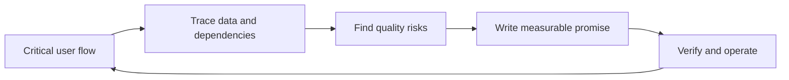

# Non-Functional Requirements — Problem

**What they are:** non-functional requirements describe the quality and limits a feature must meet while it performs its function. A functional requirement says, “an account owner can request an order export.” A non-functional requirement says how quickly, safely, privately, reliably, and visibly that export must work.

This is daily feature work, not a one-time capacity-estimation exercise. A small change can add a sensitive data flow, a critical dependency, or a new on-call failure mode even when its happy path is simple.

## The problem it solves

“Make exports fast and secure” is useful intent, but it cannot guide a trade-off, a test, or an incident response. Without a clearer agreement, a team can ship an export that works in a demo but:

- makes a customer wait without knowing whether it is still running;
- leaks one organisation's data to another;
- keeps a sensitive file longer than policy allows; or
- fails overnight with no useful signal for the person on call.

The goal is not to list every possible quality attribute. It is to find the few quality risks that matter for the user flow being changed. [Google SRE recommends choosing a small number of measures for the functionality most critical to users](https://sre.google/workbook/implementing-slos/); [Microsoft likewise starts reliability targets with the business importance of user and system flows](https://learn.microsoft.com/en-us/azure/well-architected/reliability/metrics).

## The mechanism: Quality-Risk Loop

1. **Name the critical flow.** Write who is trying to do what, and what “good” feels like to them. Do not begin with a database, cache, queue, or vendor.
2. **Trace the change.** Follow the data, dependencies, permissions, background work, and people who will operate the feature. A simple click may create a file, call a third party, and page someone later.
3. **Ask what can go wrong.** Look through five lenses: performance, reliability, security, privacy, and operability. Ask for the user impact and the tolerated loss or delay, not just a technical preference.
4. **Turn risk into a promise.** State the flow, condition, measure, threshold, time window, and owner. This makes “fast” or “safe” something the team can test and monitor.
5. **Choose evidence before build.** Decide what proves the promise: an acceptance test, an access-control test, a retention check, a dashboard, an alert, or a recovery exercise.
6. **Release, observe, and revise.** Production use, support cases, incidents, and changed policies reveal new facts. Update the promise rather than leaving it frozen in the first ticket.

## Five lenses for one feature

| Lens | Questions to ask before choosing a solution |
|---|---|
| **Performance** | What wait is acceptable at the user-facing step? What happens at a busy time or with a large valid request? |
| **Reliability** | What counts as success? How long may the flow be unavailable? What recovery time or data loss is acceptable after a failure? |
| **Security** | Who may start, view, change, or download this? What misuse must be blocked and recorded? |
| **Privacy** | What personal or sensitive data enters, leaves, or remains? Which policy, consent, retention, or legal constraint changes the answer? |
| **Operability** | How will the team know the flow is degraded? Who owns the alert, and what safe first action can they take? |

[OWASP asks teams to collect protection needs for data assets and compile functional and non-functional security requirements](https://top10.owasp.org/2025/0x03_2025-Establishing_a_Modern_Application_Security_Program/). [NIST similarly starts privacy work by identifying data processing, privacy risks, values, and legal requirements](https://www.nist.gov/privacy-framework/using-privacy-framework-11). These are questions to answer with the right product, security, privacy, support, and operations partners—not facts an engineer should guess alone.

## Worked example: “Let account owners export orders to CSV”

A product ticket says: “Let account owners export the last 90 days of their organisation's orders to CSV.” The functional behavior is clear enough to begin discussion. The quality work makes the delivery safe to operate.

| Lens | Evidence to gather | Example of a draft promise, after agreement |
|---|---|---|
| Performance | Typical and largest export; when users need the file; expected busy periods | The request is acknowledged within 2 seconds, and a 90-day export is ready within 10 minutes at the agreed peak. |
| Reliability | What support does after a failure; whether retry can duplicate work; tolerated recovery and data loss | At least 99.5% of eligible export jobs produce one complete file within 10 minutes over 30 days; a failed job is safe to retry. |
| Security | Organisation roles; access patterns; likely abuse; audit needs | Only an authorised owner can request or download that organisation's file; an unauthorised attempt is denied and recorded. |
| Privacy | Fields allowed in the file; data policy; retention; applicable legal advice | The file includes only approved fields for the requested period and is removed after the agreed retention period. |
| Operability | Queue and failure signals; on-call owner; first recovery action | The team can see created, completed, and failed jobs by organisation; a sustained failure rate alerts the named owner with a runbook. |

The numbers above are examples, not universal targets. They become requirements only after the people who own the user outcome, risk, and support cost agree to them. For reliability, an **SLI** is the measurement and an **SLO** is the target for that measurement; both need a stated window and a measurement source. [Google's guide gives latency and success-rate examples and shows that the first measurement can use the simplest trustworthy source available](https://sre.google/workbook/implementing-slos/).

Notice what is not a requirement yet: “use a queue,” “encrypt with product X,” or “add three servers.” Those may become sound design choices, but the team should first agree on the outcome and evidence that make the choice correct.

Continue to [Mistake](mistake.md).
