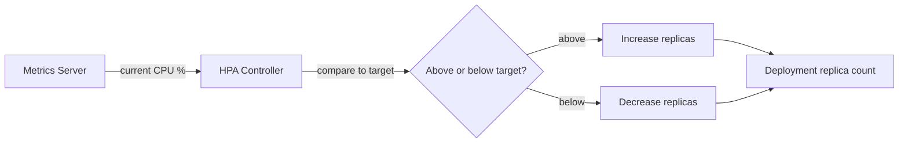

# Autoscaling — Junior

<!-- level-focus -->
At junior level, focus on this question:

> Given a stateless web service under variable load, can you configure a Horizontal Pod Autoscaler that scales replica count based on CPU utilization, and prove it scales up under load and back down afterward?

Use the smallest realistic scenario that exposes the decision and its failure behavior.

---

## Core Concept 1 — Vocabulary: Horizontal, Vertical, and the Autoscaler Loop

Four terms get mixed up constantly. Keep them apart:

- **Horizontal scaling (scale out/in)** — changing the *number* of running instances (Pods, VMs). More load, more copies of the same thing serving it.
- **Vertical scaling (scale up/down)** — changing the *size* (CPU/memory) of an existing instance, without changing how many there are.
- **Autoscaler** — a controller that watches a metric, compares it to a target, and adjusts capacity (replica count, or instance size) without a human issuing the command each time.
- **Target metric** — the signal the autoscaler watches (CPU utilization, memory, requests per second, queue depth) and the value it tries to hold that signal at.

This guide focuses on **horizontal** autoscaling — specifically Kubernetes' **Horizontal Pod Autoscaler (HPA)** — because it is the most common first autoscaler a junior engineer configures, and it directly builds on the Pod/Deployment objects covered in Kubernetes Orchestration.

The relationship in one line: **an autoscaler watches a metric and adjusts capacity so the metric stays near its target, without anyone manually running `kubectl scale`.**

## Core Concept 2 — The HPA Control Loop

The HPA is a controller that runs on a fixed interval (by default every 15 seconds) and does the same three things every time:



The math behind step 2 is a single formula, and it is worth memorizing because every scaling decision traces back to it:

```text
desiredReplicas = ceil(currentReplicas * (currentMetricValue / desiredMetricValue))
```

Worked example: 4 replicas running, each currently averaging 80% CPU, target is 50%.

```text
desiredReplicas = ceil(4 * (80 / 50)) = ceil(6.4) = 7
```

The HPA does not "add one replica and see what happens" — it computes the replica count it believes will bring the average back to target in one step, then re-measures next interval and corrects again.

## Core Concept 3 — A Worked HPA Configuration

Take a stateless HTTP service, `checkout-api`, currently a `Deployment` with a fixed `replicas: 4`. Before an HPA can manage it, the Deployment's containers **must** declare a CPU request — this is the single most important prerequisite and the one juniors skip:

```yaml
# deployment.yaml (relevant excerpt)
apiVersion: apps/v1
kind: Deployment
metadata:
  name: checkout-api
spec:
  template:
    spec:
      containers:
        - name: checkout-api
          image: registry.example.com/checkout-api:1.4.0
          resources:
            requests:
              cpu: 250m        # HPA computes % utilization against THIS number
              memory: 256Mi
            limits:
              cpu: 500m
              memory: 512Mi
```

Now the HPA itself:

```yaml
# hpa.yaml
apiVersion: autoscaling/v2
kind: HorizontalPodAutoscaler
metadata:
  name: checkout-api-hpa
spec:
  scaleTargetRef:
    apiVersion: apps/v1
    kind: Deployment
    name: checkout-api
  minReplicas: 2
  maxReplicas: 10
  metrics:
    - type: Resource
      resource:
        name: cpu
        target:
          type: Utilization
          averageUtilization: 60   # scale when average CPU crosses 60% of the 250m request
```

Apply both and watch it react to load:

```bash
kubectl apply -f deployment.yaml
kubectl apply -f hpa.yaml

# generate load against the service (any load tool works; hey is common)
hey -z 3m -c 50 http://checkout-api.default.svc.cluster.local/

# watch replica count and current utilization change over time
kubectl get hpa checkout-api-hpa --watch
```

Sample output over the course of the load test:

```
NAME                REFERENCE                TARGETS   MINPODS   MAXPODS   REPLICAS   AGE
checkout-api-hpa    Deployment/checkout-api  35%/60%   2         10        4          1m
checkout-api-hpa    Deployment/checkout-api  82%/60%   2         10        4          3m
checkout-api-hpa    Deployment/checkout-api  61%/60%   2         10        6          4m
checkout-api-hpa    Deployment/checkout-api  48%/60%   2         10        6          6m
checkout-api-hpa    Deployment/checkout-api  30%/60%   2         10        3          12m
```

Read this like a story: load arrives, CPU climbs past target (82%), the HPA computes and applies a higher replica count (6), utilization settles back near target, and once load tool stops, utilization drops and the HPA eventually scales back down — but notice it takes several minutes to come back down to 3, not instantly. That lag on the way down is deliberate (Core Concept 4), not a bug.

## Core Concept 4 — Why Scale-Down Is Slower Than Scale-Up

By default, the HPA scales up quickly but scales down cautiously, using a **stabilization window** (default 5 minutes on scale-down, 0 on scale-up in newer versions). It looks back over that window and picks the *highest* recommended replica count seen, rather than reacting to the very latest reading. This exists to prevent **thrashing**: without it, one low-traffic reading right after a spike would immediately remove replicas, only for the next reading to show high traffic again, forcing another scale-up — a cycle of pods being created and terminated back to back that wastes resources and can drop requests during each transition.

## Core Concept 5 — Simple Success Criteria

Before touching a load tool, it helps to write down, in plain terms, what "the HPA is working" actually means for this exercise. Three checks cover it at junior level:

1. **The metric is visible.** `kubectl get hpa` shows a real number under TARGETS (like `35%/60%`), not `<unknown>`. If it's `<unknown>`, nothing past this point can work — fix the metrics pipeline (usually a missing CPU `request` or a missing `metrics-server`) before judging anything else.
2. **Replica count moves in the direction the metric implies.** When the current value is above the target, replica count should climb on the next evaluation or two; when it's below, it should eventually fall. If the metric crosses the target and replica count doesn't move within a couple of evaluation intervals, the HPA is misconfigured or blocked (check `kubectl describe hpa` for events).
3. **The service keeps answering requests throughout.** Autoscaling that adds replicas but drops requests during the transition (because new Pods weren't ready before traffic was sent to them, or old Pods were killed before finishing in-flight work) has fixed a capacity problem while creating an availability one. A `readinessProbe` on the Deployment is what prevents the first half of that; this is worth checking even at junior level because it's easy to configure an HPA correctly and still break requests during a scaling event.

Keep the bar this concrete: a metric you can see, a replica count that reacts to it, and a service that never stops answering while it does.

## Common Mistakes

1. **No CPU `requests` set on the container.** The HPA's percentage math is `currentUsage / requestedAmount`. With no request, there's no denominator, and the HPA either refuses to work or shows `<unknown>` under TARGETS.
2. **Setting `minReplicas` equal to `maxReplicas`.** This isn't autoscaling — it's a fixed replica count wearing an HPA object. Leave real headroom between the two.
3. **Judging "it's working" from one `kubectl get hpa` snapshot.** A single reading tells you nothing about whether the loop reacts correctly; you need to watch it change across a load test, both up and back down.
4. **Expecting scale-down to be as fast as scale-up.** As shown above, this is intentional — don't "fix" it by assuming something is broken when replicas linger above the traffic that would justify them.
5. **Confusing pod-level and node-level scaling.** The HPA only changes how many Pods a Deployment runs. If the cluster doesn't have spare node capacity to place those new Pods, they sit `Pending` — that's a separate concern (the Cluster Autoscaler, covered from `middle.md` onward), not something the HPA controls.
6. **Forgetting `EXPOSE`-style thinking applies here too: metrics-server must be installed.** The HPA depends on the `metrics-server` add-on being deployed in the cluster; without it, `kubectl get hpa` shows `<unknown>` for every target indefinitely.

## Apply it

1. Deploy a small stateless HTTP service to a test cluster (or `minikube`/`kind`) as a `Deployment` with 4 replicas, and set a CPU `request` of `250m` per container.
2. Create an HPA targeting that Deployment with `minReplicas: 2`, `maxReplicas: 10`, and an average CPU utilization target of `60`.
3. Generate sustained load against the service for at least 3 minutes using a load tool (`hey`, `ab`, or `k6`), while running `kubectl get hpa --watch` in a second terminal.
4. Record the replica count and CPU utilization at three points: before load, at peak load, and 10 minutes after load stops.
5. Confirm the replica count rose while load was applied and fell back down afterward, and note how long the fall-back took compared to the rise.

## Verify your work

- `kubectl get hpa` shows a real percentage (not `<unknown>`) under TARGETS throughout the test.
- Replica count visibly increases within one or two HPA evaluation intervals (roughly 15-30 seconds) after CPU crosses the target.
- Replica count returns toward `minReplicas` only after load stops, and takes noticeably longer to come down than it took to go up.
- `kubectl describe hpa checkout-api-hpa` shows scaling events in its Events section that match the replica-count changes you observed.

## Review questions

- What does the HPA's replica-count formula compute, and what two numbers does it compare?
- Why does an HPA require a CPU `request` to be set on the container it manages?
- Why is scale-down typically slower than scale-up, and what problem is that lag preventing?
- What happens to newly desired Pods if the cluster has no spare node capacity to place them?
