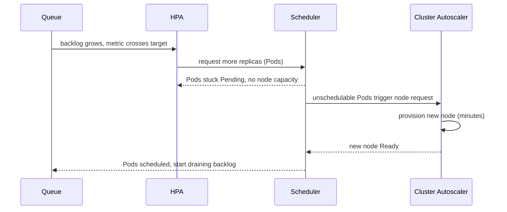

# Autoscaling — Middle

<!-- level-focus -->
At middle level, focus on this question:

> When a background worker's real bottleneck is queue depth rather than CPU, how do you choose the scaling signal and tune the scale-up/scale-down policy so the autoscaler reacts to the actual bottleneck instead of a proxy that lags or misleads?

Use the smallest realistic scenario that exposes the decision and its failure behavior.

---

## Core Concept 1 — Choosing the Scaling Signal

A junior-level HPA defaults to CPU because it's built in and requires no extra setup. The middle-level move is choosing the metric that actually reflects the bottleneck:

| Signal type | Source | Fits when | Risk if misapplied |
|---|---|---|---|
| **Resource (CPU/memory)** | Built into `metrics-server`, no extra install | The workload is genuinely CPU- or memory-bound (a web service doing request parsing, rendering, compression) | Misses I/O-bound or queue-bound work entirely — CPU can sit at 20% while a queue backs up for hours |
| **Custom metric** (app-emitted, e.g. requests-in-flight, connection count) | Prometheus Adapter or similar, scraping an app's own `/metrics` | The bottleneck is something the app can measure about itself but isn't CPU | Requires the app to actually expose a meaningful metric; a badly chosen one is as blind as CPU was |
| **External metric** (queue depth, message backlog) | KEDA scalers, cloud-provider metrics (SQS `ApproximateNumberOfMessages`, RabbitMQ queue length) | Event-driven or worker-pool architectures where the unit of work sits in a queue between producer and consumer | Requires access/credentials to the external system; a stale poll interval on the metric source makes the signal lag reality |

The discipline: don't scale on the metric that's easiest to wire up. Scale on the metric that actually represents "we don't have enough capacity right now." A CPU-based HPA on a queue worker is the textbook version of this mistake — the worker can be CPU-idle while blocked on I/O, waiting on a downstream API, or simply because the queue has more messages than there are workers to pull them.

## Core Concept 2 — Scaling Behavior: Beyond the Basic Target

Middle-level HPA configuration goes past `minReplicas`/`maxReplicas`/target into the `behavior` block, which controls *how fast* scaling happens in each direction:

```yaml
apiVersion: autoscaling/v2
kind: HorizontalPodAutoscaler
metadata:
  name: order-worker-hpa
spec:
  scaleTargetRef:
    apiVersion: apps/v1
    kind: Deployment
    name: order-worker
  minReplicas: 2
  maxReplicas: 30
  metrics:
    - type: External
      external:
        metric:
          name: rabbitmq_queue_messages_ready
        target:
          type: AverageValue
          averageValue: "20"     # aim for ~20 queued messages per replica
  behavior:
    scaleUp:
      stabilizationWindowSeconds: 0      # react immediately to a growing backlog
      policies:
        - type: Percent
          value: 100                    # allow doubling replica count per period
          periodSeconds: 30
    scaleDown:
      stabilizationWindowSeconds: 300    # wait 5 min of sustained low backlog before shrinking
      policies:
        - type: Pods
          value: 2                      # remove at most 2 replicas per period
          periodSeconds: 60
```

Each field answers a specific question: `stabilizationWindowSeconds` asks "how long a trend must hold before I act," and `policies` asks "how much capacity can I add or remove in one step." Asymmetric behavior — fast, generous scale-up and slow, conservative scale-down — is deliberate: overshooting on scale-up wastes a bit of money for a few minutes; overshooting on scale-down (removing capacity that was still needed) drops work or causes latency spikes. The two mistakes are not equally expensive, so the policy shouldn't treat them symmetrically.

## Core Concept 3 — Two Loops, Two Speeds: HPA and Cluster Autoscaler

A Pod-level HPA decision only produces a running Pod if the cluster has a node with room for it. If not, the Cluster Autoscaler has to provision a new node first — a separate control loop, on a much slower cadence:



The HPA reacts in seconds; a new node can take minutes to boot, join the cluster, and become schedulable. If the backlog grows faster than that node-provisioning lag can close, the queue keeps growing even though "autoscaling is working correctly" from the HPA's point of view. This is why composing the two loops — not just configuring the HPA in isolation — matters: a `maxReplicas` set assuming instant node capacity is a plan for the easy case only.

## Core Concept 4 — Worked Scenario: An Order-Processing Worker

`order-worker` consumes from a RabbitMQ queue, one message per order, each taking roughly 400ms to process. A KEDA `ScaledObject` wraps the HPA mechanics and scales on queue length directly:

```yaml
apiVersion: keda.sh/v1alpha1
kind: ScaledObject
metadata:
  name: order-worker-scaledobject
spec:
  scaleTargetRef:
    name: order-worker
  minReplicaCount: 2
  maxReplicaCount: 30
  cooldownPeriod: 300          # seconds of low activity before scaling to minReplicaCount
  triggers:
    - type: rabbitmq
      metadata:
        queueName: orders
        host: amqp://rabbitmq.default.svc:5672
        queueLength: "20"      # target ~20 messages per replica
```

At 20 messages/replica target and roughly 2.5 messages/second processed per replica (1000ms / 400ms), each replica sustains about 50 messages/second of throughput headroom before the queue target forces another scale-out. A traffic burst that pushes the queue from 40 messages (2 replicas' worth) to 600 messages needs roughly `ceil(600/20) = 30` replicas — which happens to be exactly `maxReplicaCount` here. That's not a coincidence to leave to chance: `maxReplicaCount` should be chosen from a load-tested worst case, not picked as a round number, or a real burst silently caps out below what the queue actually needs.

## Core Concept 5 — Under- and Over-Application Signals

**Under-scaling** shows up as: the queue-depth metric climbing steadily while replica count sits flat at `maxReplicaCount` (the ceiling is too low for real traffic), or a CPU-based HPA on an I/O-bound worker showing calm CPU graphs next to a growing backlog nobody is watching.

**Over-scaling** shows up as: an HPA that's touched `maxReplicas` on every deploy regardless of actual traffic (the ceiling was set from fear, not measurement), or **thrashing** — replica count oscillating up and down every couple of minutes because the target value is so close to normal operating range that ordinary noise crosses it constantly. Thrashing is a policy problem, not a metric problem: widening the stabilization window or moving the target further from typical operating value usually fixes it without changing what's being measured.

## Core Concept 6 — Incremental Adoption

Don't jump straight from "no autoscaler" to "multi-metric HPA with custom behavior policies":

1. Start with the built-in resource metric (CPU or memory) even if it's an imperfect proxy — it requires no extra infrastructure and validates that the basic loop (metrics flow, scaling mechanics, node capacity) works end to end.
2. Once the basic loop is proven, add the metric that actually represents the bottleneck (queue depth, requests-in-flight) for the one service where the proxy metric is visibly wrong (CPU calm, backlog growing).
3. Tune `behavior` only after you've watched the default behavior misfire — a stabilization window's right value depends on that service's real traffic noise, not a guess made in advance.
4. Only then extend custom-metric scaling to other services with a similar profile (queue-based workers), reusing the `ScaledObject` template rather than each team reinventing one.

## Core Concept 7 — Verifying at Two Levels

- **Unit level** — does the HPA/`ScaledObject`'s configured metric actually track the bottleneck? Compare the metric's graph against an independent measure of real backlog (queue depth from the broker's own dashboard) over a known traffic pattern; they should move together.
- **Integrated-flow level** — run a load test against the whole path, not just the worker in isolation, at a volume that would require scaling past current replica count. This is the only way to catch the composed limit from Core Concept 3: node-provisioning lag, or a downstream dependency (a database connection pool, a rate-limited API) that the worker's own scaling doesn't account for.

---

## Common Mistakes

- **Scaling a queue-bound worker on CPU because it's the default.** CPU can look calm while the real bottleneck — backlog — grows unmonitored.
- **Picking `maxReplicaCount` as a round number instead of from a load-tested worst case.** The ceiling should trace back to arithmetic like Core Concept 4's, not a guess.
- **Symmetric scale-up/scale-down policies.** Treating overshoot in both directions as equally costly ignores that removing needed capacity is usually worse than briefly having too much.
- **Configuring the HPA without accounting for Cluster Autoscaler lag.** A `maxReplicas` that assumes Pods schedule instantly ignores the minutes it can take to provision a new node.
- **Mistaking thrashing for a metric problem.** Oscillating replicas near a target usually means the stabilization window or the target's distance from normal operating range needs adjusting, not a different metric.

---

## Apply it

1. Pick a real background worker you own (or the `order-worker` example above) and identify what it's actually bottlenecked on — CPU, memory, or a queue/backlog — by comparing its CPU graph against its backlog graph during a known busy period.
2. If the current scaling signal (or the CPU default) doesn't match the real bottleneck, write the KEDA `ScaledObject` or custom-metric HPA spec that would scale on the correct signal instead, following Core Concept 4's format.
3. Calculate a `maxReplicaCount` from a concrete worst-case number (peak queue depth ÷ target messages-per-replica), showing the arithmetic, rather than picking a round number.
4. Configure asymmetric `behavior` policies — fast, generous scale-up and slow, conservative scale-down — and state the stabilization window you chose for each and why.
5. Describe the integrated-flow load test you'd run to confirm the worker's new `maxReplicaCount` doesn't get bottlenecked by node-provisioning lag or a downstream dependency it wasn't designed around.

## Verify your work

- Your chosen scaling signal's graph visibly tracks the real bottleneck (backlog, requests-in-flight) over the same time window you checked CPU against.
- Your `maxReplicaCount` traces back to an explicit calculation (worst-case backlog ÷ per-replica throughput), not a round number picked without arithmetic.
- Your scale-up and scale-down policies are asymmetric, and you can state in one sentence why each value is set the way it is.
- Your integrated-flow test plan names the traffic level you'd run it at and which component (node capacity, a downstream limit) you expect to be tested, not just "load test the worker."

## Review questions

- Why can a CPU-based autoscaler look healthy while a queue-bound worker's real backlog keeps growing?
- Why should scale-up and scale-down policies typically be asymmetric rather than mirror images of each other?
- What causes an autoscaler to thrash, and what's the usual fix — changing the metric or changing the policy?
- Why can an HPA that's "reacting correctly" still fail to keep a queue's backlog from growing?
