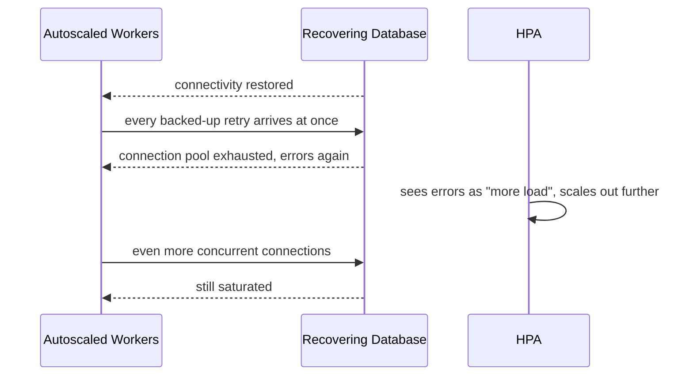

# Autoscaling — Senior

<!-- level-focus -->
At senior level, focus on this question:

> What invariant must hold when autoscaling reacts to a traffic surge, and what evidence proves the newly added capacity doesn't just shift the bottleneck downstream or trigger a scale storm that makes the incident worse?

Use the smallest realistic scenario that exposes the decision and its failure behavior.

---

## Core Concept 1 — The Invariant: Added Capacity Must Be Absorbable, Not Just Producible

A middle-level configuration gets the HPA reacting to the right signal with sane policies. A senior-level review states an explicit invariant: **every replica count the autoscaler can reach must be one the rest of the system — downstream databases, connection pools, rate-limited dependencies, the node fleet itself — can actually absorb.** An autoscaler that can *compute* a desired replica count is not the same as a system that can *serve* at that replica count.

The practical consequence: `maxReplicas` is not a cost-control knob chosen in isolation. It is the minimum of several ceilings — the HPA's own configured maximum, the number of Pods the node fleet can schedule, and the replica count at which a shared downstream resource (a database's `max_connections`, a partner API's rate limit) breaks. A plan that only checks the first ceiling will pass every normal load test and still fail the first real surge that pushes replicas past whichever ceiling was never modeled.

## Core Concept 2 — Failure Modes Specific to the Scaling Mechanism

These are properties of *how autoscaling works*, not of the traffic pattern it's responding to — they exist even when the growth forecast is accurate.

**Thrashing from a noisy metric.** A target set too close to a metric's normal operating range means ordinary variance crosses it constantly, producing rapid scale up/down cycles. Each cycle carries real cost: new Pods cold-start, in-flight connections on terminated Pods are cut unless drained, and the churn itself consumes cluster scheduling capacity. The fix lives in the stabilization window and target placement, not in chasing a "better" metric.

**Scale-up lag under a fast surge.** Between the moment a metric crosses target and the moment a new replica is actually warm and serving (image pull, application startup, cache/connection-pool warm-up, and — if no node has room — full node provisioning), demand keeps climbing. If the surge outpaces this lag structurally, no amount of HPA tuning closes the gap; only pre-provisioned headroom or predictive/scheduled scaling can.

**Cluster Autoscaler node-provisioning lag compounding Pod-level lag.** The HPA's seconds-scale reaction sits in front of the Cluster Autoscaler's minutes-scale reaction. A `maxReplicas` set high enough to look safe on paper can still leave Pods `Pending` for minutes during exactly the surge it was meant to absorb.

**Scale-in during a recovery causing a second incident.** When a dependency that was failing recovers, every Pod that was queuing, retrying, or backed up hits it at once — a version of thundering herd triggered by *recovery*, not by the original surge:

Note the last step: an autoscaler that reacts to error rate or latency as a scale-out signal can make this specific failure *worse* — adding replicas increases concurrent connection attempts against a database that was already the bottleneck, not helped by it.

## Core Concept 3 — VPA and HPA: Don't Point Both at the Same Signal

Vertical Pod Autoscaler (resizing a Pod's CPU/memory request) and Horizontal Pod Autoscaler (changing replica count) can both react to CPU. Running both against the same resource metric on the same workload creates a race: VPA changes the CPU request, which changes the denominator the HPA's percentage is computed against, which changes the HPA's desired replica count, which changes per-Pod load, which VPA then reacts to again. The stable pattern is to split responsibility — VPA on memory (which HPA rarely targets well) while HPA handles CPU or a custom/external metric, or run VPA in recommendation-only mode and apply its suggestions deliberately rather than automatically alongside a live HPA on the same signal.

## Core Concept 4 — Evidence Over Configuration

A `maxReplicas` value or a stabilization window is only trustworthy to the degree it was validated, not assumed:

- **Load-test to the real ceiling, not an extrapolated one.** Run traffic until something actually breaks — a connection pool exhausts, a node group hits its own quota — and confirm that ceiling is at or above the replica count your worst-case forecast requires. A benchmark stopped early and extrapolated linearly hides exactly the non-linear breakdowns (connection exhaustion, GC pauses under many small Pods) that matter here.
- **Scale-storm drills.** Deliberately simulate a dependency recovering after an outage while the autoscaler is live, and confirm the system doesn't repeat Core Concept 2's recovery-thundering-herd pattern. A design that "should" handle this on paper is an assumption until drilled.
- **Cross-check the composed ceiling.** For any workload with a downstream dependency (a database, a rate-limited API), calculate `desired_max_replicas × per-replica_resource_use` against that dependency's actual limit, the same way a connection-pool budget is checked against `max_connections`. If nobody has performed this arithmetic, the `maxReplicas` value is a guess wearing a number.

## Core Concept 5 — Cross-Component Scenario: Two Designs for a Payment Retry Surge

A payment-processing worker pool scales via KEDA on queue depth, each replica holding a pool of 15 connections to a payments database capped at `max_connections: 300`.

| Design | Behavior under a 10x retry surge (a downstream partner API recovers after an outage) | Trade-off |
|---|---|---|
| **A: Hard ceiling derived from the shared resource** — `maxReplicaCount` capped at `floor(300 / 15) = 20`, enforced regardless of queue depth | Database never sees more than its rated connection load; queue may back up temporarily but the database stays healthy | Backlog drains slower during the surge; requires a second lever (priority queue, backpressure to callers) to bound end-user latency |
| **B: Uncapped scaling tied only to queue depth** — `maxReplicaCount` set high (e.g., 60) to drain the backlog as fast as possible | Backlog drains fast under moderate surges | At the full 10x surge, replica count can reach 60 × 15 = 900 connections against a 300-connection ceiling — the database saturates, every replica starts failing, and the worsening error rate can itself look like "more load" to a naive scaling policy (Core Concept 2) |

Design A trades faster backlog drain for a validated invariant that holds without depending on anyone catching the composed limit in real time. Design B is cheaper to configure and looks fine in a moderate-load test, but the senior-level judgment is checking what happens at the *actual* worst case, not the case the initial load test happened to cover — and here, "cap the autoscaler at what the shared resource can take" is not a compromise, it's the invariant from Core Concept 1 made concrete.

## Core Concept 6 — Questions That Expose Weak Assumptions

- "Is `maxReplicas` derived from a shared downstream resource's actual limit, or was it picked as a number that felt safe?"
- "If every currently-queued retry hit this service's dependency at once, would the connection/rate-limit math still hold — and has that been drilled, or only reasoned about?"
- "Does this autoscaler treat error rate or latency as a scale-out signal? If so, what happens when the errors are caused by a saturated downstream dependency instead of insufficient replicas?"
- "How long does it actually take a new replica to go from 'scheduled' to 'absorbing real traffic' here — and is that faster or slower than this workload's fastest realistic traffic surge?"
- "Are VPA and HPA both configured against the same metric on this workload, and if so, has anyone confirmed they don't fight each other?"

## Core Concept 7 — Recovery and Evolution

An autoscaling design needs a trigger for revisiting it, the same as a capacity plan does: a new downstream dependency added without updating `maxReplicas`, a scale-storm drill that didn't hold, a thrashing incident that wasn't predicted, or a VPA/HPA conflict discovered after the fact. Treat "the autoscaler did something we didn't expect" as a finding worth recording — it usually reveals either a ceiling that was never derived from a real limit, or a signal (error rate, latency) that was scaling out in response to the wrong kind of problem.

---

## Common Mistakes

- **Setting `maxReplicas` without checking it against a downstream shared resource's actual limit.** The payment-worker scenario above is this mistake made concrete: every layer looks fine in isolation, and the database connection ceiling is what actually breaks.
- **Using error rate or latency as a scale-out trigger without checking whether the errors are caused by a saturated dependency.** This can turn an autoscaler into an amplifier for exactly the failure it was meant to absorb.
- **Running VPA and HPA against the same metric on the same workload.** Without splitting responsibility, they can chase each other's changes indefinitely.
- **Never drilling a scale storm.** A design that "should" survive a dependency recovery after an outage is an assumption until it's actually been simulated.
- **Extrapolating a load test's safe ceiling instead of finding the real one.** Non-linear breakdowns (connection exhaustion, cold-start contention) only show up at the actual limit.

---

## Apply it

1. For one autoscaled workload you know, state its scaling invariant explicitly — for example, "replica count never exceeds what the payments database's connection limit can serve" — and name the specific downstream resource it depends on.
2. Calculate that workload's real `maxReplicas` ceiling from the shared resource's limit divided by per-replica resource use, showing the arithmetic, and compare it to the `maxReplicas` currently configured.
3. Check whether this workload's autoscaler treats error rate or latency as a scale-out signal, and if so, describe what would happen if those errors were caused by a saturated downstream dependency rather than insufficient replicas.
4. Design a scale-storm drill for this workload — simulate a dependency recovering after an outage while the autoscaler is live — and state what evidence would confirm the system doesn't repeat the recovery-thundering-herd pattern.
5. Ask the five weak-assumption questions from Core Concept 6 against this workload's real configuration, and record which one exposes the shakiest assumption.

## Verify your work

- Your stated invariant names a specific downstream resource and a specific limit, not a general "the system should scale safely."
- Your `maxReplicas` calculation shows the arithmetic (shared-resource limit ÷ per-replica use) and states whether the currently configured value is above or below that ceiling.
- Your answer on error-rate-as-scale-signal identifies a concrete failure path it could trigger or confirms the workload doesn't use that signal.
- Your scale-storm drill plan names the specific recovery scenario simulated and the specific metric (connection count, error rate) that would prove the system held.

## Review questions

- Why is a downstream resource's real capacity limit part of what determines an autoscaler's safe `maxReplicas`, not just cost or a round number?
- How can an autoscaler that treats error rate as a scale-out signal make a dependency-saturation incident worse instead of better?
- Why can running VPA and HPA against the same metric on the same workload become unstable?
- What does a scale-storm drill prove that a normal, steady-growth load test does not?
