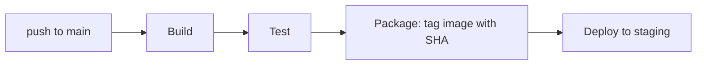

# CI/CD Pipelines — Junior

<!-- level-focus -->
At junior level, focus on this question:

> Given a single repository and a simple code change, can you build a pipeline with build, test, package, and deploy stages that produces one versioned artifact and ships it to one environment?

Use the smallest realistic scenario that exposes the decision and its failure behavior.

*A pipeline is not "the thing that runs when I push." It is a repeatable, version-controlled sequence that turns a commit into a deployable artifact and proves that artifact works before anything runs it. This level is about building that sequence correctly for one service, one path, one environment.*

---

## Core Concept 1 — Vocabulary: What a Pipeline Actually Is

| Term | Meaning |
|---|---|
| **Pipeline** | The full, automated sequence from a code change to a deployed (or deployable) result |
| **Stage** | A named phase of the pipeline (build, test, package, deploy) that groups related work |
| **Job** | A unit of work inside a stage, often running in its own isolated environment/container |
| **Step** | A single command or action inside a job |
| **Trigger** | The event that starts a pipeline run — a push, a pull request, a tag, a schedule |
| **Artifact** | The packaged, versioned output of the build (a container image, a `.jar`, a `.zip`) that everything downstream deploys |
| **Continuous Integration (CI)** | Automatically building and testing every change, frequently, so integration problems surface in minutes, not weeks |
| **Continuous Delivery/Deployment (CD)** | Automatically preparing (delivery) or automatically shipping (deployment) a tested artifact toward an environment |
| **Pipeline-as-code** | The pipeline's definition lives in a version-controlled file (e.g., `.github/workflows/ci.yml`, `.gitlab-ci.yml`) next to the code it builds |

Two of these are commonly confused: CI is about *catching problems early through frequent build-and-test*. CD is about *what happens to a build that already passed* — how it gets toward users. A repository can have excellent CI and still have no CD at all (a human copies the artifact by hand). This level focuses on connecting both into one pipeline.

## Core Concept 2 — A Repeatable Method for One Service

For a single repository with a single deploy target, run these stages in order. The order is not arbitrary — each stage should only run if the previous one succeeded, so a broken build never reaches a test, and a failing test never reaches a deploy.

1. **Trigger.** Define exactly what starts the pipeline — typically a push to a branch or a pull request. Vague triggers ("run on everything") waste compute and slow feedback.
2. **Build.** Compile or transpile the code and resolve dependencies from a lock file, so the same versions are used every time. A build that silently pulls the "latest" version of a dependency is not reproducible.
3. **Test.** Run the automated test suite against the build. This stage must be able to fail the pipeline — a test stage that only prints results without stopping the pipeline on failure provides no real gate.
4. **Package.** Produce one immutable, versioned artifact from the build that passed tests — tag it with something traceable back to the commit, such as the Git SHA.
5. **Deploy.** Ship that exact artifact to the target environment. Nothing is rebuilt at this stage; the artifact produced in step 4 is what runs.

## Core Concept 3 — Worked Example: a Small Node Service

A repository `order-notifier` has one CI/CD pipeline file. On every push to `main`, it should build, test, package a container image tagged with the commit SHA, and deploy that image to a single `staging` environment.

```yaml
# .github/workflows/ci-cd.yml
name: CI/CD

on:
  push:
    branches: [main]

jobs:
  build-test-package:
    runs-on: ubuntu-latest
    steps:
      - uses: actions/checkout@v4

      - uses: actions/setup-node@v4
        with:
          node-version: "20"

      - name: Install dependencies
        run: npm ci                     # ci, not install — uses the lock file exactly

      - name: Build
        run: npm run build

      - name: Test
        run: npm test                   # a nonzero exit here stops the pipeline

      - name: Set image tag
        id: tag
        run: echo "sha=${GITHUB_SHA::7}" >> "$GITHUB_OUTPUT"

      - name: Build and push image
        run: |
          docker build -t registry.example.com/order-notifier:${{ steps.tag.outputs.sha }} .
          docker push registry.example.com/order-notifier:${{ steps.tag.outputs.sha }}

  deploy-staging:
    needs: build-test-package
    runs-on: ubuntu-latest
    environment: staging
    steps:
      - name: Deploy image to staging
        run: |
          ./deploy.sh registry.example.com/order-notifier:${{ needs.build-test-package.outputs.sha }} staging
```

Trace the flow:



Two details matter more than they look like they should. First, the image tag is the commit SHA, not `latest` — so anyone can answer "what code is running in staging?" by reading the tag. Second, `deploy-staging` uses `needs: build-test-package` — it cannot start until the first job finishes successfully, so a failing test genuinely blocks the deploy rather than merely warning about it.

## Core Concept 4 — Reading a Pipeline Run

Writing the pipeline file is only half the skill; reading its output is the other half, and it's the part that catches problems fastest. Every run produces the same shape of information, whichever tool you use:

| What to check | What it tells you |
|---|---|
| **Overall status** (passed / failed / running) | Whether it's safe to consider this commit deployed anywhere |
| **Which stage failed** | Narrows the problem to build, test, package, or deploy before you open a single log |
| **The failing step's log output** | The actual error — a compiler error, a failing assertion, a registry auth rejection |
| **The artifact tag produced** | What exactly would be (or was) deployed, so you can compare it against what's currently running |
| **Duration per stage** | Whether the pipeline is getting slower over time, which erodes how often people are willing to run it |

A common beginner habit is re-running a failed pipeline immediately, hoping it passes the second time, without reading which stage failed or opening the log. That treats the pipeline as a slot machine instead of a diagnostic tool. If the test stage failed, the log will show which test and why — that's almost always faster to read than to guess around.

## Core Concept 5 — When a Pipeline Is Actually Done

A first pipeline for one service is complete when it has all of these:

1. A **defined trigger** — you can state exactly what causes a run, not "it runs sometimes."
2. A **test stage that can fail the pipeline** — verified by actually breaking a test and watching the deploy stage not run.
3. A **versioned artifact**, traceable to a specific commit, not overwritten by every subsequent build.
4. A **deploy stage that uses the artifact from the package stage**, never rebuilding at deploy time.
5. A **way to see the result** — the pipeline run's status is visible without SSHing into a server or guessing.

## Common Mistakes

- **Tagging every image `latest`.** Nobody can tell which commit is actually deployed, and a rollback has nothing specific to roll back to.
- **A test stage that doesn't gate anything.** Tests run and print a report, but the pipeline continues to deploy even when they fail — this is CI in name only.
- **Rebuilding at deploy time.** Running `npm run build` again inside the deploy step means staging might not be running what was actually tested; a dependency could resolve differently between the two builds.
- **Committing secrets directly into the pipeline file.** An API key pasted into a YAML step is now in the repository's history forever, even if it's deleted in the next commit.
- **No visible pipeline status.** If a teammate cannot look at one place and see "build #482 passed, deployed to staging," the pipeline isn't actually providing confidence — it's just automation nobody trusts.

---

## Apply it

1. Pick one small repository (or create a toy one) and write a pipeline file with four stages: build, test, package, deploy — using GitHub Actions or GitLab CI, whichever your team already uses.
2. Make the package stage tag its artifact with the Git commit SHA, and make the deploy stage reference that exact tag rather than rebuilding.
3. Deliberately break a test and push the change; confirm the pipeline stops before the deploy stage runs, and record what you observed (which stage failed, what the pipeline UI showed).
4. Fix the test, push again, and confirm the full pipeline runs through to a successful deploy with a new, distinct artifact tag.
5. Write one sentence stating how a teammate — without asking you — could find out which commit is currently deployed.

## Verify your work

- The pipeline file defines exactly four stages in order, and the deploy stage explicitly depends on the earlier stages succeeding.
- A deliberately broken test actually stops the pipeline before deploy — you saw this happen, not just assumed it would.
- Two separate successful runs produced two different, traceable artifact tags, not the same tag overwritten twice.
- Someone other than you can identify the currently deployed commit using only the pipeline's own output.

## Review questions

- What is the difference between Continuous Integration and Continuous Delivery/Deployment?
- Why must the deploy stage use the exact artifact produced by the package stage instead of rebuilding?
- What observable behavior proves a test stage can actually fail the pipeline, rather than just report results?
- Why does tagging every artifact `latest` make a rollback harder?
