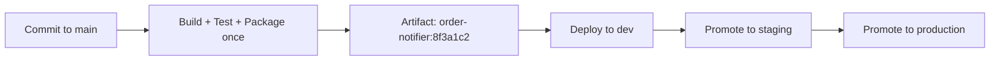

# CI/CD Pipelines — Middle

<!-- level-focus -->
At middle level, focus on this question:

> Across dev, staging, and production, how do you structure a pipeline so the same artifact is built once and promoted through environments — rather than rebuilt for each one — while keeping the pipeline fast and trustworthy?

Use the smallest realistic scenario that exposes the decision and its failure behavior.

*A junior pipeline proves one artifact works in one place. A middle-level pipeline proves the same artifact keeps working as it moves through several places, each with different config, different risk tolerance, and a different set of people watching it.*

---

## Core Concept 1 — Build Once, Deploy Many

The single most important structural decision in a multi-environment pipeline: the artifact is built and packaged **exactly once**, then the *same* artifact is promoted through dev, staging, and production. What changes between environments is configuration and approval gates — never the binary, image, or package itself.

The alternative — rebuilding for each environment — introduces a question nobody can answer with confidence: did staging actually test the thing that's now running in production, or did a dependency resolve differently on the second build? Build-once-deploy-many closes that question by construction: the artifact tag that passed staging is the literal artifact tag deployed to production.



## Core Concept 2 — Evaluating Competing Choices

Several structural decisions recur once a pipeline crosses more than one environment. None has a single correct answer — each trades speed against safety differently.

| Decision | Option A | Option B | What it trades off |
|---|---|---|---|
| **Promotion gate** | Fully automatic promotion on passing tests | Manual approval required before staging→prod | Speed of delivery vs. a deliberate human checkpoint for risk-sensitive changes |
| **Environment config** | Baked into the artifact per environment | Injected at deploy time from environment-specific config/secrets store | Simplicity of a single artifact vs. strict separation of "what we tested" from "where it runs" |
| **Test placement** | All tests run before packaging | Some tests (smoke, integration) run *after* deploying to each environment | Faster packaging vs. catching environment-specific problems (DNS, real credentials, network policy) that unit tests can't see |
| **Pipeline scope** | One pipeline definition per service | One shared, reusable pipeline template used by many services | Flexibility per service vs. consistency and lower maintenance cost across a fleet |

The middle-level skill is choosing deliberately per situation, not defaulting to whichever option is easiest to set up first. A payments-adjacent service usually needs a manual gate before production; an internal admin tool usually doesn't. Baking config into the artifact is tempting because it's simple, but it silently reintroduces "we didn't actually test what's running" the moment an environment-specific value differs.

## Core Concept 3 — Under- and Over-Application Signals

**Over-applied (too much ceremony for the risk):**
- Every promotion, even to a low-traffic internal dev environment, requires a manual approval — slowing feedback without reducing any real risk, since a broken dev deploy affects nobody but the team that just pushed it.
- A pipeline rebuilds the artifact separately for dev, staging, and production "to be safe," multiplying build time and reintroducing the exact drift build-once-deploy-many exists to prevent.

**Under-applied (too little rigor for the risk):**
- Production deploys happen straight from a developer's local machine or an ad hoc script, bypassing the pipeline entirely "just this once" — which means the audit trail, the tests, and the approval gate all silently don't apply to that release.
- Environment-specific secrets are hardcoded into the pipeline file per environment, rather than pulled from a secrets store at deploy time, so promoting a change means editing pipeline YAML instead of just retagging an artifact.

The pattern to watch for: gates and rigor should scale with the *blast radius* of the target environment, not be applied uniformly everywhere or skipped everywhere.

## Core Concept 4 — Incremental Adoption

Introducing environment promotion into an existing single-environment pipeline works better as a sequence than a rewrite:

1. **Add a staging environment first**, deploying the same artifact that dev already uses, with no new gates yet — just prove the artifact runs unmodified in a second place.
2. **Externalize environment-specific configuration** (URLs, feature flags, credentials) out of the codebase and into a config/secrets mechanism the deploy step reads at runtime, so the artifact itself never differs between environments.
3. **Add a smoke test stage after each deploy** — a handful of requests against real endpoints — to catch what unit tests structurally cannot: DNS misconfiguration, missing environment variables, network policy blocking a call.
4. **Add the production promotion gate last**, once dev→staging is proven reliable, so the team has evidence (not hope) that the pipeline mechanics themselves are sound before production risk is added.
5. **Only after several stable release cycles**, consider automating the production gate for low-risk changes (e.g., auto-promote if smoke tests pass and no incident is open), keeping manual approval for higher-risk categories.

## Core Concept 5 — Scenario: Promoting `order-notifier` Through Three Environments

`order-notifier` now has three environments. The GitLab CI pipeline below builds once and reuses the artifact by reference across all three:

```yaml
# .gitlab-ci.yml
stages:
  - build
  - test
  - package
  - deploy-dev
  - deploy-staging
  - deploy-prod

build:
  stage: build
  script:
    - npm ci
    - npm run build

test:
  stage: test
  script:
    - npm test

package:
  stage: package
  script:
    - docker build -t $CI_REGISTRY_IMAGE:$CI_COMMIT_SHORT_SHA .
    - docker push $CI_REGISTRY_IMAGE:$CI_COMMIT_SHORT_SHA

deploy-dev:
  stage: deploy-dev
  environment: dev
  script:
    - ./deploy.sh $CI_REGISTRY_IMAGE:$CI_COMMIT_SHORT_SHA dev

deploy-staging:
  stage: deploy-staging
  environment: staging
  script:
    - ./deploy.sh $CI_REGISTRY_IMAGE:$CI_COMMIT_SHORT_SHA staging
    - ./smoke-test.sh staging       # hits real staging endpoints, not mocks
  needs: ["deploy-dev"]

deploy-prod:
  stage: deploy-prod
  environment: production
  script:
    - ./deploy.sh $CI_REGISTRY_IMAGE:$CI_COMMIT_SHORT_SHA production
  needs: ["deploy-staging"]
  when: manual                     # explicit human approval gate before production
```

Notice `$CI_REGISTRY_IMAGE:$CI_COMMIT_SHORT_SHA` appears identically in all three deploy jobs — the same tag, never rebuilt. `deploy-prod` carries `when: manual`, the deliberate gate from Core Concept 3, while dev and staging promote automatically. The smoke test after staging is the environment-specific check that a unit test suite run before packaging could never have caught.

## Core Concept 6 — Verifying at Unit and Integrated-Flow Level

**Unit-level checks** (fast, run on every pipeline change):
- A linter or schema check on the pipeline file itself confirms required stages exist and required jobs declare `needs` correctly — a pipeline structure bug should be caught before it's used, not discovered mid-release.
- A test confirms the packaging step's tag is derived from the commit SHA, not a static or manually-set string, so it's impossible to accidentally reintroduce `latest`.

**Integrated-flow checks** (slower, run against the real system):
- After each environment's deploy job, the smoke test suite exercises the real deployed service (a handful of representative requests, not internal unit calls) and fails the pipeline if the deployed instance doesn't behave as expected.
- Periodically, verify by hand that the artifact tag running in production matches the tag that passed staging — this is the sentence that build-once-deploy-many should always make trivially true, and if it isn't, the pipeline is rebuilding somewhere it shouldn't be.

## Common Mistakes

- **Rebuilding per environment "just to be safe."** This defeats the entire purpose of build-once-deploy-many and reintroduces exactly the drift it exists to prevent.
- **Applying the same gate rigor everywhere.** Either every environment requires manual approval (slowing dev/staging for no safety benefit) or none does (removing the one deliberate human checkpoint production usually needs).
- **Smoke tests that call internal mocks instead of the real deployed service.** This passes even when the actual deployment is broken, because it never touches what was actually deployed.
- **Environment config drift.** Staging and production configs are edited independently over time until nobody can say confidently what actually differs between them — config, like code, needs its own version control.
- **No `needs` (or equivalent) between environment stages.** Without an explicit dependency, a slow dev deploy and a fast staging deploy can race, and staging can end up running before dev even finishes, silently breaking the intended promotion order.

---

## Apply it

1. Take a pipeline you own (or the junior-level example) and add a second environment, using the exact same artifact tag for both deploys — no rebuild step in either.
2. Externalize one piece of environment-specific configuration (a URL, a flag, a credential) out of the codebase and into a mechanism the deploy step reads at runtime.
3. Add a smoke-test stage that runs after each deploy and calls a real endpoint of the freshly deployed service — not an internal mock — and make it capable of failing the pipeline.
4. Add a manual approval gate before the highest-risk environment only, leaving the lower-risk environments on automatic promotion.
5. Write down, in one sentence per environment, what differs between them (config, gate, approval) and confirm the artifact itself is the one thing that does not.

## Verify your work

- The same artifact tag appears in the deploy step for every environment in your pipeline definition — grep for it and confirm there's exactly one build/package step upstream of all of them.
- The smoke test genuinely fails the pipeline when pointed at a deliberately broken deployment (test this by temporarily breaking the target environment).
- The manual gate blocks promotion to the highest-risk environment until explicitly approved, while lower environments continue promoting automatically.
- Your one-sentence-per-environment summary correctly identifies config and gates as the only differences, with the artifact itself constant across all of them.

## Review questions

- Why does build-once-deploy-many close the question of "did staging actually test what's in production"?
- What determines whether a promotion gate should be automatic or require manual approval?
- Why can a smoke test catch failures that a pre-packaging unit test suite structurally cannot?
- What signal tells you a pipeline has too much ceremony versus too little for a given environment?
