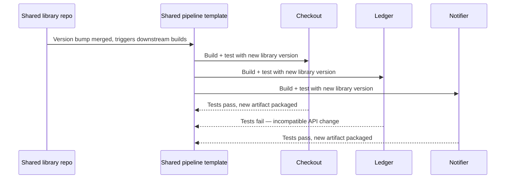

# CI/CD Pipelines — Senior

<!-- level-focus -->
At senior level, focus on this question:

> How do you architect a CI/CD pipeline so its core invariants — build-once, immutable artifacts, an auditable path from commit to production — hold as the number of services, teams, and deployment targets grows, and so it degrades safely when a stage fails, is bypassed, or lies?

Use the smallest realistic scenario that exposes the decision and its failure behavior.

*A middle-level pipeline correctly promotes one artifact through three environments. A senior-level pipeline architecture is correct when fifteen services, six teams, and a shared runner fleet are all using the same mechanism, and it has to keep being correct after the next migration, the next security incident, and the next team that tries to skip a stage under deadline pressure.*

---

## Core Concept 1 — Separate the Pipeline Definition Layer From the Environment Configuration Layer

The architectural mistake that causes the most drift at scale is letting environment-specific detail leak into the pipeline's logic instead of staying in externalized configuration. If the *steps* a pipeline runs differ meaningfully between staging and production — different build flags, different test suites, a different packaging process — then "the same artifact was promoted" stops being true even if the deploy commands look similar.

The fix is a clean boundary between two layers:

- **Pipeline definition layer** — the sequence of stages (build, test, package, deploy) and its logic. This should be identical regardless of target environment, ideally expressed as a single reusable template or workflow that every environment invokes the same way.
- **Environment configuration layer** — everything that varies: URLs, resource limits, secrets, feature flags, the approval gate itself. This lives outside the pipeline's logic, in environment-specific config or a secrets manager, injected at deploy time.

When these layers are entangled — a pipeline file with `if environment == "prod"` branches sprinkled through its build and test logic — the artifact that reaches production was never exactly what staging validated, and nobody can point to the moment the two diverged.

## Core Concept 2 — Invariants

| Invariant | Statement | Why it must hold |
|---|---|---|
| **Build-once, immutable artifact** | An artifact is built and packaged exactly once per commit, given an identity it never loses (a content-addressable tag), and never modified in place after packaging | Without this, "staging tested it" and "prod is running it" can silently refer to two different things |
| **No pipeline bypass** | Every deployment to a shared environment happens through the pipeline; no direct, ad hoc deploy path exists | An unaudited deploy path means the pipeline's gates, tests, and audit trail have a hole exactly where risk is highest |
| **Auditable lineage** | Any artifact running anywhere can be traced back to the exact commit, the exact test run, and the exact approval that produced it | Incident response and compliance both depend on being able to answer "what changed, and who approved it?" without guessing |
| **Config-code separation** | Environment-specific values never live inside the pipeline's build/test logic | Keeps the definition layer identical across environments, so promotion is a config change, not a logic change |

These invariants have to hold independent of which team or service is running through the pipeline — which is why they belong in shared infrastructure (templates, policy checks), not in each team's individual discipline.

## Core Concept 3 — Failure Modes

- **Flaky-test override culture.** A test that fails intermittently gets re-run until it passes, or is quietly marked "skip for now" under deadline pressure. Once this pattern normalizes, the test stage stops being a real gate — it becomes a formality the team has learned to route around, and it usually stays broken exactly when it would have caught something real.
- **Secret sprawl across environment configs.** As environments and services multiply, credentials get copied into more places (per-repo secrets, per-environment variable files) than anyone tracks. A leaked credential in one forgotten pipeline config becomes a production incident with no clear owner of "how did that get there."
- **Supply-chain compromise through the pipeline itself.** A pipeline typically has broad permissions (registry push, cloud deploy credentials) and pulls in third-party actions, plugins, or base images. An unpinned third-party action or an unverified base image gives an attacker a path directly into the build process — a category of risk distinct from application-level vulnerabilities, because it targets the thing that has permission to ship code everywhere.
- **Pipeline as a single point of failure.** When the entire organization's ability to deploy runs through one shared CI system, an outage or misconfiguration there doesn't just block one team's release — it can block every team's release simultaneously, including an urgent hotfix for an unrelated incident.
- **Artifact identity drift.** A tag that *looks* immutable (like a version number) gets overwritten because someone re-pushed under the same tag after a hotfix, silently breaking the assumption that "this tag always means this exact content."

## Core Concept 4 — Evidence Over Assumption

A senior-level pipeline architecture is validated against evidence, not confidence:

- **The DORA four keys** — deployment frequency, lead time for changes, change failure rate, and time to restore service — are a widely used, well-established way to judge whether the pipeline is actually helping teams ship safely and often, rather than just existing. A pipeline that looks sophisticated but hasn't moved these numbers is optimizing the wrong thing.
- **Artifact provenance verification** — confirming, for a given artifact, exactly which commit, dependency versions, and test results produced it (an SBOM and a signed build attestation are common mechanisms) — checked *before* trusting an artifact makes it to production, not reconstructed afterward during an incident.
- **Pipeline duration and queue-time trend**, tracked over time, not a single run — a pipeline that has quietly grown from an eight-minute to a forty-minute round trip changes team behavior (batching more changes per deploy, running fewer, smaller-batch releases) even if no single change to the pipeline caused it.
- **A traced audit path exercised for real**, not assumed to exist — pick a production artifact and confirm you can actually walk back to its commit, its test run, and its approval, end to end, using only the pipeline's own records.

## Core Concept 5 — Cross-Component Scenario: a Shared-Library Version Bump Across Five Services

A payments organization has five services (`checkout`, `ledger`, `notifier`, `refunds`, `reporting`) that all depend on a shared internal library. A security patch requires bumping that library everywhere. Each service has its own pipeline built from the same shared template, each promoting independently through dev → staging → production with its own manual gate before production.

What the invariants buy the organization here: because every service uses the same pipeline template (Core Concept 1), the failure in `ledger` is caught by *its own* test stage using the *same* gate logic every other service uses — not a bespoke, possibly weaker check someone wrote for that service. Because build-once-deploy-many holds, `checkout` and `notifier` can each promote their own newly built artifact independently; `ledger`'s failure blocks only `ledger`, not the other four services, because there is no shared "one pipeline run for all five" step that would have coupled their fates together.

## Core Concept 6 — Trade-offs Among Plausible Approaches

| Approach | Consistency across services | Team autonomy | Blast radius of a pipeline platform failure | Best fit |
|---|---|---|---|---|
| **One shared, centrally-owned pipeline template** | High — every service gets the same gates and audit trail | Lower — teams must request template changes | An outage or bug in the template affects every consuming service at once | Organizations prioritizing consistent governance and audit over per-team customization |
| **Fully independent, per-service pipelines** | Low — each team invents its own stages and gates | Highest | Contained to one service | Small organizations, or services with genuinely unusual build/deploy needs |
| **A shared template with defined extension points** | High on required gates, flexible on service-specific steps | Moderate — teams customize within guardrails | Failure in the required-gate logic is shared; service-specific extensions are isolated | Most mid-to-large organizations — the usual middle ground |

No option eliminates risk; each relocates it. A fully centralized template concentrates platform risk in one place but makes it easy to prove every service meets a security or audit requirement. Fully independent pipelines contain failure but make "does every service actually run its tests before deploying" an unanswerable question without auditing each one by hand.

## Core Concept 7 — Questions That Expose Weak Assumptions

- If the shared pipeline platform went down right now, is there any deploy path — including an "emergency" one — that would bypass the audit trail and gates entirely?
- For an artifact currently running in production, can someone actually produce its originating commit, test run, and approval right now, or would that require reconstructing history from memory and Slack messages?
- Which third-party actions, plugins, or base images does this pipeline pull in without a pinned version or verified checksum, and what could one of them do if compromised?
- Has the flaky-test override actually been exercised recently — and if so, what did the team learn about why it was flaky, or did the override just make the question go away?

## Core Concept 8 — Recovery and Evolution

- **Rollback as redeploy, not rebuild.** Recovering from a bad release means redeploying the last known-good artifact by its immutable tag — never rebuilding from an older commit, which could resolve dependencies differently and produce something that was never actually tested.
- **Pipeline template versioning.** The shared template itself should be versioned, so a breaking change to it can roll out to a pilot service first, rather than instantly changing behavior for every consuming service simultaneously (the same build-once-deploy-many discipline applied to the pipeline's own logic, not just application artifacts).
- **A mandatory review trigger on new third-party dependencies.** Any new action, plugin, or base image entering the pipeline should trigger a lightweight security review before adoption — the same way a new production dependency triggers one — since the pipeline itself is now part of the organization's attack surface, not just a convenience.

---

## Apply it

1. For one pipeline you're familiar with, identify one place where environment-specific logic (not just config) has leaked into the shared pipeline definition — an `if environment == "prod"` branch in build or test logic counts.
2. Pick one artifact currently deployed somewhere and attempt to trace it back to its originating commit, test run, and approval using only the pipeline's own records. Note where the trail breaks down, if it does.
3. List every third-party action, plugin, or base image your pipeline depends on, and check whether each is pinned to a specific version or checksum rather than a moving tag like `latest` or `main`.
4. For a service that shares a pipeline template with others, describe what would happen to the other services if this one service's build broke — confirm the failure is actually contained, not coupled.
5. Write the one question from Core Concept 7 that you're least confident you could answer right now, and identify who in your organization could actually answer it.

## Verify your work

- You found a concrete instance of environment-specific logic in pipeline definition code, or can state confidently that none exists and why you're confident.
- The artifact trace either succeeds end-to-end using only pipeline records, or you've identified the exact point where lineage is lost.
- You have a complete list of unpinned third-party pipeline dependencies, not just "we probably don't have any."
- You can state precisely what breaks and what doesn't when one service's shared-template build fails, backed by the pipeline's actual `needs`/dependency structure rather than an assumption.

## Review questions

- Why does environment-specific logic inside the pipeline's build or test steps undermine the build-once-deploy-many invariant even when the deploy commands look identical?
- What distinguishes a pipeline outage that blocks one service from one that blocks an entire organization's ability to deploy?
- Why is a flaky test that gets overridden repeatedly a bigger risk than a test that fails consistently?
- What evidence would prove an artifact's audit trail is real, rather than merely assumed to exist?
