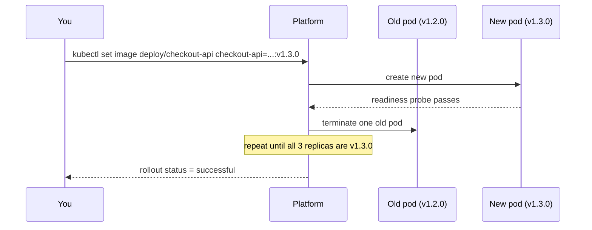

# Deployment Strategies — Junior

<!-- level-focus -->
At junior level, focus on this question:

> How can I run a rolling update on a small service and prove it replaced every old pod without dropping traffic?

Use the smallest realistic scenario that exposes the decision and its failure behavior.

## What a deployment strategy actually decides

Shipping new code is easy. Shipping it into a service that is already handling live traffic, without an outage, is the actual problem a **deployment strategy** solves. A deployment strategy is just the answer to one question: *while the old version is being replaced by the new one, who serves traffic, in what order, and what happens if the new version is broken?*

You will meet three names constantly. At this level, know what each one is, not yet how to choose between them (that's the middle-level question):

- **Rolling update** — replace old instances with new ones a few at a time, so some old and some new are always serving traffic during the transition.
- **Blue-green** — run a full second copy of the environment ("green") next to the live one ("blue"), then switch all traffic over at once.
- **Canary** — send a small slice of traffic to the new version first, watch it, then gradually send more.

This guide is about the first one, because it's the one you'll perform yourself the most, and the other two are easiest to understand once rolling update's mechanics are second nature.

## Vocabulary you need before touching a cluster

- **Replica** — one running copy (pod) of your service. A Deployment usually runs several replicas so it can survive one dying and handle more traffic.
- **Readiness probe** — a check the platform runs against a pod to decide *"can this pod receive traffic yet?"* A pod that has started but hasn't finished loading its config is running but not ready.
- **Liveness probe** — a check that decides *"is this pod still healthy, or should it be killed and restarted?"* Different question from readiness: a pod can be alive but not ready.
- **Rollout** — the act of replacing the old version with the new one, and everything the platform does automatically to make that safe.
- **Rollback** — reverting to the previous working version when the new one turns out to be broken.

## The rolling update, step by step

A rolling update never takes all replicas down at once. It replaces them in small batches, checking each new batch's health before touching the next one. On Kubernetes, this is the default `Deployment` strategy:

```yaml
apiVersion: apps/v1
kind: Deployment
metadata:
  name: checkout-api
spec:
  replicas: 3
  strategy:
    type: RollingUpdate
    rollingUpdate:
      maxUnavailable: 1   # at most 1 of 3 replicas may be down during the update
      maxSurge: 1         # at most 1 extra replica may exist above the normal 3
  template:
    spec:
      containers:
        - name: checkout-api
          image: registry.example.com/checkout-api:v1.2.0
          readinessProbe:
            httpGet:
              path: /healthz
              port: 8080
            initialDelaySeconds: 5
            periodSeconds: 5
          livenessProbe:
            httpGet:
              path: /healthz
              port: 8080
            periodSeconds: 10
```

Walk through what happens when you change the image tag from `v1.2.0` to `v1.3.0`:

1. The platform creates **1 new pod** running `v1.3.0` (allowed by `maxSurge: 1`, so you briefly have 4 pods).
2. It waits for that new pod's **readiness probe** to pass before sending it any traffic.
3. Once the new pod is ready, the platform removes **1 old pod** running `v1.2.0` (allowed by `maxUnavailable: 1`).
4. It repeats steps 1–3 until all 3 replicas are running `v1.3.0` and all pass readiness.



The key property: at every moment during the rollout, both `v1.2.0` and `v1.3.0` pods are serving live traffic side by side. That's the trade you're making — you avoid downtime, but for a few minutes your service is answering requests with two different versions of your code at once.

## Worked example: doing it and watching it happen

Assume `checkout-api` is already running with the Deployment above, at `v1.2.0`, 3/3 replicas ready.

**Step 1 — trigger the rollout and watch it live:**

```bash
kubectl set image deployment/checkout-api checkout-api=registry.example.com/checkout-api:v1.3.0
kubectl rollout status deployment/checkout-api
```

Expected output while it progresses:

```
Waiting for deployment "checkout-api" rollout to finish: 1 out of 3 new replicas have been updated...
Waiting for deployment "checkout-api" rollout to finish: 2 out of 3 new replicas have been updated...
deployment "checkout-api" successfully rolled out
```

**Step 2 — confirm zero dropped requests during the switch.** While the rollout runs, hit the service in a loop from another terminal:

```bash
while true; do curl -s -o /dev/null -w "%{http_code}\n" http://checkout-api.internal/healthz; sleep 0.2; done
```

If every line prints `200`, the rollout was seamless. Any `5xx` or connection error during the window means a pod took traffic before it was truly ready — usually a missing or too-shallow readiness probe.

**Step 3 — break it on purpose, then roll back.** Push a tag that crashes on startup:

```bash
kubectl set image deployment/checkout-api checkout-api=registry.example.com/checkout-api:v1.4.0-broken
kubectl rollout status deployment/checkout-api --timeout=60s
# ... times out: new pods never become Ready, old pods are never removed
kubectl rollout undo deployment/checkout-api
kubectl rollout status deployment/checkout-api
```

Because `maxUnavailable: 1`, the platform never removed more old pods than the broken new ones could safely replace — the old, working pods kept serving throughout. `rollout undo` returns you to `v1.3.0` the same way you got to it: one small batch at a time.

## Success criteria

A rolling update is done correctly when, and only when:

- `kubectl rollout status` reports success (not just "the apply command didn't error").
- Replica count matches desired count, and every replica is on the new image (`kubectl get pods -o wide`).
- The health-check loop showed no failed requests during the transition.
- You know the one command (`kubectl rollout undo`) that gets you back if it goes wrong, and you've actually tried it once.

## Common mistakes at this level

- **No readiness probe at all.** Without one, the platform assumes a pod is ready the instant its container starts, and sends it traffic before your app has finished loading config or warming a connection pool. Requests fail against a technically-running pod.
- **`maxUnavailable` too high for a small replica count.** With `replicas: 3` and `maxUnavailable: 2`, the platform can take down 2 of 3 pods at once — a third of your capacity is now carrying all the traffic, or less if the third pod is also mid-restart.
- **Treating `kubectl apply` succeeding as "the deploy worked."** `apply` only means the platform *accepted* your new desired state. It says nothing about whether the new pods actually became healthy. Always follow with `kubectl rollout status`.
- **Walking away before the rollout finishes.** A stuck rollout (crashlooping new pod, failing readiness forever) sits there consuming resources and confusing the next person, unless someone watches it complete or fail.
- **No rollback rehearsal.** The first time you run `kubectl rollout undo` should not be during a real incident. Practice it against a throwaway deployment first.

## Apply it

1. Create a `Deployment` named `demo-api` with `replicas: 3`, a `RollingUpdate` strategy (`maxUnavailable: 1`, `maxSurge: 1`), and a `readinessProbe` hitting `/healthz`.
2. Start the `curl` health-check loop from a second terminal, then change the image tag to a new, working version and run `kubectl rollout status`.
3. Confirm every health-check line printed `200` during the rollout and that `kubectl get pods` shows all 3 replicas on the new tag.
4. Deploy a deliberately broken tag (one whose container exits immediately or fails `/healthz` forever) and observe `kubectl rollout status` hang or report the rollout as not progressing.
5. Run `kubectl rollout undo deployment/demo-api` and confirm `kubectl rollout status` reports success again on the previous tag.

## Verify your work

- `kubectl rollout status` printed "successfully rolled out" for the good tag, and the pods it lists are all on the new image.
- The health-check loop's output file or terminal history shows an unbroken run of `200`s across the whole rollout window.
- For the broken tag, `kubectl get pods` shows at least one pod stuck in `CrashLoopBackOff` or failing readiness, and old pods were never fully removed.
- After `rollout undo`, `kubectl describe deployment demo-api` shows the image tag back at the last known-good version and 3/3 replicas ready.

## Review questions

- What is the difference between a readiness probe and a liveness probe, and why does a rolling update depend on the readiness one?
- Why does setting `maxUnavailable: 2` on a 3-replica Deployment reduce your safety margin during a rollout?
- What observable evidence tells you a rollout finished successfully, as opposed to the `kubectl apply` command simply not returning an error?
- If a new pod never becomes ready, what does a correctly configured rolling update do to your existing, healthy old pods?
