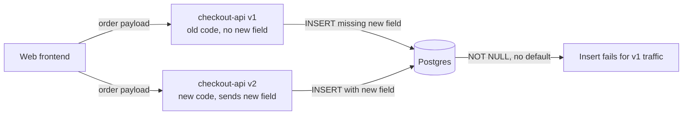

# Deployment Strategies — Middle

<!-- level-focus -->
At middle level, focus on this question:

> Given a service's risk profile, which deployment strategy — rolling, blue-green, or canary — keeps blast radius and infra cost proportionate to that risk?

Use the smallest realistic scenario that exposes the decision and its failure behavior.

## Rolling update stops being "enough" at a specific point

At junior level, rolling update was *the* deployment strategy. At this level, recognize that it is one point on a spectrum, and it has a specific weakness: **it commits gradually, but it doesn't let you observe before committing.** Once you start replacing pods, you're already exposing every user's traffic — proportionally — to the new version. If the new version has a subtle bug (wrong price calculation, a slow query plan) that doesn't crash the pod or fail readiness, a rolling update will happily roll it out to 100% of capacity while looking perfectly healthy from the platform's point of view.

That gap is exactly what blue-green and canary exist to close, each in a different way:

- **Rolling update** trades blast-radius control for simplicity and cost. Good default when a bad release usually *fails loudly* (crashes, failed health checks) rather than quietly (wrong output, slow degradation).
- **Blue-green** trades infra cost for an instant, total switch and an instant, total rollback. Good when you need certainty that the cutover is atomic — no mixed-version window at all — and you can afford to run two full environments, even briefly.
- **Canary** trades speed-to-100% for blast-radius control. Good when a bad release is more likely to be *quietly wrong* than loudly broken, and you have the observability to tell the difference on a small slice of real traffic before committing everyone.

## The comparison that should drive the choice

This is the table to keep next to the decision, not to memorize in the abstract:

| Property | Rolling update | Blue-green | Canary |
|---|---|---|---|
| **Rollback speed** | Fast — reverse the rolling update (minutes, one batch at a time) | Instant — flip the router back to the old environment (seconds) | Fast — set weight back to 0% on the new version (seconds to minutes) |
| **Infra cost during release** | Low — briefly `+1` replica (surge), never a full second environment | High — a full second environment running in parallel, even if only for minutes | Low to moderate — a small extra slice of capacity for the canary, not a full duplicate |
| **Blast radius if the new version is bad** | Proportional to how far the rollout has progressed (uncontrolled unless paused) | 100% instantly — there is no partial exposure, good or bad | Small and controlled — capped at the current traffic weight until you decide to widen it |
| **Mixed-version window** | Yes, by design — old and new coexist while rolling | No — the switch is atomic | Yes, by design — small and large versions coexist while observing |
| **Needs strong per-version observability?** | Not strictly (relies on health checks) | Not strictly (relies on a smoke test post-switch) | Yes — you must be able to tell "canary" traffic's error rate/latency apart from "stable" traffic's |
| **Detects "quietly wrong" releases before wide exposure?** | No | No (found only after the full switch) | Yes — that's the entire point |

Read the table as a decision tool, not trivia: if you can't answer "how would I know the canary is unhealthy?" with something more specific than "the pods are still running," canary buys you nothing over rolling update — you've paid for the machinery without the payoff.

## Canary in practice: a weight-shifting config

A canary needs something rolling update doesn't: a way to route a *specific percentage* of traffic to the new version while the rest goes to the old one, and a way to move that percentage up in controlled steps. A progressive-delivery controller (Argo Rollouts is a common one; Flagger is another) automates the shifting and the checking:

```yaml
apiVersion: argoproj.io/v1alpha1
kind: Rollout
metadata:
  name: checkout-api
spec:
  replicas: 10
  strategy:
    canary:
      steps:
        - setWeight: 10      # 10% of traffic to the new version
        - pause: { duration: 5m }
        - setWeight: 50      # widen once the first step looks healthy
        - pause: { duration: 10m }
        - setWeight: 100     # full cutover
  template:
    spec:
      containers:
        - name: checkout-api
          image: registry.example.com/checkout-api:v1.3.0
```

Notice what this buys you that a plain `Deployment` doesn't: a **pause** between each weight increase, during which a human (or, later, an automated check) can look at the canary's metrics and decide whether to continue, hold, or abort. At 10% weight, a bug affects roughly one-tenth of your traffic instead of all of it — and you find out before it affects the rest.

## Testability and debugging at each stage

Two separate checks matter, and confusing them is a common source of false confidence:

- **Unit-level: is the pod itself healthy?** This is the readiness/liveness probe layer from junior level — it tells you the process is up and responding, nothing about whether its *answers* are correct.
- **Integrated-flow level: is the canary's behavior actually correct?** This means running a real request through the canary specifically — often by routing on a header (`X-Canary: true`) or a small synthetic-traffic script — and asserting on the *content* of the response, not just its status code. A checkout service returning `200 OK` with the wrong total charged is a integrated-flow failure a readiness probe will never catch.

When a canary looks unhealthy, debug in that order: check whether the pods are Ready at all (unit level) before you trust any traffic-level metric coming out of them — a pod flapping between ready and not-ready will corrupt your error-rate signal and make you misdiagnose an infrastructure problem as an application bug, or vice versa.

## Under-application and over-application signals

- **Under-applying:** running a payment-authorization service on a bare rolling update with no canary and no automated checks, where a subtly wrong release could double-charge customers before anyone notices. The failure mode here isn't a crash — it's silent, so a strategy that only reacts to crashes is the wrong one.
- **Over-applying:** standing up full blue-green (two complete environments, double the database connections, double the cache warm-up cost) for an internal admin tool used by five people, where a five-minute rollback via `rollout undo` would have been perfectly fine. The extra infra cost buys you nothing you needed.

A useful gut check: **if you cannot articulate what specifically could go quietly wrong with this release, you probably don't need canary — rolling update with good health checks is enough.** If you can articulate it, and the cost of that quiet failure is high, canary (or blue-green, if you specifically need an atomic switch) earns its cost.

## Incremental adoption

You don't have to build the full canary platform on day one. A realistic path:

1. **Start with rolling update plus real readiness probes.** This alone eliminates the most common outage cause (traffic to a not-ready pod).
2. **Add a canary step with a manual pause and a person watching a dashboard.** No automation yet — just "deploy 10%, a human looks at Grafana for five minutes, then proceeds." This is where most teams should be for anything above a low-risk service.
3. **Add an automated analysis step** (covered at senior level) once you trust your metrics enough to let a machine decide "abort" without a human in the loop.

Each step is a net improvement on its own — you don't need step 3 to get real value from step 2, and you don't need step 2 to get real value from step 1.

## A cross-component scenario

A checkout flow has three moving parts: a **web frontend**, a **checkout-api**, and a shared **Postgres** database. The team is shipping a checkout-api change that adds a new required field to the order payload.

If checkout-api is rolled out with a plain rolling update, for several minutes some replicas run the old version (which doesn't send the new field) and some run the new version (which expects it). If the database column is `NOT NULL` with no default, the old replicas' inserts start failing the moment the migration lands — a rolling update didn't cause this, but it *guarantees* both versions run concurrently, so any migration that isn't compatible with both breaks during every single rolling deploy, not just this one.



The fix isn't a fancier deployment strategy — it's making the schema change **compatible with both versions during the transition window**, regardless of which strategy is used: add the column as nullable (or with a default) first, deploy the code that can write and read it, backfill, and only make it `NOT NULL` in a later, separate change once no old code path remains. Canary doesn't remove this requirement — it just gives you a smaller blast radius while you find the problem.

## Verification at unit and integrated-flow levels

For the scenario above, verify both layers before calling the release safe:

- **Unit:** a test asserting that checkout-api's insert path succeeds whether or not the new field is present (i.e., the app code itself tolerates both shapes), independent of any deployment mechanics.
- **Integrated flow:** during the actual canary window, route a synthetic order through the canary-tagged pods specifically and confirm the order lands correctly in the database and the response to the frontend is correct — not just `200`.

## Apply it

1. Take the 3-replica `demo-api` Deployment from junior level and convert it to an Argo Rollouts `canary` strategy with steps `setWeight: 10`, `pause: 5m`, `setWeight: 50`, `pause: 10m`, `setWeight: 100`.
2. Add a database migration that introduces a new `NOT NULL` column with no default, deploy the old code against the new schema, and observe the write failures it causes.
3. Fix the migration using expand-first (nullable column, code that writes it, then tighten later) and re-run the canary at 10% weight while sending synthetic requests tagged for the canary specifically.
4. Compare what the pod-level readiness probe reports against what your synthetic integrated check reports at the same moment, and note any case where they disagree.
5. Fill in the rollback-speed / infra-cost / blast-radius table for this specific service and decide, in writing, whether rolling, blue-green, or canary is the right default for it.

## Verify your work

- The rollout pauses at 10% and 50% and does not proceed automatically past `setWeight: 100` until you advance it, proving the steps are enforced, not cosmetic.
- The `NOT NULL`-with-no-default migration reproduces a write failure during the mixed-version window, and the expand-first fix removes that failure under the same rolling/canary conditions.
- A synthetic request routed at 10% canary weight returns a correct order total and is confirmed present in the database with the new field populated.
- Your filled-in comparison table names a specific reason (not a general preference) for the strategy you picked for this service.

## Review questions

- Why can a canary release be "healthy" at the pod level while still being wrong at the business-logic level?
- What specific property of blue-green makes it worth its extra infra cost, and for which kind of service is that property not worth paying for?
- Why does a schema migration need to tolerate both the old and new application version regardless of which deployment strategy is chosen?
- What would you need to see in your metrics before trusting an automated abort decision instead of a human watching a dashboard?
