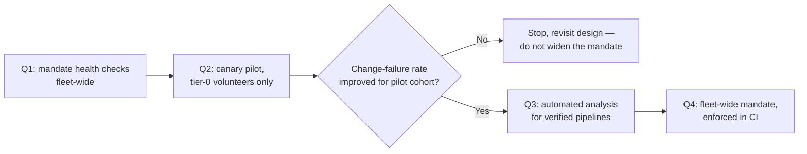

# Deployment Strategies — Professional

<!-- level-focus -->
At professional level, focus on this question:

> How should an organization standardize deployment-strategy choice across many teams so risk scales with service tier instead of with who happens to be on call?

Use the smallest realistic scenario that exposes the decision and its failure behavior.

## From a per-team choice to a platform policy

A senior engineer picks the right deployment strategy for one service by reasoning about its invariants. That reasoning does not scale to two hundred services across thirty teams — not because the reasoning is wrong, but because it takes judgment and time that most teams under deadline pressure will skip. Left alone, some services end up canaried with rigorous automated analysis, others ship on a bare rolling update with no health checks at all, and the difference has nothing to do with which service actually carries more risk — it tracks who happened to read the senior-level guidance and who didn't.

The organizational fix is to stop treating "which deployment strategy" as a per-team decision and start treating it as a **platform policy keyed to service tier**, expressed as a template teams inherit rather than a recommendation they may or may not follow:

| Service tier | Example | Mandated strategy | Mandated rigor |
|---|---|---|---|
| Tier 0 (revenue/safety critical) | checkout, payments, auth | Canary, automated analysis, required | Segmented SLO-based abort, minimum bake time, mandatory rollback drill on file |
| Tier 1 (high traffic, recoverable) | search, recommendations | Canary, manual or automated analysis | Segmented metrics required; automated abort recommended |
| Tier 2 (internal-facing, moderate impact) | internal dashboards, batch coordinators | Rolling update with readiness/liveness probes | Health checks mandatory; canary optional |
| Tier 3 (low traffic, low impact) | one-off internal tools | Rolling update | Baseline health checks only |

The point of the table isn't the specific tiers — it's that **the mandated rigor is a function of what the service tier can afford to get wrong**, decided once by people who can see the whole fleet, not re-derived from scratch by each team under its own deadline.

## Decomposing the migration into reversible, observable increments

Moving an existing fleet onto this policy is itself a delivery problem, and it fails the same way an ungoverned product rollout does if you treat it as a single cutover. Decompose it the way you'd decompose any release:

1. **Foundation quarter.** Mandate readiness/liveness probes fleet-wide, enforced by a CI check that rejects a Deployment manifest without them. Low cost, no behavior change to rollout mechanics, and it fixes the single most common outage cause across every tier.
2. **Tier-0 canary quarter.** Migrate only tier-0 services to the canary Rollout template, starting with two or three volunteer teams, not a mandate. Measure their change-failure rate for a full quarter before deciding whether to widen the requirement.
3. **Automated-analysis quarter.** For the tier-0 services already on canary, add the `AnalysisTemplate` auto-abort layer, but only once each team's metrics pipeline has been independently verified reliable enough to gate an unattended decision.
4. **Fleet-wide mandate.** Only after the pilot cohort's data shows a measurable improvement (fewer incidents, faster recovery) does the policy become mandatory for the rest of tier 0 and tier 1, enforced in CI rather than requested in a wiki page.

Each increment is independently reversible — if the canary pilot in step 2 doesn't move the metrics that matter, you stop there and don't roll it out further. That's the difference between a migration and a mandate handed down before anyone had evidence it works.

## Governance as policy-as-code, not a wiki page

A rule that lives in a document gets read once and ignored under deadline pressure. A rule enforced at the CI/admission boundary doesn't need anyone to remember it:

```rego
# OPA policy: a tier-0 service must ship as a canary Rollout with an
# AnalysisTemplate attached — a bare Deployment is rejected at the gate.
package deploy.strategy

deny[msg] {
    input.metadata.labels.tier == "tier-0"
    input.kind == "Deployment"
    msg := sprintf(
        "%s is tier-0 and must use kind Rollout with a canary strategy, not a bare Deployment",
        [input.metadata.name],
    )
}

deny[msg] {
    input.metadata.labels.tier == "tier-0"
    input.kind == "Rollout"
    not input.spec.strategy.canary.analysis
    msg := sprintf(
        "%s is tier-0 and must attach an AnalysisTemplate to its canary steps",
        [input.metadata.name],
    )
}

deny[msg] {
    input.metadata.labels.tier == "tier-0"
    input.kind == "Rollout"
    input.spec.strategy.canary.steps[_].pause.duration == null
    msg := sprintf(
        "%s has a canary step with no pause — tier-0 requires a minimum bake time at every step",
        [input.metadata.name],
    )
}
```

This turns "teams should use canary for tier-0 services" from an expectation into a build failure. It also creates a single place — the policy repository — where the whole org's deployment governance is legible in one read, instead of scattered across two hundred teams' private conventions.

## Migration, compliance, and coordination risks that only appear at this scale

- **The platform change itself has a blast radius.** Rolling out a new ingress controller or service-mesh version to support weighted canary traffic affects every team simultaneously, whether or not their own release is in flight. Canary the platform change too, and communicate the maintenance window — the platform team is not exempt from the same discipline it's imposing on everyone else.
- **Policy gaming.** A team under deadline pressure can trivially satisfy the letter of a policy while defeating its intent — a canary step with `setWeight: 99` and a one-second pause technically has "a canary step," but provides none of the protection the policy intended. Detect this with a minimum-bake-time floor and periodic audits of real step configurations, not just their presence.
- **Cross-service coordination.** Two services with a shared contract, each independently canaried, can still break each other if their release order isn't coordinated — the same expand/contract sequencing problem from senior level, now multiplied across every pair of dependent services in the fleet. This needs a lightweight, visible dependency declaration (which services consume which contracts) so a release train tool or a human reviewer can catch an out-of-order release before it ships.
- **Audit and compliance evidence.** In a regulated environment, "we used canary" is not sufficient evidence during an audit — you need a retained record of what percentage was exposed, when, what the abort thresholds were, and who had rollback authority for every tier-0 release. Build this as an automatic side effect of the Rollout/AnalysisTemplate objects (they already carry this data), not as a manual log someone maintains separately and inevitably lets drift.

## Outcome measures and evidence-based exit conditions

An initiative like this is not "done" because the templates exist — it's done when the fleet's actual behavior changes, and you can prove it with the same metrics the rest of the org already trusts:

- **Change failure rate** (one of the four DORA metrics) for the migrated cohort, before and after, per tier. A canary migration that doesn't lower this number for tier-0 services didn't achieve its purpose, regardless of how many services adopted the template.
- **MTTR / rollback time**, tracked as a distribution (p50 and p95), not an average. Target something explicit and public, e.g. "p95 rollback time under 5 minutes for tier-0," and treat a regression against it as a bug in the platform, not the team.
- **Deployment frequency**, watched as a guardrail in the other direction — if the new rigor makes releases so slow that teams start batching changes to avoid the overhead, you've traded one risk (bad releases) for another (bigger, riskier releases, less often).
- **Adoption and unused-legacy-path proof.** The migration is complete only when telemetry shows the old bare-`Deployment` path is no longer used for the target tier — not when the new template merely exists as an option alongside it. A policy with an escape hatch everyone quietly keeps using isn't a completed migration.



## Cross-team contracts and accountability

- **The platform team owns:** the Rollout and AnalysisTemplate templates, the shared ingress/mesh capability that makes weighted traffic possible, the metrics-provider integration, and the policy-as-code gate itself. When the gate is wrong or too rigid, that's the platform team's bug to fix — not something app teams should route around.
- **Each service team owns:** its own abort thresholds and SLOs (the platform doesn't get to dictate what error rate is acceptable for a specific service's specific business logic), its rollback authority (who is allowed to advance or abort a release), and the correctness of its own metrics pipeline that the analysis depends on.
- **Escalation is defined in advance, not improvised during an incident.** When an automated abort fires, there is a named on-call for that service, a paging path, and a postmortem SLA — the same rigor an org already applies to production incidents, applied consistently to automated rollback events instead of treating them as "the system quietly handled it, no need to look."
- **Dependency declarations are a shared artifact.** Services that consume each other's contracts publish that dependency somewhere both teams' release tooling can see it, so an out-of-order release across a service boundary is caught by tooling, not discovered in production.

## A scenario of sustained delivery, not a static target

The realistic version of this initiative doesn't end after one migration — it's a standing capability the org keeps investing in as new risk shows up. A plausible year:

- **Q1:** foundation — health checks fleet-wide, enforced in CI. Exit condition: zero Deployments merge without a readiness probe.
- **Q2:** canary pilot on 3 volunteer tier-0 services. Exit condition: change-failure rate for the pilot cohort measurably lower than the prior two quarters' baseline for the same services.
- **Q3:** automated analysis added for the pilot cohort, plus the policy-as-code gate written and tested against the pilot's own manifests (dogfooded before being made mandatory for anyone else). Exit condition: at least one real abort fires correctly in production and the postmortem confirms it prevented a worse outcome.
- **Q4:** fleet-wide mandate for tier-0 and tier-1, enforced in CI, with the legacy bare-`Deployment` path for those tiers removed once telemetry shows zero live usage. Exit condition: the removal itself ships without incident, proving the new path was genuinely load-bearing and not just an option nobody needed.

Nothing in this sequence assumes the destination is fixed. A new failure mode discovered in Q3 (say, a metrics pipeline that's less reliable than assumed) legitimately delays or reshapes Q4 — the initiative is a standing program with quarterly evidence gates, not a project with a ship date set on day one.

## Apply it

1. Draft a four-tier service classification for a hypothetical 50-service platform, and assign a mandated deployment strategy and rigor level to each tier, matching risk to cost the way the table above does.
2. Write an OPA/Rego-style policy that rejects a tier-0 manifest lacking an `AnalysisTemplate` and a minimum canary bake time, and test it against one manifest that should pass and one that should fail.
3. Define the DORA-based exit condition for a one-quarter pilot migrating three volunteer tier-0 services onto canary, including the specific change-failure-rate baseline you'd compare against.
4. Write the escalation path for an automated abort: who is paged, within what time, and what the postmortem SLA is — as if this were going into an on-call runbook today.
5. Identify one way a team could technically satisfy your policy while defeating its intent, and add a specific detection rule (a minimum threshold, an audit query) that catches it.

## Verify your work

- The tier table assigns rigor by consequence of failure, not by team preference, and you can justify each tier's placement in one sentence.
- The policy rejects the failing test manifest and accepts the passing one, with an error message specific enough that a team could fix the violation without asking for help.
- The exit condition names a real number (a baseline change-failure rate or rollback-time target) rather than "it feels safer," and states what happens if the pilot doesn't hit it.
- The escalation path names a specific role and a specific time bound, not "the team gets notified."
- The gaming scenario and its detection rule are concrete enough that you could point to the exact manifest field the rule inspects.

## Review questions

- Why does mapping deployment rigor to service tier scale better across an organization than asking each team to reason about its own risk from scratch?
- What evidence would prove a canary migration succeeded, beyond the fact that services adopted the new template?
- Who should own the abort threshold for a given service, and who should own the shared platform capability that enforces it?
- What would make you deliberately pause or reshape the migration plan mid-year instead of continuing to the next quarter's mandate?
