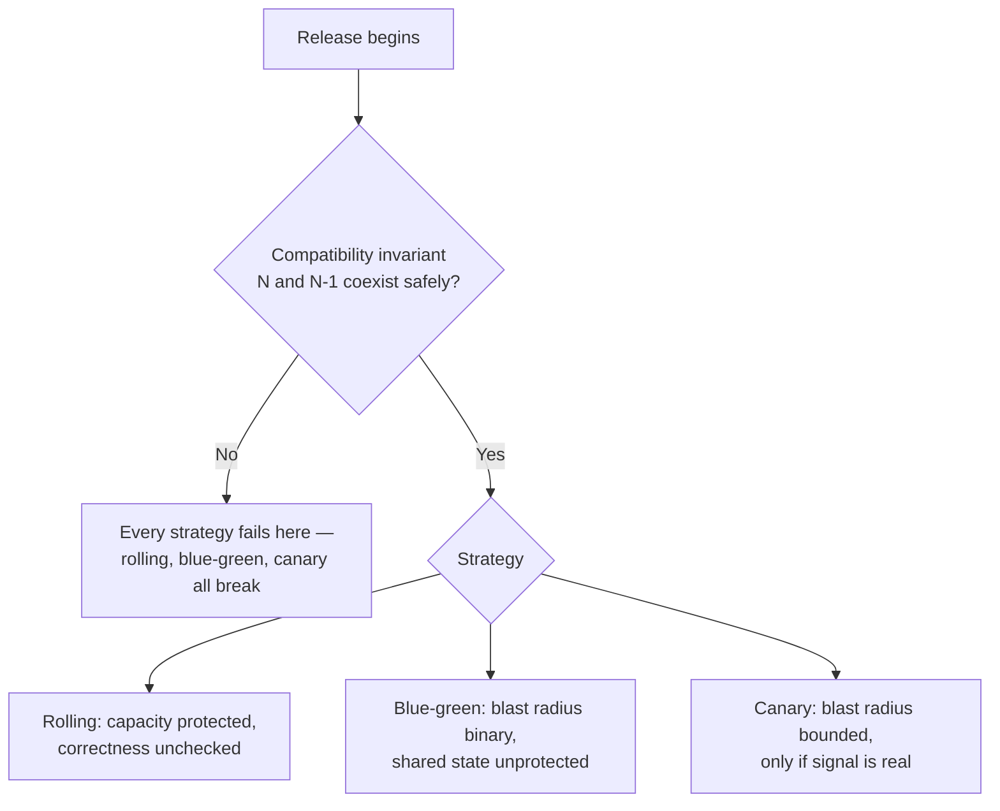

# Deployment Strategies — Senior

<!-- level-focus -->
At senior level, focus on this question:

> Which invariant — capacity, version compatibility, or blast radius — does a chosen deployment strategy actually fail to protect once the release goes wrong?

Use the smallest realistic scenario that exposes the decision and its failure behavior.

## Deployment strategy as invariant protection, not ritual

A deployment strategy is not a checklist you run to feel safe; it's a set of invariants you're committing to hold *while the system is in an inconsistent, half-migrated state*. Naming them precisely is what separates a strategy that works from one that only looks like it does:

- **Capacity invariant** — the number of healthy replicas serving traffic never drops below what current load requires, at any point during the transition.
- **Compatibility invariant** — the old version (N-1) and new version (N) can coexist correctly for the duration of the mixed-version window: same database schema, same message formats, same API contract in both directions.
- **Blast-radius invariant** — the fraction of real users or requests exposed to an unproven version is bounded and known at every moment, not just at the end.

Every deployment strategy protects some of these by construction and leaves others entirely up to you. Rolling update mechanically protects capacity (that's what `maxUnavailable` is for) but says nothing about compatibility — it *assumes* you've made N and N-1 compatible yourself. Blue-green protects blast radius by making it binary (0% or 100%, never partial) but does nothing for compatibility either, and actually removes your ability to detect a compatibility problem gradually, because there's no partial-traffic window in which to notice it. Canary protects blast radius *continuously* but only if your compatibility invariant already holds — a canary running against data the old version can't read is broken at 1% exactly as much as at 100%, just with fewer people knowing yet.

## Failure modes, by strategy

**Rolling update.** The dangerous failure isn't a crash — the platform handles that by simply not proceeding. It's a **stalled rollout that nobody notices**: a new pod passes readiness (its process is up) but is subtly broken (wrong config, bad feature flag default), and because readiness only checks "can this process answer requests," the rollout completes successfully while serving wrong answers to 100% of traffic. The invariant that silently failed is compatibility-as-correctness, not capacity — capacity was fine the whole time.

**Blue-green.** The failure that catches teams off guard is that the "cutover" is not actually instant for everything. Application state cuts over atomically at the router, but anything with warm-up cost — connection pools, in-memory caches, JIT-compiled hot paths — is cold on green the moment it receives 100% of traffic. A cutover under load without a pre-warming step trades a gradual, forgiving rollout for a sudden latency spike or a connection-pool storm against the database, right as you've removed your ability to fall back gradually (green is now taking everything). The second classic failure: blue and green sharing one database. If green's code depends on a schema change, that migration is now live for blue too, the instant it's applied — blue-green isolates *compute*, never *shared state*.

**Canary.** The subtle failure is trusting an analysis metric that's the wrong shape for the risk. An aggregate error rate over the whole canary cohort can stay flat while a *specific* segment (one region, one customer tier, one payment method) degrades badly — averages hide tails. Equally common: sizing the canary too small to be statistically meaningful. A canary at 1% of a service doing 50 requests/minute total sees roughly one request every two minutes; "no errors in five minutes" from that sample is nearly no evidence at all, not a green light.



## Recovery: automated rollback and the flag as a faster path

A human deciding to roll back is the slowest recovery path you have. Two mechanisms remove the human from the critical path, and they solve different problems.

**Automated rollback on SLO breach.** A progressive-delivery controller can evaluate a real query against your monitoring backend at each canary step and abort on its own:

```yaml
apiVersion: argoproj.io/v1alpha1
kind: AnalysisTemplate
metadata:
  name: error-rate-check
spec:
  metrics:
    - name: error-rate
      interval: 30s
      failureLimit: 2                 # two bad samples in a row aborts
      successCondition: result < 0.01
      provider:
        prometheus:
          address: http://prometheus.monitoring:9090
          query: |
            sum(rate(http_requests_total{job="checkout-api",canary="true",code=~"5.."}[2m]))
            / sum(rate(http_requests_total{job="checkout-api",canary="true"}[2m]))
```

This closes the loop from the middle-level manual pause: instead of a person eyeballing a dashboard for five minutes, the controller samples the *canary-tagged* traffic specifically (note the `canary="true"` label — segmenting by cohort is what makes this trustworthy) and aborts automatically if the error ratio crosses the threshold. It collapses detection-to-action from minutes of human reaction time to roughly one polling interval.

**Feature-flag kill switch.** This is a fundamentally different recovery path: it doesn't touch the deployment at all. The new code is already running on 100% of pods, gated behind a flag that's off by default; "rollback" is flipping the flag, which takes effect in seconds and requires no rollout machinery whatsoever. This is the fastest possible recovery, but it only exists for behavior you deliberately gated — it does nothing for a bug in code that isn't behind a flag, and it doesn't help with infrastructure-level problems (a bad base image, a broken startup command) that a flag can't reach. Treat deployment strategy and feature flags as complementary layers, not substitutes: the deployment strategy bounds exposure to *code that's running*; flags bound exposure to *behavior that's active*.

## Evidence over preference

"The canary looked fine" is not evidence; a specific, pre-agreed threshold checked against segmented data is. Before trusting a design, demand:

- **A stated error-budget or SLO burn-rate threshold**, not "no obvious errors." If your SLO allows 0.1% error rate over a month, a canary burning 5% of that budget in ten minutes is a fast-burn signal worth aborting on, even though the raw error count looks tiny.
- **A compatibility test in CI**, not an assumption. Run the previous version's code against the *new* schema (or the new version's code against old-format messages) as an automated check before the release ships, not as something you discover live during the mixed-version window.
- **A rehearsed rollback**, not a documented one. A rollback procedure nobody has executed is a hope. Run it against a staging environment on a schedule and record how long it actually takes.

## A cross-component scenario worth reasoning through carefully

A `payment-service` is changing the message format it publishes to a queue consumed by `ledger-service`. The team wants to canary the change.

The naive plan — canary `payment-service` at 10%, watch its own error rate — checks the wrong invariant. `payment-service`'s error rate can be perfectly flat (it successfully published every message) while `ledger-service` silently fails to parse 10% of the messages, because `ledger-service` wasn't part of the canary at all — it's just consuming whatever arrives, old or new format, from whichever `payment-service` pod produced it. The compatibility invariant crosses a service boundary the canary metric never looked at.

The correct sequencing: **expand first.** `ledger-service` must be deployed *first*, with code that can parse both the old and new message formats, and that deployment must itself be verified before `payment-service` ever produces the new format. Only after `ledger-service`'s compatibility is proven does `payment-service`'s canary become meaningful — and even then, the canary's success signal must include `ledger-service`'s parse-error rate for messages tagged as coming from canary pods, not just `payment-service`'s own health.

| Question to ask before this release | Why it matters |
|---|---|
| Does `ledger-service` already tolerate the new message shape? | If not, the canary is measuring the wrong service's health entirely |
| Is the new format canary-tagged so `ledger-service`'s errors can be attributed to it specifically? | Without this, a spike is invisible until it's org-wide |
| What is the rollback order — payment-service first, or ledger-service? | Rolling back payment-service alone, if ledger-service already dropped old-format support, reopens the same incompatibility from the other direction |

## Trade-offs among plausible approaches, stated plainly

| Approach | What it actually buys you | What it costs | Wrong fit for |
|---|---|---|---|
| Rolling update, tuned `maxSurge`/`maxUnavailable` | Cheap, simple, protects capacity mechanically | No blast-radius control; a quiet bug reaches 100% | Any release where wrong-but-not-crashing output is plausible and costly |
| Blue-green | Atomic cutover, instant full rollback, zero mixed-version code window | Doubles compute cost during the switch; does nothing for shared state; cutover-moment cold-start risk | Services with meaningful shared state (a database) between the two environments, unless that state is also isolated |
| Canary with manual observation | Bounded, controlled blast radius; catches quiet bugs before they're expensive | Slower to 100%; needs segmentable, trustworthy metrics; a human is the bottleneck and can be paged out or distracted | Services without per-cohort telemetry — the canary "signal" is fiction without it |
| Canary with automated analysis | All of the above, plus removes human reaction time from the abort path | Requires an SLO/threshold worth trusting unattended, and a metrics pipeline reliable enough to gate a rollback on | Services whose metrics pipeline itself is flaky — you'll abort on noise |
| Feature-flag-gated release | Fastest possible recovery (seconds); fully decouples *deploy* timing from *release* timing | Only covers gated behavior; adds flag debt if not cleaned up; doesn't fix infra-level failures | Nothing on its own — it's a complement to one of the above, not a replacement |

## Questions that expose weak assumptions before you implement any of this

- If the new version's error rate stays flat but a *downstream* service starts failing, does anything in your canary analysis actually see that?
- What happens to in-flight requests and open sessions at the exact moment of a blue-green cutover — are they dropped, or drained?
- Is your database migration provably reversible — has CI actually run the old code against the new schema, or is that an assumption someone made once?
- Who, or what, decides to abort a canary — and if it's a person, what's the plan for the hours when no one is watching?
- Have you ever actually executed your rollback path outside of an incident, and do you know how long it takes?

## Apply it

1. State, in writing, which of the three invariants (capacity, compatibility, blast radius) each of rolling update, blue-green, and canary actually protects by construction for your chosen service — and which it leaves to you.
2. Design a cross-service release for two services that share a message contract (like `payment-service` and `ledger-service`), and write the deployment order that keeps compatibility true throughout.
3. Write an `AnalysisTemplate`-style query that segments canary traffic from stable traffic by a label, not a hope, and define the exact threshold that triggers an abort.
4. Identify the one assumption in your design most likely to be wrong (e.g., "ledger-service already tolerates the new format") and design the smallest experiment that would prove or disprove it before the real release.
5. Run a rollback rehearsal end-to-end in staging and record the actual elapsed time from "decision to roll back" to "traffic fully reverted."

## Verify your work

- The written invariant analysis names a specific failure each strategy would *not* catch, not just what it protects.
- The cross-service deployment order is justified by which side must tolerate which format first, not by convenience.
- The analysis query is segmented by a cohort label and the abort threshold is tied to a stated SLO or error budget, not a round number picked by feel.
- The rollback rehearsal produces a real, recorded time — not an assertion that "it should be fast."

## Review questions

- Which invariant does a rolling update leave entirely to you, and what concretely can go wrong because of that gap?
- Why can a canary's own error rate look perfectly healthy while a downstream consumer of its output is already failing?
- What is the difference between a feature-flag kill switch and an automated canary abort, and when does each one fail to help?
- What evidence would you require before trusting an automated rollback decision instead of a person watching a dashboard?
