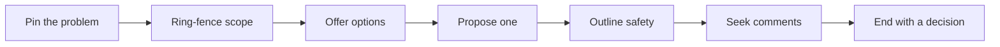

# RFC — Problem

**What it is:** an RFC (Request for Comments) is a working proposal for a meaningful technical change. It is not an IETF protocol document, and it is not a polished plan written after the decision. It gives people a shared place to ask: *what problem are we solving, what could we do, what are we choosing, and what could go wrong?*

An RFC is useful when a change reaches beyond one small, reversible edit:

- it changes a public API, shared service, stored data, security boundary, or operating cost;
- more than one team or role will carry its effects;
- a choice made today would be costly to undo later; or
- the team needs evidence before it can safely pick a direction.

LLVM uses RFCs for substantive changes so the wider community can give feedback before implementation. Its proposal asks for an overview, motivation, impact, and open questions. [Rust's RFC template](https://github.com/rust-lang/rfcs/blob/master/0000-template.md) similarly asks the author to explain the problem, design, drawbacks, alternatives, and unresolved questions. These are useful habits for ordinary product engineering too.

## The problem an RFC prevents

Without a written proposal, a team often starts with the first implementation idea:

- a ticket says what someone wants, but not the rules, trade-offs, or failure cases;
- a meeting creates a decision that people remember differently;
- code review happens after the expensive design choice is already built; and
- the engineer who made the choice has to explain it again whenever a new teammate asks why.

An RFC moves the costly conversation earlier, while changing direction is still cheap. It does **not** promise agreement. It makes disagreement visible enough to resolve deliberately.

## Worked example: import a large customer list

Product asks: “Let an account administrator upload a CSV file to invite many employees at once.”

The current endpoint reads the file and sends invitations during one HTTP request. A large file can time out; retrying can send duplicate invitations. The change touches the web app, API, worker service, object storage, email provider, security review, monitoring, and support.

A good RFC asks for a decision before the team starts changing each of those parts.

## The PROPOSE loop

Use this local framework for a first RFC draft. It is a short form of the parts that appear in the [LLVM RFC process](https://llvm.org/docs/RFCProcess.html), the [Rust RFC template](https://github.com/rust-lang/rfcs/blob/master/0000-template.md), and the [Kubernetes Enhancement Proposal template](https://github.com/kubernetes/enhancements/blob/master/keps/NNNN-kep-template/README.md).

### P — Pin the problem

State the user or system pain, who feels it, and the evidence you have. Do not start with a technology name.

- **In the example:** “Administrators need to invite up to 10,000 employees from one file. The synchronous import can outlive the request timeout, and a retry can repeat email sends.”
- **Ask:** What happens today? Who is blocked? What has been measured, observed, or reported? What happens if we do nothing?

### R — Ring-fence the scope

Name goals, non-goals, and hard limits. This lets a reviewer tell whether a suggestion is needed now or belongs in a later change. Kubernetes makes goals and non-goals explicit in its KEP template for this reason.

- **Goals:** accept a 10,000-row CSV, show progress, avoid duplicate invitation emails, and let an admin see row-level errors.
- **Non-goals:** redesign the whole invitation flow, support spreadsheet formats other than CSV, or build a general data-import platform.
- **Constraints:** existing email provider limits, a 30-day file-retention policy, and no new personally identifiable data in application logs.

### O — Offer real options

Show the credible paths, including the smallest one. A reviewer cannot judge a choice they cannot see.

| Option | What it does | Main trade-off |
|---|---|---|
| Raise the HTTP timeout | Keep the synchronous endpoint and wait longer | Small change, but failures still hold a request open and retries remain risky |
| Parse in the browser | Validate rows before upload | Faster feedback, but the server still needs a trustworthy import and retries remain unclear |
| Run an asynchronous import job | Store the file, create an import record, and let a worker process it | More moving parts, but work can resume and show progress safely |

### P — Propose one direction

Pick the option you recommend and explain enough detail that another engineer can test its interactions and failure cases. Rust's template calls for a technical explanation that makes interactions, implementation shape, and corner cases clear.

- **Recommendation:** create an `Import` record before accepting the file; store the file in private object storage; queue the import ID; let a worker validate and process rows; use the import ID plus row number as an idempotency key for invitation sending; expose a status endpoint with counts and downloadable errors.
- **Why this option:** the API returns quickly, retries restart or resume a named job instead of repeating a blind request, and support can inspect one import rather than search many logs.
- **Known cost:** the team must operate a queue, worker, storage lifecycle, and status UI.

### O — Outline safety

Show how the proposal will be proved and safely introduced. Kubernetes asks for risks, a test plan, rollout and rollback planning, monitoring, and scalability because a design is not complete when its happy path works.

- **Tests:** CSV parsing, duplicate-row behavior, permission checks, job retry behavior, and an end-to-end import in a test environment.
- **Measures:** queue delay, import completion rate, failed-row rate, duplicate-email count, and worker error rate.
- **Rollout:** enable the new path for internal accounts first, then a small account group behind a feature flag.
- **Rollback:** disable new uploads with the flag; let already-started jobs finish or cancel them with a visible status; retain files only under the stated policy.

### S — Seek directed comments

Ask the people affected by the decision specific questions while the proposal is still a draft.

- **Product:** Is “all valid rows succeed even if some rows fail” the desired user promise?
- **Security/privacy:** Are the storage access and 30-day retention policy acceptable for this file?
- **Platform/SRE:** What queue delay and worker error thresholds should page or halt rollout?
- **API consumers:** Is polling import status acceptable, or is a webhook needed later?

LLVM's process expects authors to edit the proposal as useful feedback arrives and make the changes clear. An RFC is a conversation artifact, not a one-way announcement.

### E — End with a decision and next steps

Close the loop visibly:

- record whether the proposal is accepted, declined, or needs a revision;
- state the decision owner and date;
- list the remaining open questions, if any;
- link the implementation tasks; and
- reopen review if a later change materially alters the agreed scope, risk, or choice.

Then implement in small pull requests. LLVM explicitly recommends incremental changes after an RFC is finalized; that keeps later code review focused on the code rather than rediscovering the whole design.

## Sources

- [LLVM: Request For Comment process](https://llvm.org/docs/RFCProcess.html) — proposal contents, feedback, consensus, and incremental implementation.
- [Rust: RFC template](https://github.com/rust-lang/rfcs/blob/master/0000-template.md) — motivation, technical explanation, drawbacks, alternatives, and unresolved questions.
- [Kubernetes: KEP template](https://github.com/kubernetes/enhancements/blob/master/keps/NNNN-kep-template/README.md) — goals/non-goals, risks, tests, rollout, rollback, monitoring, and scale.

Continue to [Mistake](mistake.md).
