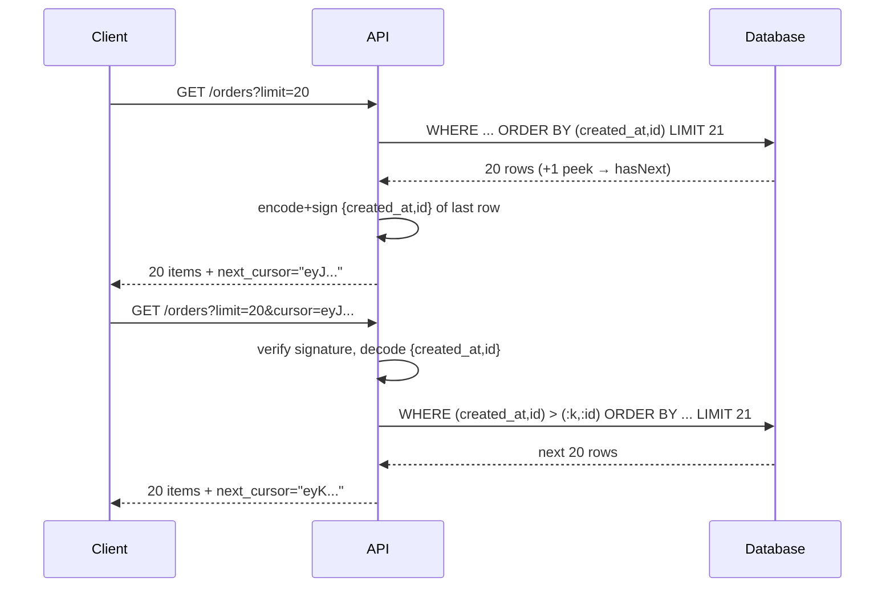

# Pagination and Filtering — Interview

A tiered Q&A bank, from fundamentals to staff-level judgment. Each answer is written to survive follow-ups, so pay attention to the *why*, not just the mechanism.

1. Why paginate at all?
2. How does offset/limit work, and why does it degrade on deep pages?
3. What is cursor (keyset) pagination and how does the `WHERE (k, id) > cursor` predicate work?
4. Why does keyset pagination need a matching composite index?
5. Why must the sort be stable, and why tie-break on a unique key?
6. Why encode cursors as opaque, signed tokens?
7. How do offset and cursor pagination differ under concurrent inserts?
8. Why is returning a total count expensive, and what do you do instead?
9. How do you filter safely — whitelist vs. open query language?
10. How do you handle deep-pagination limits and abuse?
11. Elasticsearch: `from`/`size` vs. `search_after` — what changes?
12. What is a Relay cursor connection and why the extra structure?
13. (Staff) How do you standardize pagination across many teams?

---

## Q1: Why paginate at all?

Because unbounded collection responses are a latency, memory, and availability liability. A single `GET /orders` on a large tenant could try to serialize millions of rows, exhausting server memory, saturating the network, and timing out the client — while holding a database cursor open long enough to inflate connection-pool pressure. Pagination bounds the work per request: the server reads and serializes a fixed page, response time stays predictable, and back-pressure is natural because the client must ask for the next page. It also protects the database from a single query monopolizing buffer cache and I/O. The rule of thumb: any list endpoint that can grow without bound must paginate from day one, because retrofitting pagination onto a shipped endpoint is a breaking change to every client.

## Q2: How does offset/limit work, and why does it degrade on deep pages?

Offset/limit tells the database to compute the full ordered result and then *skip* the first `OFFSET` rows before returning `LIMIT` rows: `ORDER BY created_at DESC LIMIT 20 OFFSET 100000`. The problem is that the skip is not free — the engine still has to generate and count the 100,000 rows it discards. Cost grows linearly with page depth (`O(offset + limit)`), so page 5,000 is thousands of times more expensive than page 1. On deep pages this becomes a slow, buffer-cache-thrashing scan even when an index exists, because the index can locate the *start* of the ordering but not jump to an arbitrary ordinal without walking. Offset is fine for shallow, human-facing "page 1–10" UIs on modest datasets; it is the wrong tool for large collections, API consumers that iterate to the end, or "load more" feeds.

## Q3: What is cursor (keyset) pagination and how does the `WHERE (k, id) > cursor` predicate work?

Keyset (a.k.a. cursor or seek) pagination remembers *where you stopped* by value, not by ordinal. Instead of "skip 100,000 rows," it says "give me rows ordered the same way, starting immediately after the last row I saw." If you order by `(created_at, id)`, the next page is:

```sql
SELECT ... FROM orders
WHERE (created_at, id) > ('2026-06-01T10:00:00Z', 918273)
ORDER BY created_at, id
LIMIT 20;
```

The row-value comparison `(created_at, id) > (:k, :id)` expands to `created_at > :k OR (created_at = :k AND id > :id)` — it advances past the last-seen `created_at`, and for rows sharing that exact timestamp it advances past the last-seen `id`. Because the predicate is a *range seek*, the database jumps straight to the boundary in the index and reads forward `LIMIT` rows. Cost is `O(limit)` regardless of depth: page 5,000 is as cheap as page 1. The trade-off is that you can only move relative to a cursor — no "jump to page 500" — which is exactly right for infinite-scroll feeds and API iteration.

## Q4: Why does keyset pagination need a matching composite index?

The seek is only cheap if the index physically orders rows the same way the query does. For `ORDER BY created_at, id` with a `WHERE (created_at, id) > (...)` predicate, you need a composite index on `(created_at, id)` in that exact column order and direction. With it, the engine positions to the cursor in `O(log n)` and reads the next `LIMIT` rows sequentially off the index — no sort, no scan. Without it, the database must sort the whole candidate set to satisfy the ordering, collapsing back to offset-like cost and defeating the entire point. Two subtleties: (1) the index column order must match the `ORDER BY` column order; a `(id, created_at)` index does not serve an `ORDER BY created_at, id` seek. (2) If you paginate in descending order, you may need a descending index (or a database that can scan a b-tree backward efficiently). Any filter columns applied *before* the sort should generally be a prefix of the index so the seek still lands in a contiguous range.

## Q5: Why must the sort be stable, and why tie-break on a unique key?

Keyset pagination assumes a *total order* — every row has a unique position. If you order by only `created_at` and 50 rows share the same millisecond, the cursor `created_at > :k` cannot tell which of those 50 you already returned: you'll either skip some or return duplicates at the page boundary. The fix is to append a unique, immutable tie-breaker — the primary key — making the sort key `(created_at, id)`. Now the order is deterministic and total, and the row-value predicate uniquely identifies the boundary. This matters even for offset pagination: without a tie-break, the database is free to order tied rows differently between two queries, so a row can be pushed across the page boundary and get skipped or duplicated. The discipline is simple: **always sort on a key that is unique in aggregate, ending in a primary/immutable column.**

## Q6: Why encode cursors as opaque, signed tokens?

A cursor is a server-side implementation detail — which columns you sort on, their values, sometimes the filter set and sort direction. If you expose that as a readable query param (`?after_created_at=...&after_id=...`), three things go wrong: clients start constructing cursors themselves and break when you change the sort key; you can't evolve the pagination scheme without a breaking change; and a caller can tamper with the cursor to seek into data or inject values into your `WHERE`. The fix is an **opaque cursor**: serialize the internal state (sort values, direction, maybe a filter hash) and base64url-encode it into a single `cursor` string the client treats as a blob it only echoes back. Sign it (HMAC) or encrypt it so tampering is detected and rejected — this both prevents injection and lets you validate that the cursor belongs to the same filter set. Optionally embed a scheme version so old cursors can be rejected cleanly after a change.



## Q7: How do offset and cursor pagination differ under concurrent inserts?

This is where offset pagination silently corrupts results. Suppose you're reading a feed newest-first with offset. Between fetching page 1 and page 2, three new rows are inserted at the top. Now `OFFSET 20` skips 20 rows relative to the *shifted* list — the three rows that were at positions 18–20 slide to 21–23, and you see them **again** (duplicates); symmetrically, deletions cause **skips**. The client sees a shimmering, inconsistent view. Keyset pagination is immune to this class of anomaly for the "next" direction: the cursor anchors on a value, so rows inserted after your cursor position simply don't move your boundary — you continue reading forward from exactly where you stopped, seeing each qualifying row at most once. (Rows inserted *before* your cursor won't appear in your forward scan, which is usually the correct semantics for a stable read; if you need to surface brand-new items, that's a separate "poll the head" query.)

| Dimension | Offset / Limit | Cursor / Keyset |
|---|---|---|
| Deep-page cost | `O(offset + limit)` — degrades | `O(limit)` — flat |
| Random access ("go to page N") | Yes | No, sequential only |
| Total count / "showing X of Y" | Natural | Expensive/omitted |
| Stability under concurrent writes | Skips & duplicates | Stable forward reads |
| Index requirement | Any index on sort col | Composite index matching sort |
| Cursor state | Just a number | Opaque signed token |
| Best fit | Shallow UI paging, admin tables | Feeds, APIs, deep iteration |

## Q8: Why is returning a total count expensive, and what do you do instead?

`SELECT COUNT(*)` over a filtered collection must evaluate the predicate against every matching row — on a large table with a non-covering filter, that's a full scan or a large index scan, often costing more than fetching the page itself. Worse, under concurrent writes the count is stale the instant you compute it, so paying for exactness buys a number that's already wrong. Options, cheapest to most exact: (1) **omit it** — feeds and infinite scroll only need `has_next`, which you get for free by fetching `limit + 1` rows and checking whether the extra one exists; (2) **approximate** — use `reltuples`/table statistics or an ES `track_total_counts` cap like "10,000+"; (3) **cache** a periodically-recomputed count; (4) **exact but bounded** — only when the filter is highly selective and index-covered. The senior instinct is to ask the product question first: does the UI actually need a precise total, or does it just need "there's more"? Usually the latter.

## Q9: How do you filter safely — whitelist vs. open query language?

Never let clients hand you raw predicates. There are two safe postures. The **whitelist** approach exposes a fixed, documented set of filter fields and operators (`?status=shipped&created_after=...`), each validated, type-checked, and mapped to a parameterized query fragment — no field the client names can reach the query unless it's on the list, and every value is bound, never concatenated. This is the default for public APIs: predictable, indexable, and immune to SQL/NoSQL injection and to "excessive data exposure" via clever filters. The **open query language** approach (RSQL, OData `$filter`, GraphQL argument trees, or a JSON DSL) is more expressive but must be treated as untrusted input: parse into an AST, validate every field against an allowlist, cap operator complexity and nesting depth, and translate only allowlisted nodes into parameterized queries. The overriding constraint on either path is **index coverage** — every filterable field combination a client can request must be backed by an index, or you've handed callers a way to trigger full scans. If a filter can't be indexed, it shouldn't be filterable (or must be gated behind async/search infrastructure).

## Q10: How do you handle deep-pagination limits and abuse?

Even with cursors, unbounded iteration and hostile inputs need guardrails. Enforce a **max page size** (e.g. clamp `limit` to 100) so no single request can request a million rows. For offset-based endpoints you cannot fully protect, cap the reachable depth (reject `offset > 50000`) and steer heavy consumers to a cursor or bulk-export path. Prefer keyset pagination precisely because its flat cost removes the "deep page = expensive query" abuse vector entirely. Rate-limit list endpoints per client, and consider that a bulk export is a *different* product need than pagination — offer a dedicated async export/streaming API (`GET → job → download`) rather than letting callers hammer the paginated endpoint 10,000 times. Sign cursors so callers can't fabricate boundaries or replay a cursor against a different filter set. And validate/normalize every pagination parameter (`limit`, sort field, direction) against an allowlist so a malformed cursor or an unindexed sort request is rejected, not executed.

## Q11: Elasticsearch — `from`/`size` vs. `search_after`?

`from`/`size` is Elasticsearch's offset pagination, and it carries an extra distributed penalty: to return `from + size` globally-ranked hits, *each shard* must produce `from + size` hits and the coordinating node merges and re-sorts them. Deep paging therefore multiplies memory and CPU across shards, which is why ES enforces `index.max_result_window` (default 10,000) and refuses to page beyond it. `search_after` is the keyset equivalent: you sort on a tie-broken key (e.g. `[@timestamp, _id]`) and pass the sort values of the last hit as the `search_after` array; each subsequent request seeks forward from that point with flat cost and no deep-window ceiling. It pairs naturally with a Point-In-Time (PIT) snapshot so the view stays consistent across pages despite ongoing indexing. For exhaustive extraction (not user-facing paging), the Scroll API historically held a live cursor, but modern guidance favors `search_after` + PIT because it doesn't pin server-side scroll contexts. Same lesson as SQL: value-based seeks beat ordinal skips at scale.

## Q12: What is a Relay cursor connection and why the extra structure?

Relay Connections are GraphQL's standardized pagination contract, and their shape encodes the keyset model directly. A connection returns `edges` (each an object with a `node` and a per-item `cursor`) plus `pageInfo` with `hasNextPage`, `hasPreviousPage`, `startCursor`, and `endCursor`. Clients page with `first: N, after: <cursor>` (forward) or `last: N, before: <cursor>` (backward). The design choices are deliberate: attaching a `cursor` to *every* edge (not just the page ends) lets a client resume from any item; `pageInfo` provides the "is there more?" signal without a total count; and the cursors are opaque strings, so the server is free to back them with keyset seeks and change the underlying sort without breaking clients. In other words, Relay is a well-thought-out, tool-friendly envelope around exactly the opaque-cursor keyset pagination described in Q3–Q6 — its main cost is the verbosity of the `edges`/`node`/`pageInfo` nesting, which is the price of a uniform, client-cache-friendly contract.

## Q13: (Staff) How do you standardize pagination across many teams?

The failure mode at scale is inconsistency: one team ships offset with `page`/`per_page`, another does keyset with `cursor`, a third invented `nextToken`, and now every client integration is bespoke and half of them fall over on deep pages. As a staff engineer you make pagination a **platform decision, not a per-endpoint one**. Concretely: publish a paved-road standard (parameter names, `limit` semantics and max, opaque signed-cursor format, response envelope, `has_next`/`page_info` shape) as a shared library or API guideline, so teams get correct keyset pagination by default rather than reinventing it. Bake the constraints into linters and API-review gates — a list endpoint that returns an unbounded array, or a filter field with no backing index, fails review. Default to cursor pagination for machine-facing and large collections, permit offset only for bounded human-facing tables with a documented depth cap, and never mix count-dependent UI with unbounded data. Provide the opaque-cursor codec centrally so signing, versioning, and filter-binding are consistent and can be rotated. And treat pagination as part of the API contract: cursor format and page-size caps are versioned, deprecated deliberately, and load-tested at the deep-page tail — because the whole point of standardization is that the expensive mistakes are made *once*, in the platform, not repeatedly in every service.

*Next step:* [Idempotency and Retries — Junior](../idempotency-and-retries/junior.md)
