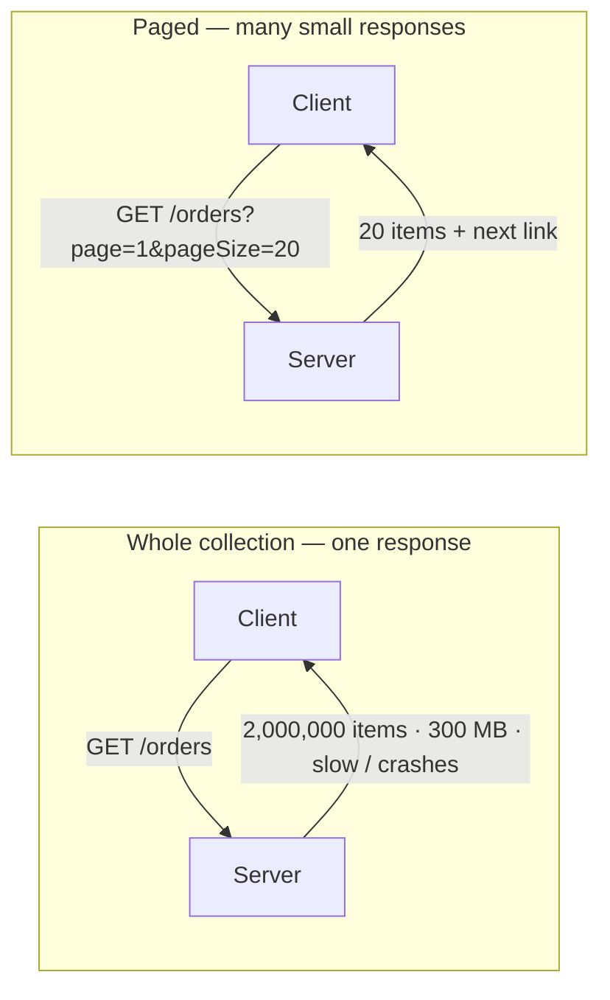
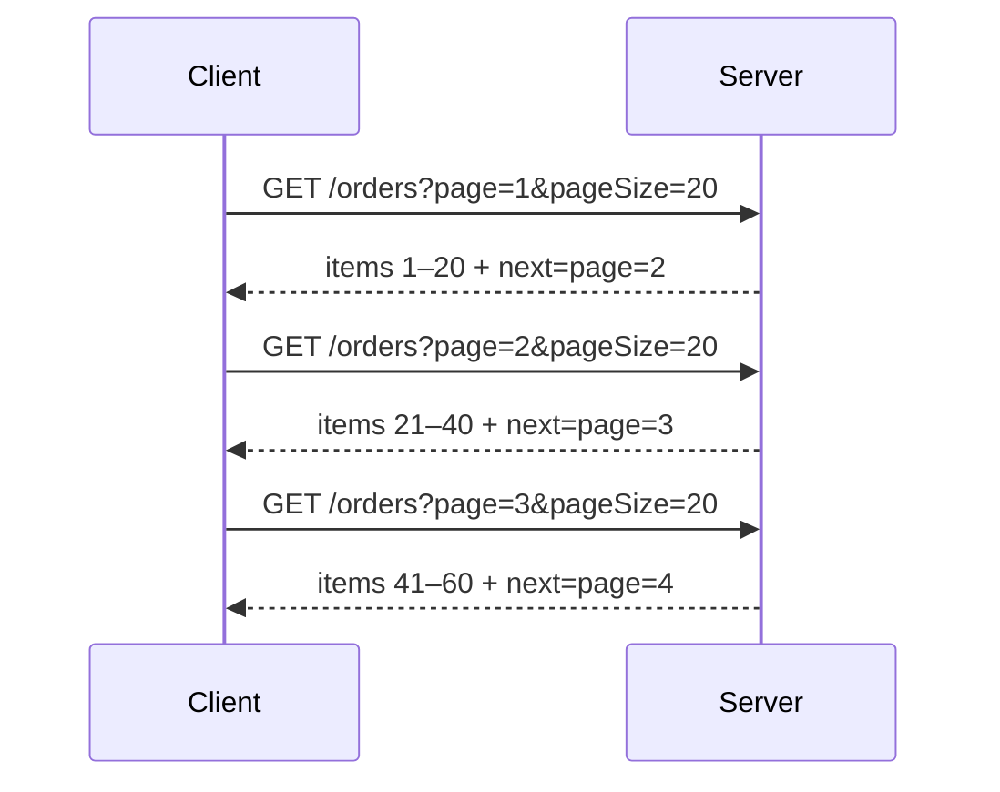
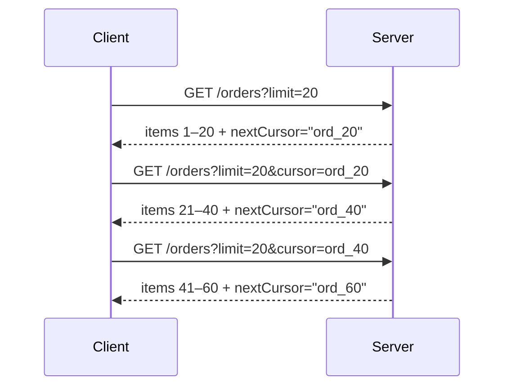

# Pagination and Filtering — Junior

<!-- level-focus -->
At junior level, focus on this question:

> How can I apply **Pagination and Filtering** in one small example and prove the result?

Use the smallest realistic scenario that exposes the decision and its failure behavior.
---

## 1. Why you can't return the whole collection

Imagine `GET /orders` on a shop with 2 million orders. Returning them all in one response breaks in three separate ways at once:

- **Payload size.** Two million JSON objects can be hundreds of megabytes. That is expensive to serialize on the server, expensive to send over the network, and expensive to parse on the client. On a mobile connection it may never finish.
- **Latency.** The server must read every row from the database, turn each into JSON, and stream it before the client sees anything. The user stares at a spinner for seconds — or the request times out first.
- **Memory.** To build one giant response, the server often holds the entire result set in memory at once. A handful of such requests in parallel can exhaust the server's RAM and crash it for *everyone*.

The fix is to hand out the collection in pages. The client asks for a manageable slice (say 20 items), the server does a small, fast query, and if the client wants more it asks again.



A good default page size is small — often 20 to 50. Always cap it server-side (for example, reject or clamp any `pageSize` above 100) so a client cannot ask for a page so large it recreates the original problem.

---

## 2. What a page of results looks like

A page is not just an array. It is the items **plus metadata** that tells the client where it is and how to get more. A typical shape:

```json
{
  "items": [
    { "id": 41, "total": 19.90 },
    { "id": 42, "total": 8.50 }
  ],
  "page": 3,
  "pageSize": 20,
  "totalItems": 2000000,
  "next": "/orders?page=4&pageSize=20"
}
```

The `items` array is the data. Everything else is navigation: which page this is, how many exist, and — most usefully — a ready-made link to the next page so the client does not have to build the URL itself. Returning a `next` link (and often `prev`) is a small courtesy that makes the API much easier to consume.

---

## 3. Offset / limit pagination

The simplest scheme. The client says *how many to skip* and *how many to return*. Two common spellings mean the same thing:

- `?offset=40&limit=20` — skip 40 rows, return the next 20.
- `?page=3&pageSize=20` — page 3 of 20-item pages. The server computes `offset = (page - 1) * pageSize = 40` internally.



Offset pagination is easy to understand and lets the client jump straight to any page (page 1, page 5, page 100). That makes it a natural fit for a classic "page 1 2 3 … Next" UI.

It has one weakness worth knowing early: the database still has to *count past* all the skipped rows. Reaching page 10,000 means telling the database to skip ~200,000 rows before returning 20 — which gets slower the deeper you go. There is also a subtler issue: if someone inserts or deletes a row while the user is paging, items can shift, so a row is shown twice or skipped. Cursor pagination, next, fixes both.

---

## 4. Cursor / keyset pagination

Instead of "skip N rows," the client sends a **cursor** — a pointer to *where it left off*. Think of it as a bookmark. The server returns the next chunk *after* that bookmark and hands back a new cursor for next time.



The cursor usually encodes the last item's sort key — for example, the id or timestamp of the last row you saw. The database then runs a query like "give me 20 orders whose id is greater than `ord_20`." That uses an index and is fast *no matter how deep you go*, because there is no skipping. Because it anchors on a real value rather than a position, rows inserted or deleted meanwhile do not cause the double-shown or skipped items you get with offsets.

The trade-off: you can only move forward (or backward) one page at a time, following the cursors. You cannot say "jump straight to page 500," because there is no page number — only "the chunk after this bookmark." That is exactly why cursor pagination suits infinite-scroll feeds and large datasets, while offset suits numbered-page UIs.

Treat the cursor as **opaque**: the client should send it back untouched, never try to read or construct it. That lets the server change how cursors work later without breaking clients.

---

## 5. Offset vs cursor at a glance

| Aspect | Offset / limit (`page`, `pageSize`) | Cursor / keyset (`cursor`, `limit`) |
|---|---|---|
| Client sends | A page number or row offset | An opaque bookmark to "where I left off" |
| Jump to arbitrary page | Yes — page 1, 5, 100 directly | No — forward/back one page at a time |
| Speed on deep pages | Degrades: DB skips many rows | Stays fast: indexed lookup, no skipping |
| Stable if data changes mid-paging | No — rows can shift, repeat, or be skipped | Yes — anchored to a real key |
| Mental model | Simple, familiar | Slightly more to learn |
| Best fit | Numbered-page UIs, small/medium data | Infinite scroll, feeds, very large data |

Start with offset pagination when you are learning — it is easy and fine for modest datasets. Reach for cursor pagination when data is large, pages go deep, or the collection changes constantly.

---

## 6. Filtering and sorting

Pagination controls *how much* you get back. **Filtering** and **sorting** control *which* items and *in what order* — so the client can page through a meaningful, ordered subset instead of the raw firehose.

**Filtering** narrows the collection using query parameters that map to fields:

```
GET /orders?status=paid&minTotal=10
```

This asks for orders that are paid *and* cost at least 10. The server translates each parameter into a condition on the query. Filtering happens *before* paging: you filter down to the matching set, then hand out pages of that set.

**Sorting** decides the order, usually with a `sort` parameter naming a field and a direction:

```
GET /orders?sort=createdAt&order=desc
```

Newest orders first. Sorting matters more than it looks: pagination is only consistent if the order is stable. If two requests could return the same page in a different order, items can appear twice or vanish between pages. So always page over a **defined, deterministic sort** — and cursor pagination in particular *depends* on the sort key it is built around.

Put together, a realistic request combines all three concerns:

```
GET /orders?status=paid&sort=createdAt&order=desc&page=1&pageSize=20
```

Read it as: *paid orders, newest first, first page of 20.*

---

## 7. Query parameter roles

Every parameter above plays exactly one of three roles. Keeping them straight makes any paginated endpoint easy to read:

| Role | Example params | Job |
|---|---|---|
| **Filter** | `status=paid`, `minTotal=10` | Choose *which* items qualify |
| **Sort** | `sort=createdAt`, `order=desc` | Choose the *order* of qualifying items |
| **Paginate** | `page`, `pageSize`, `limit`, `cursor` | Choose *which slice* of the ordered result to return |

The order of operations on the server is always the same: **filter → sort → paginate**. Filter to the matching rows, sort them into a stable order, then cut out the requested page. Keeping the three groups distinct — rather than inventing one giant `query` parameter that does everything — keeps the API predictable for both callers and the server code.

---

## 8. Common beginner mistakes

- **No default and no cap on page size.** If a client omits `pageSize`, pick a sane default (e.g. 20). If it asks for 10,000, clamp it. Otherwise you have reinvented "return everything."
- **Paging without a sort.** With no defined order, the database may return rows in any order, and pages overlap or skip items. Always page over a deterministic sort.
- **Filtering in application code instead of the query.** Fetching all rows and then filtering in memory still loads the whole collection — the exact cost pagination exists to avoid. Push filters and sorting down into the database query.
- **Parsing the cursor on the client.** Cursors are opaque. If clients decode or build them, you can never change the format. Send them back untouched.
- **Forgetting the "no more pages" signal.** The client needs to know when to stop. Omit the `next` link (or set it to null) on the last page, or return an empty `items` array.

---

## Apply it

1. Choose one small, known input for **Pagination and Filtering**.
2. Predict the output or observable behavior.
3. Run the smallest example or probe that exercises the concept.
4. Change one input to trigger a failure or boundary case.
5. Explain the evidence using the guide's vocabulary.

## Verify your work

- Record the exact input, command or code path, and output.
- Repeat the probe and confirm the result is consistent.
- Show one expected success and one expected failure.
- Resolve any difference between the prediction and the evidence.

## Review questions

- What problem does Pagination and Filtering solve in the example?
- Which input changes the observed result, and why?
- What is the smallest useful success check?
- Which beginner mistake would your evidence catch?
