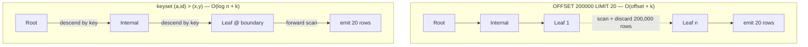
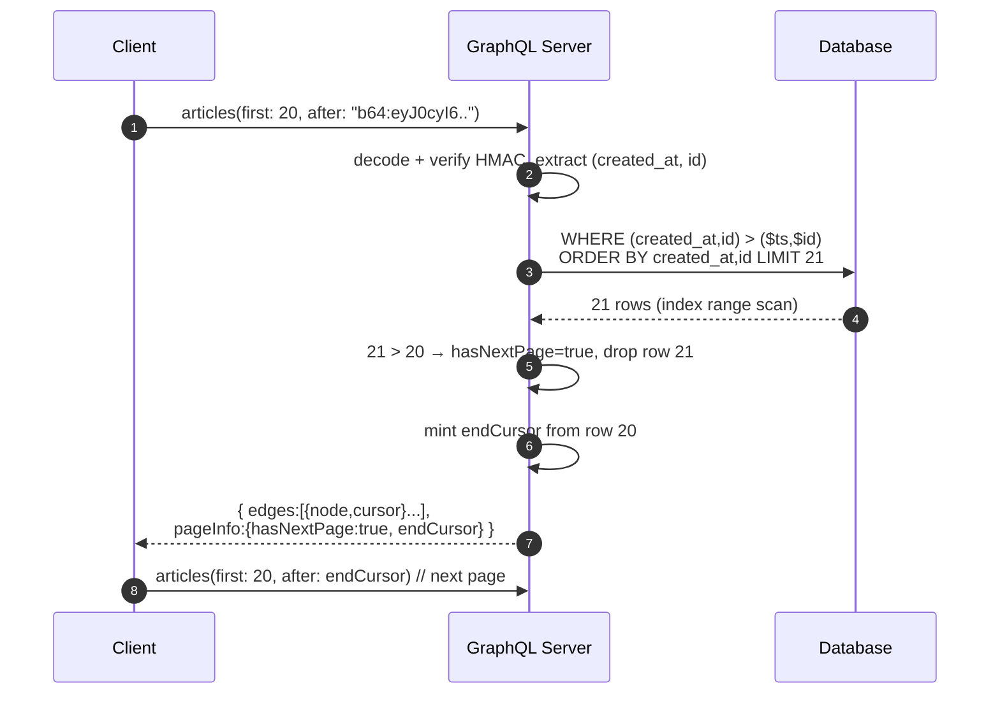

# Pagination and Filtering — Professional

<!-- level-focus -->
At professional level, focus on this question:

> How should teams adopt and operate **Pagination and Filtering** with measurable outcomes and limited coordination?

Use the smallest realistic scenario that exposes the decision and its failure behavior.
## 1. The cost model: why offset is O(offset + k)

`LIMIT k OFFSET n` does not skip rows cheaply. The engine must **produce and discard** the first `n` rows before it can emit anything. Even when a B-tree index supplies the order, the executor walks the index (or heap) counting rows until the offset is satisfied, then returns `k`. There is no "seek to the n-th leaf" primitive in a plain B-tree, because a B-tree indexes by *key*, not by *ordinal position*.

The consequence is well known and measurable:

- Cost grows with **page depth**, not page size. Page 1 is fast; page 10,000 reads and throws away ~200,000 rows for a page of 20.
- A `SELECT count(*)` for total pages is a second full scan of the filtered set.
- Under concurrent inserts/deletes, offsets **shift**: a row inserted before the current page pushes one row from page N onto page N+1 (a duplicate) or hides one (a skip).

Offset is acceptable only when the offset is bounded and small (a UI that never lets users past page 20, an admin table). At scale it is a liability.

---

## 2. Keyset pagination as a row-value comparison

Keyset (a.k.a. seek method, cursor pagination) replaces "skip n rows" with "start *after* the last row I saw." The cursor carries the **sort key values** of the last returned row, and the next query asks for rows strictly greater (or less) than those values.

For a single-column ascending sort on `created_at` this is trivial:

```sql
SELECT id, created_at, title
FROM articles
WHERE created_at > $last_created_at   -- the cursor
ORDER BY created_at
LIMIT 20;
```

The subtlety is **ties**. `created_at` is not unique, so `>` skips rows sharing the boundary timestamp and `>=` duplicates them. The fix is a **tie-breaker**: append a unique column (the primary key) to the sort key, making the *tuple* unique. The comparison then becomes a **row-value comparison** (tuple comparison):

```sql
SELECT id, created_at, title
FROM articles
WHERE (created_at, id) > ($last_created_at, $last_id)
ORDER BY created_at, id
LIMIT 20;
```

`(a, b) > (x, y)` evaluates in lexicographic order: `a > x`, OR (`a = x` AND `b > y`). PostgreSQL implements this row constructor comparison natively (`postgresql.org`, "Row and Array Comparisons"), and — critically — the planner can turn it into an **index range scan** when the index matches the tuple. This is what makes keyset O(log n + k): a B-tree descent to the boundary tuple (`log n`) followed by a forward leaf scan of `k` rows. No rows before the boundary are ever visited.

Do not hand-expand the tuple into `a > x OR (a = x AND b > y)` unless forced to; many planners optimize the row-constructor form better, and the expanded form is easy to get wrong (a missing parenthesis silently drops rows).

---

## 3. Composite index alignment with ORDER BY

Keyset's O(log n + k) guarantee holds **only** if a B-tree index exists whose leading columns match the `ORDER BY` tuple, in the same column order and same direction. The index is what lets the engine *seek* to the boundary tuple instead of scanning.

For `ORDER BY created_at, id`:

```sql
CREATE INDEX idx_articles_created_id ON articles (created_at, id);
```

Now `(created_at, id) > ($ts, $id)` becomes an index range scan starting at the leaf immediately after the boundary tuple. The following diagram contrasts the two access patterns on the same index.



The left path pays for depth; the right path pays only `log n` (tree height, typically 3–4 for millions of rows) plus the page size. Verify with `EXPLAIN (ANALYZE, BUFFERS)`: keyset should show an `Index Scan` (or `Index Only Scan`) with `Buffers: shared hit` proportional to `k`, and no `Sort` node — the index already supplies the order.

---

## 4. Mixed-direction sorts break a single index

A B-tree leaf is a single totally-ordered sequence. It can serve `ORDER BY a ASC, b ASC` by forward scan and `ORDER BY a DESC, b DESC` by backward scan (both cheap). But a **mixed-direction** sort like `ORDER BY score DESC, id ASC` is **not** a prefix or reverse of a `(score, id)` index in either direction — walking the index by `score DESC` gives you `id DESC` within each score group, which is the wrong tie order.

Symptom: the planner inserts a `Sort` node, the ordering is no longer index-supplied, and keyset's row-value comparison no longer maps to a clean range scan. Two fixes:

1. **Build an index with matching directions.** PostgreSQL supports per-column direction and NULL placement in the index definition:

   ```sql
   CREATE INDEX idx_leaderboard ON scores (score DESC, id ASC);
   ```

   Now `ORDER BY score DESC, id ASC` is a plain forward scan of this index, and the keyset predicate becomes a clean range scan again. The trade-off: this index serves *only* that direction pair; the reverse page requires either a backward scan (fine) or, for a different sort, a different index.

2. **Normalize the value** so all columns sort the same direction. If `score` is a bounded non-negative integer, index and query on `(-score, id)` ascending, or store a `rank_key`. This is a workaround; prefer the explicit directional index.

The row-value comparison operator `(a, b) > (x, y)` itself assumes *all columns ascending*. For mixed directions you cannot use a single tuple comparison — you must either flip via a directional index (recommended, keeps the tuple form against the flipped index) or hand-write the boundary as `score < $s OR (score = $s AND id > $i)`, carefully matching each column's direction.

---

## 5. NULLS FIRST/LAST and pagination correctness

If any sort column is nullable, NULL ordering is part of correctness, not cosmetics. SQL standard and PostgreSQL default: ascending sorts put `NULLS LAST`, descending puts `NULLS FIRST` (`postgresql.org`, `SELECT` / `ORDER BY`). The row-value comparison `(a, b) > (x, y)` does **not** honor NULLS ordering — comparisons involving `NULL` return `NULL` (treated as not-true), so a nullable leading column silently drops or reorders rows at the boundary.

Rules for correct keyset over nullable columns:

- **Make the index's NULL placement match the ORDER BY.** `CREATE INDEX ... (a NULLS LAST, id)` must match `ORDER BY a NULLS LAST, id`. A mismatch forces a `Sort` node and voids the seek.
- **Handle the NULL boundary explicitly.** When the boundary row's `a` is NULL (you have crossed into the NULL partition), the next-page predicate changes shape — you are now paginating within the NULL group by the tie-breaker alone: `WHERE a IS NULL AND id > $last_id`. Before the NULL partition, the predicate is the normal tuple comparison plus `OR a IS NULL` (for `NULLS LAST`) to admit the NULL tail.
- **Simplest robust option: make sort columns non-nullable.** Coalesce to a sentinel at write time (e.g., a far-future timestamp for "no due date") so the sort key is total and the tuple comparison is always well-defined. Document the sentinel; it leaks into ordering semantics.

The general lesson: keyset correctness reduces to making the sort key a **total order with a unique tie-breaker and no NULLs in the comparison path.**

---

## 6. Cursor encoding: opacity, signing, direction

A cursor is the serialized boundary tuple plus the metadata needed to resume. Treat it as an **opaque token**: clients must not parse or construct it, which frees you to change the sort key or storage without breaking the contract.

What a cursor should encode:

- The **sort-key values** of the boundary row (e.g., `created_at` + `id`), enough to reconstruct the row-value comparison.
- The **direction** and sort definition it was minted for, so the server can reject a cursor replayed against a different `ORDER BY` (mismatched cursors otherwise return silently wrong pages).
- Optionally a **snapshot/PIT token** (see §8) for repeatable reads.

Encoding and integrity:

- **Base64url the payload** (JSON or a compact binary) so it survives URLs and headers. This is *encoding*, not security — it is trivially reversible.
- **Sign it (HMAC-SHA256) when the cursor is client-facing and correctness or trust matters.** A signed cursor lets the server detect tampering — a client that edits the boundary values to probe rows outside its authorization, or corrupts the payload — and reject it rather than executing a malformed predicate. Store only the key server-side; the signature travels with the cursor. Do **not** put secrets or another tenant's data in the payload even signed; signing proves integrity, not confidentiality.

**Forward and backward cursors.** Bidirectional pagination needs both `after` (rows following the boundary, forward) and `before` (rows preceding it, backward). The backward query is the mirror: flip the comparison operator and the `ORDER BY` direction, fetch `k`, then **reverse the result set in the application** so the caller always receives ascending order regardless of traversal direction. A page therefore exposes two cursors — a `startCursor` (for going `before` it) and an `endCursor` (for going `after` it).

---

## 7. Relay Connections: edges, pageInfo, before/after

The GraphQL **Cursor Connections Specification** (`relay.dev/graphql/connections`) is the canonical formalization of opaque-cursor pagination and is worth adopting even outside Relay because it pins down the semantics precisely.

A connection wraps a collection in a fixed shape:

| Field | Meaning |
| --- | --- |
| `edges` | List of `{ node, cursor }`; `cursor` is the opaque boundary token for that specific node |
| `edges[].node` | The actual domain object |
| `edges[].cursor` | Opaque cursor usable as `after`/`before` for resuming at that edge |
| `pageInfo.hasNextPage` | Whether more rows exist *after* the last edge |
| `pageInfo.hasPreviousPage` | Whether rows exist *before* the first edge |
| `pageInfo.startCursor` | Cursor of the first edge (pass to `before`) |
| `pageInfo.endCursor` | Cursor of the last edge (pass to `after`) |

The four pagination arguments follow strict rules from the spec:

- `first: n, after: cursor` — forward page: the first `n` edges after `cursor`.
- `last: n, before: cursor` — backward page: the last `n` edges before `cursor`.
- Servers **must** support at least `first`/`after`; `first` and `last` in the same query is discouraged (ambiguous) and the spec advises against it.

Computing `hasNextPage` cheaply: **over-fetch by one**. Ask the database for `k + 1` rows; if `k + 1` come back, `hasNextPage = true` and you discard the extra row. This avoids a separate `count` query. `hasPreviousPage` under forward pagination is `after != null` (per the spec's simplification), and vice versa for backward.

The round-trip:



Each edge carrying its *own* cursor (not just page-level cursors) is what lets a client resume from any position, not merely page boundaries — a property offset pagination cannot offer.

---

## 8. Snapshot consistency and point-in-time reads

Keyset pagination is stable against inserts/deletes *at the boundary* — a new row before the current cursor cannot shift the page, because the predicate anchors on values, not positions. But a **long-lived pagination session** over a mutating dataset can still observe rows that appeared or vanished mid-traversal, and a row whose sort key is *updated* can be seen twice or skipped (it moves relative to the cursor).

For **repeatable pagination** — every page reflects a single logical moment — you need a snapshot:

- **Snapshot / point-in-time token.** Capture a consistent view at the first request and thread its identifier through every cursor. Subsequent pages read against that frozen view, so mutations after the session started are invisible and the sequence is stable and duplicate-free.
- **MVCC databases** already have the machinery: a `REPEATABLE READ`/`SERIALIZABLE` transaction, or an explicit exported snapshot, pins a view. But holding a transaction open across many client-driven pages is usually unacceptable (it blocks vacuum, holds resources). The practical pattern is a **short-lived, resumable snapshot** the client re-references by token, not an open transaction — which is exactly what dedicated search engines provide (§9).
- **Trade-off:** snapshot pagination trades freshness for stability. The client sees a consistent-but-stale view; new data appears only on a fresh session. This is the right default for exports, reports, and cursors meant to be paged to completion; it is the wrong default for infinite-scroll feeds, where seeing new items is desirable and keyset-without-snapshot is preferred.

---

## 9. Elasticsearch: from/size, search_after, PIT

Elasticsearch makes the offset-vs-keyset distinction unusually explicit and enforces it (`elastic.co`, "Paginate search results").

**`from` / `size` (offset pagination).** Simple but bounded: to return `from + size` results, *each shard* must build and return `from + size` hits to the coordinating node, which merges and discards. Deep offsets multiply memory across shards. Elasticsearch caps this with **`index.max_result_window`** (default **10,000**): `from + size` may not exceed it, and requests beyond the window are rejected. This is a deliberate guardrail against the O(offset + k) blow-up, not a bug to raise away.

**`search_after` (keyset).** The scalable path. You supply the **sort values of the last hit** as the `search_after` array, and the query resumes strictly after that tuple — the direct analog of the row-value comparison. Requirements mirror SQL keyset exactly:

- The `sort` must include a **tie-breaker guaranteeing a total order** — a unique field such as `_id` (or, recommended for performance, `_shard_doc`) appended to the sort. Without it, hits sharing a sort value are dropped or duplicated across pages.
- There is **no `from`** with `search_after`; you always resume from the cursor tuple.

**Point-in-Time (PIT).** `search_after` alone can still see mutations across pages because indices refresh between requests. A **PIT** freezes a lightweight view of the index at open time; passing the returned `pit.id` into subsequent `search_after` queries makes the whole traversal read a consistent snapshot — Elasticsearch's concrete implementation of the point-in-time token from §8. You open a PIT with a keep-alive, thread it plus `search_after` through each page, and explicitly close it when done. This is the recommended production combination for deep, consistent pagination in Elasticsearch, and it is why the legacy `scroll` API is now discouraged in its favor.

---

## 10. Comparison summary

| Dimension | Offset (`LIMIT k OFFSET n`) | Keyset (row-value seek) |
| --- | --- | --- |
| Time complexity | O(offset + k) — grows with depth | O(log n + k) — depth-independent |
| Index requirement | Any index for order (still scans offset) | Composite B-tree matching ORDER BY tuple + direction |
| Access pattern | Scan-and-discard from start | Descend to boundary, forward scan `k` |
| Random page access | Yes (jump to page N) | No — sequential only (next/prev) |
| Stability under writes | Rows shift → skips/duplicates | Boundary-stable; needs snapshot for full repeatability |
| Total count | Second full scan | Not naturally available; use `hasNextPage` over-fetch |
| Tie-breaker needed | No | Yes — unique column for total order |
| NULL handling | Sort-level only | Must align index NULL placement + explicit NULL boundary |
| Cursor exposed to client | Just an integer | Opaque, optionally HMAC-signed tuple |
| Best fit | Small/bounded offsets, admin tables, "jump to page" | Feeds, infinite scroll, deep + high-volume pagination |
| Canonical formalization | — | Relay Cursor Connections; ES `search_after` + PIT |

The through-line: **offset indexes by position and pays for depth; keyset indexes by value and pays only for tree height plus page size.** Everything else — tie-breakers, directional indexes, NULL placement, cursor signing, snapshot tokens — exists to make the value-based boundary a *total, stable, tamper-resistant* order so the O(log n + k) seek is actually reachable and actually correct.

---


---

## Apply it

1. Define the user or business outcome that **Pagination and Filtering** should improve.
2. Assign one owner for code, contracts, operations, and incidents.
3. Split delivery into reversible increments that produce evidence early.
4. Publish responsibilities, escalation paths, and compatibility windows.
5. Stop or expand only when the agreed measures support that decision.

## Verify your work

- Each increment has an owner, rollback path, and observable exit condition.
- Adoption, reliability, delivery time, and coordination cost are measured.
- Incident and migration exercises prove that responsibility is executable.
- The old path is removed only after telemetry proves it is unused.

## Review questions

- Which measurable outcome justifies investing in Pagination and Filtering?
- Which team owns the full lifecycle and incident response?
- What reversible increment produces the earliest useful evidence?
- Which exit condition proves that migration or adoption is complete?
