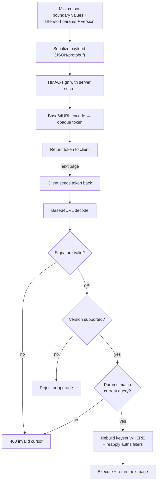
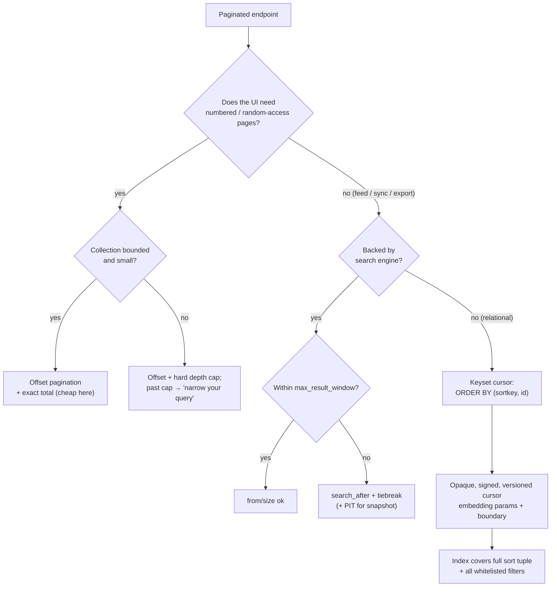

# Pagination and Filtering — Senior

<!-- level-focus -->
At senior level, focus on this question:

> Which system invariant is affected by **Pagination and Filtering** under failure, load, and change?

Use the smallest realistic scenario that exposes the decision and its failure behavior.
## 1. Choosing the strategy by access pattern

There is no universally correct pagination scheme. The right one is dictated by how the client walks the collection.

- **Jump-to-page UI** (admin tables, search results with page numbers 1..N, "go to page 47"): the client needs *random access* to arbitrary positions and a stable notion of "page 47". Offset pagination is the natural fit because a cursor cannot express "skip ahead to an arbitrary page I have never visited."
- **Infinite scroll / feeds / API sync** (mobile timelines, "load more", batch export, replication of a dataset): the client only ever walks *forward from where it stopped*. It never needs page 47 by number. Cursor pagination is strictly better here — stable under concurrent inserts and O(page-size) at any depth.
- **Full dataset traversal by a job** (ETL, reindexing, webhooks catch-up): correctness and completeness dominate. You want keyset/cursor traversal keyed on an immutable, monotonic column so rows are never skipped or double-visited under concurrent writes.

The key senior insight: **offset degrades with depth, cursor does not.** `OFFSET 1_000_000` forces the database to read and discard a million rows to return ten. Keyset pagination (`WHERE (sort_key, id) > (:last_sort, :last_id) ORDER BY sort_key, id LIMIT :n`) uses the index to seek directly to the boundary, so page 100,000 costs the same as page 1.

| Property | Offset (`LIMIT/OFFSET`) | Cursor / keyset | `search_after` (search engine) |
|---|---|---|---|
| UI fit | Jump-to-page, page numbers | Infinite scroll, sync, next/prev | Infinite scroll over search results |
| Cost at depth | O(offset) — scans skipped rows | O(1) per page — index seek | O(1) per page — no deep-window buffer |
| Stable under concurrent inserts | No (rows shift, dup/skip) | Yes (anchored to a key) | Yes (anchored to a sort tiebreak) |
| Total count available | Yes (extra query) | Not naturally | Yes (`total`, but capped/estimated) |
| Requires a unique tiebreak | No | Yes | Yes |
| Index requirement | Sort index helps | **Must** cover sort + filter | Mapping + sort field |
| Random access to page N | Yes | No | No |

Rule of thumb: **default to cursor.** Only reach for offset when a product requirement genuinely needs numbered random-access pages, and even then, cap the reachable depth (see §5).

---

## 2. Cursor design in depth

A cursor is a serialized *position* in an ordered result set. The design axes are: what it encodes, whether it is opaque or transparent, and whether it is stateless-encoded or server-stored.

### 2.1 Opaque vs transparent

Always present the cursor as **opaque** to clients — an unstructured token like `eyJz...`. This is a contract decision, not just aesthetics: if clients can read and hand-construct cursors, you can never change the sort key, add a tiebreak, or migrate encoding without breaking them. Opacity buys you freedom to evolve.

Internally the cursor is *transparent to you*: it must carry enough to reconstruct the exact `WHERE`/`ORDER BY` boundary.

### 2.2 What to embed

A keyset cursor must encode every column in the sort order, in order, so the next query can express `> (last values)`:

- The value(s) of the sort key(s) at the boundary row — e.g. `created_at`.
- A **unique tiebreaker**, almost always the primary key, appended to the sort so the ordering is total (see §3).
- A copy (or hash) of the **filter and sort parameters** the cursor was minted under, so you can reject a cursor replayed against a different query (`?status=open` cursor sent to `?status=closed`).
- A **version tag** so you can change the cursor format later and detect old cursors.

Do **not** embed an offset inside an "opaque cursor" — that is offset pagination wearing a costume and inherits all its depth costs.

### 2.3 Stateless-encoded vs server-stored

- **Stateless-encoded** (recommended default): the cursor *is* the state. Base64URL-encode the boundary values + params + version. No server storage, works across a stateless fleet, survives restarts. This is what most public APIs do.
- **Server-stored**: the cursor is a random ID pointing at a snapshot/scroll context held server-side (e.g. a materialized result set or a scroll ID). Needed when you must freeze a consistent snapshot for the whole traversal, but it costs memory, has a TTL, and pins resources — avoid unless the consistency requirement demands it.

### 2.4 Tamper-resistance and signing

Because the cursor round-trips through an untrusted client, treat its contents as untrusted input. Two concerns:

1. **Tampering** — a client edits the encoded boundary to probe rows outside its authorization, or to inject values that skew the query. Mitigate by re-applying all authorization filters on every page (never trust the cursor to scope access) and by **signing** the cursor (HMAC over the payload with a server secret) so a modified cursor is rejected before it reaches the query.
2. **Schema drift** — the sort key you encoded no longer exists, or its type changed. The version tag lets you reject or transparently upgrade stale cursors instead of producing wrong results.



---

## 3. Sorting on non-unique keys

Keyset pagination breaks silently when the sort key is not unique. If you paginate `ORDER BY created_at DESC LIMIT 20` and 50 rows share the same `created_at`, the boundary `WHERE created_at < :last` will *skip* the rows that share the timestamp of the last row on the page — or duplicate them, depending on the comparison. You get missing and repeated records, and it only shows up under real data where timestamps collide.

The fix is to make the ordering **total** by appending a unique tiebreaker (the primary key) to both the `ORDER BY` and the cursor comparison:

```
ORDER BY created_at DESC, id DESC
WHERE (created_at, id) < (:last_created_at, :last_id)
```

This row-value comparison (a lexicographic `<` on the tuple) gives a single unambiguous boundary. Requirements:

- The **index must match the full sort tuple** — `(created_at, id)` — or the planner falls back to a sort/scan and you lose the seek. This is the point where "add a tiebreak" and "add an index" become the same task.
- The tiebreak column must be **immutable** for a given row. A mutable tiebreak lets rows migrate across the boundary and reintroduces skip/dup.
- Mind **null ordering**: nullable sort columns need explicit `NULLS FIRST/LAST` and a null-aware boundary, or the comparison misbehaves at the null cluster.

---

## 4. Filtering at scale

Filtering is where pagination endpoints quietly become database-DoS endpoints.

### 4.1 Every filter and sort needs an index

The hard rule: **any field a client can filter or sort by must be backed by an index that the query can actually use.** An unindexed filter turns each page into a full-table scan; combine it with deep pagination and you have handed clients a resource-exhaustion primitive. Composite queries need composite indexes ordered to match the query's equality-then-range-then-sort shape.

### 4.2 Combinatorial explosion

If you allow arbitrary combinations of `N` filters plus arbitrary sort fields, no finite set of indexes covers every permutation — you cannot index the full cross-product. Senior mitigations:

- Support only a **curated set of filter/sort combinations** that map to indexes you have deliberately created.
- Require certain **high-selectivity filters to be mandatory** (e.g. `tenant_id` or a date range) so every query has an index anchor and can never scan the whole table.
- Reject unsupported sort/filter combinations with a clear 4xx rather than silently running a table scan.

### 4.3 Whitelisting to protect the database

Never let clients name columns freely. **Whitelist** the exact set of filterable fields, operators, and sortable fields. Everything off the list is rejected. This protects against three failures at once: SQL/NoSQL injection via field names, accidental scans on unindexed columns, and exposure of internal columns clients should not see. The whitelist is your contract *and* your safety rail.

### 4.4 The RSQL / OData rabbit hole

Rich query languages — RSQL/FIQL (`status==open;createdAt=gt=2026-01-01`), OData `$filter`, GraphQL arbitrary `where` — are seductive: one endpoint, infinite expressiveness. The senior warning: **expressiveness you expose is expressiveness you must index, secure, and bound.**

| | Fixed whitelist of filters | Open query language (RSQL/OData) |
|---|---|---|
| Index coverage | Every allowed query maps to a known index | Clients can craft queries no index covers |
| Injection surface | Small, per-field validated | Large — full grammar must be parsed & sanitized |
| DB blast radius | Bounded by design | Unbounded without a query cost limiter |
| Client ergonomics | Rigid, more endpoints | Flexible, fewer endpoints |
| Evolution cost | Add fields deliberately | Whole grammar is now your public contract |

If you do adopt a query language, put a **query planner / cost estimator** in front of it that rejects queries lacking an indexed anchor, caps the number of predicates, and forbids sorting on unindexed fields. Without that gate you have shipped a "run any query against my primary database" API.

---

## 5. Deep-pagination attacks and abuse limits

Deep pagination is both a performance cliff and an abuse vector. `OFFSET 5_000_000` (or requesting page 250,000) forces work proportional to depth; a handful of concurrent deep-page requests can saturate the database. Defenses:

- **Cap page size.** Enforce a hard `max` (e.g. 100–200) and a sane default; clamp anything larger rather than trusting the client's `limit`.
- **Bound reachable depth for offset.** Cap the maximum offset/page number the API will serve. Beyond a threshold, return an error that tells the client to *narrow the query* (add filters) rather than page deeper.
- **Prefer cursor-only for large sets.** For endpoints over collections that can grow unbounded, expose *only* cursor pagination — clients physically cannot request "page 1,000,000" because there are no page numbers. This removes the deep-offset primitive entirely.
- **Rate-limit and cost-account.** Charge deep or expensive paginated queries more against a rate/cost budget, so a scraper walking millions of rows hits limits.

The through-line: an API that lets a client name an arbitrary depth *and* an arbitrary filter *and* an arbitrary sort has multiplied its worst-case query cost by the client's imagination. Bound each axis.

---

## 6. Pagination over search engines

Search engines have their own depth cliff, and it is sharper than a relational one.

Elasticsearch/OpenSearch paginates with `from`/`size` by default, which is offset pagination over a distributed index. Because the coordinating node must gather `from + size` hits **from every shard** and merge them, deep windows blow up memory. The engine enforces a hard ceiling — `index.max_result_window`, default **10,000** — beyond which `from + size` requests are rejected. This is a feature, not a bug: it stops one query from OOM-ing the cluster.

For anything past that window, use **`search_after`**: you re-issue the query with a sort tiebreak and the sort values of the last hit as the anchor, walking forward without buffering a deep window. It is the search-engine equivalent of keyset pagination and carries the same requirement — the sort must be **total** (include a unique tiebreak such as `_id` or a document key) or hits at a shared sort value are skipped/duplicated, exactly as in §3. For consistent, snapshot-stable deep traversals (reindex/export), pair `search_after` with a **Point in Time (PIT)** so the underlying segments do not shift mid-walk. (See Elastic's paginate-search-results documentation for `from`/`size`, `search_after`, and PIT.)

Practical mapping of the earlier decision:

- **Jump-to-page over search, shallow** → `from`/`size`, but only within `max_result_window`.
- **Infinite scroll / deep traversal over search** → `search_after` with a tiebreak; add PIT for snapshot consistency.
- **Never** raise `max_result_window` to enable deep `from`/`size` "because a client asked" — that trades a bounded rejection for an unbounded cluster risk.

---

## 7. Exposing total counts

A total count (`"total": 48213`, page counts, "48,213 results") is a UX nicety with a real cost.

- On a relational store, an exact `COUNT(*)` over a filtered set can be as expensive as the full scan you are trying to avoid — it must touch every matching row. On a large filtered collection this dominates the request.
- On a search engine, exact deep totals are similarly capped: by default the hit count is **tracked accurately only up to 10,000** (`"total": {"value": 10000, "relation": "gte"}`) unless you set `track_total_hits: true`, which reintroduces the cost you were avoiding.

Senior options, cheapest to most expensive:

- **Don't expose a total.** Infinite-scroll UIs rarely need one; a `next` cursor and "load more" suffice. This is the default for high-scale feeds.
- **Expose an approximate/capped total** — "10,000+ results", or a cheap estimate from table statistics / planner row estimates — when the UI just needs a rough sense of scale.
- **Expose an exact total only when the product truly needs it** and the filtered set is small or well-indexed enough that the count is cheap; consider caching it or computing it asynchronously.

The decision is a UX-vs-cost trade, and it is *per endpoint*: the admin table over 500 rows can afford an exact count; the global activity feed over 500M rows cannot.

---

## 8. Decision flow



---

## 9. Senior takeaways

- **Pick by access pattern, not by habit.** Jump-to-page → offset (bounded); feed/sync/export → cursor; deep search → `search_after`.
- **Offset's cost is O(depth); keyset's is O(page).** That single fact drives most of the design.
- **Cursors are untrusted input.** Opaque to clients, signed and versioned for you, embedding the boundary *and* the query params; re-apply authorization on every page.
- **Non-unique sort keys silently corrupt keyset pagination.** Always append a unique, immutable tiebreak and index the full tuple.
- **Every filter and sort field needs an index.** Whitelist fields and operators; treat open query languages (RSQL/OData) as an indexing, security, and cost-bounding liability, not a free feature.
- **Bound every axis of abuse:** max page size, capped/forbidden deep offset, cursor-only for unbounded sets, and rate/cost accounting.
- **Respect the search-engine window** (`max_result_window` ≈ 10,000); go past it with `search_after` + PIT, never by raising the ceiling.
- **Total counts are a per-endpoint UX-vs-cost trade** — prefer no total or an approximate/capped one at scale; reserve exact counts for small, well-indexed sets.

*Next step:* [Pagination and Filtering — Professional](professional.md)

---

## Apply it

1. State the system invariant that **Pagination and Filtering** must protect.
2. Mark ownership, state, and failure propagation at each boundary.
3. Compare two designs under load, dependency failure, and future change.
4. Define recovery and compatibility behavior before implementation.
5. Test the riskiest assumption with a focused experiment.

## Verify your work

- The experiment supports the design with evidence, not preference.
- Failure injection shows the blast radius and recovery path.
- Compatibility checks cover old and new callers or data.
- Operational signals reveal invariant violations and recovery progress.

## Review questions

- Which invariant must remain true when Pagination and Filtering fails?
- Where should recovery responsibility live, and why?
- Which assumption deserves an experiment before implementation?
- How can the design evolve without changing every consumer at once?
