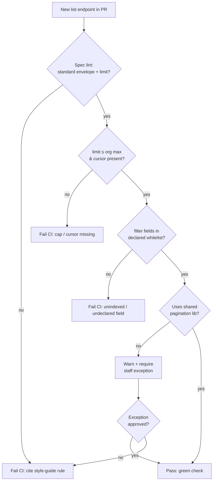
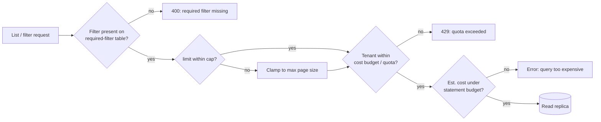

# Pagination and Filtering — Staff

At staff scope, pagination and filtering stop being an endpoint detail and become a **platform contract**. The technical mechanics — cursors, keyset queries, filter grammars — are settled at the senior tier. What is left is organizational: whether every team ships its own dialect of "page 2, sorted by name," whether product-facing APIs let clients hand-write arbitrary predicates against your primary database, and who eats the incident when an unindexed filter table-scans a 400M-row table during peak. Your job is to make the safe path the default path, encode it as a rule the whole org follows, and defend the shared datastore as the finite resource it is.

---

## Contents

1. [The org failure mode: N dialects of pagination](#1-the-org-failure-mode-n-dialects-of-pagination)
2. [Standardizing one convention across every team](#2-standardizing-one-convention-across-every-team)
3. [The cost of arbitrary filter languages](#3-the-cost-of-arbitrary-filter-languages)
4. [Governance: style guide + linting, not review heroics](#4-governance-style-guide--linting-not-review-heroics)
5. [Protecting the datastore as a shared resource](#5-protecting-the-datastore-as-a-shared-resource)
6. [Ownership: primary DB vs a search tier](#6-ownership-primary-db-vs-a-search-tier)
7. [Migration: turning an offset API into a cursor API](#7-migration-turning-an-offset-api-into-a-cursor-api)
8. [Framing the caps to product and leadership](#8-framing-the-caps-to-product-and-leadership)
9. [Staff checklist](#9-staff-checklist)

---

## 1. The org failure mode: N dialects of pagination

Left ungoverned, pagination diverges the moment you have more than one team. One service takes `?page=2&per_page=50`, a second takes `?offset=100&limit=50`, a third invented `?cursor=…&size=50`, and a fourth returns a naked array with a `Link` header. Each defines "the total count" differently, or omits it. Each names the page envelope differently — `data` vs `items` vs `results` vs the bare list. Sort syntax splits into `?sort=name&order=desc`, `?sort=-name`, and `?orderBy=name%20DESC`.

The cost is not aesthetic. It lands on:

- **Client engineers**, who relearn pagination per endpoint and write N slightly-different loops, each with its own off-by-one and its own end-of-collection detection.
- **SDK/codegen**, which cannot offer one `paginate()` helper because there is no single shape to generate against.
- **Support and incident load**, because "why did my export stop at 10,000 rows" has a different answer per service.

This is a classic Conway's-law leak: the API surface mirrors the org chart instead of a coherent product. Standardization is the fix, and standardization is a staff responsibility because no single team can impose it on the others.

---

## 2. Standardizing one convention across every team

Pick **one** convention and make it boring. The concrete choices matter less than the fact that they are singular. A defensible org default:

- **Cursor-based (keyset) pagination** as the standard for any collection that can grow unbounded. Offset pagination is reserved for small, bounded, admin-only lists and is opt-in, not default.
- **One page envelope**, identical across every endpoint:

```json
{
  "items": [ ... ],
  "page": {
    "next_cursor": "b3BhcXVlLXRva2Vu",
    "has_more": true
  }
}
```

- **One set of parameter names**: `limit` for page size, `cursor` for the opaque continuation token, `sort` for ordering, `filter[...]` for narrowing. No per-team synonyms.
- **Opaque cursors.** The token is base64 of a server-owned struct (sort key + tiebreak + a version byte). Clients treat it as a black box. This is what lets you change the underlying keyset later without a breaking change — the opacity is the whole point.
- **No client-computed total by default.** `COUNT(*)` over a filtered large table is its own foot-gun; expose an approximate or capped count only where product genuinely needs it.

The standard should ship as **more than a document**: a shared library/middleware that parses these params, enforces the caps, and emits the envelope. Teams adopt the library, not the prose. A rule you have to re-explain in every review is a rule you don't have.

| Decision | Standardize one convention | Let each team choose |
|---|---|---|
| Client learning cost | Learn once, reuse everywhere | Relearn per endpoint |
| SDK / codegen | One `paginate()` helper for all | Bespoke per service; often none |
| Cross-service consistency | Guaranteed by shared lib | Drifts with every new team |
| Incident surface | One place to fix caps/bugs | N places, N behaviours |
| Migration leverage | Change cursor internals centrally | Each team migrates alone |
| Upfront cost | Build + socialize the standard | Zero — you pay later, with interest |
| Right when | You have >1 team or a public API | Genuinely one team, throwaway API |

The trade you are making: a real upfront cost (build the library, run the socialization, absorb the "but my case is special" conversations) against a compounding cost that grows with every team and every client. Above one team, the standard wins.

---

## 3. The cost of arbitrary filter languages

The most expensive foot-gun in this topic is the "flexible" filter. A well-meaning team ships `?filter=<some expression language>` — an RSQL/OData/GraphQL-ish grammar that lets clients express arbitrary predicates. It demos beautifully. Then it becomes an incident generator:

- **Every filter is a potential unindexed query.** An open grammar means clients can filter on columns you never indexed, combine predicates in orders your indexes don't cover, or `LIKE '%…%'` their way into a full table scan. You cannot pre-provision indexes for a query space you didn't design.
- **You inherit an unbounded query planner as a public API.** The filter language's expressiveness is now a contract. Restricting it later — banning a slow operator, requiring a leading equality predicate — is a breaking change.
- **Cost is unpredictable and client-controlled.** One customer's dashboard can generate a query that pins a primary replica. The blast radius is the whole shared database, not one tenant.
- **Security surface widens.** Arbitrary predicate injection, resource-exhaustion DoS via pathological filters, and data-exposure via filters that traverse relationships you didn't mean to expose.

The disciplined alternative is a **whitelist of filterable fields with declared operators**, each backed by an index and each with a known cost profile. `filter[status]=active` and `filter[created_after]=…` are allowed because you designed for them; `filter[notes]=~"%mistake%"` is not, because nothing backs it.

| Signal | Open filter language | Whitelisted fields + operators |
|---|---|---|
| Query space | Unbounded, client-defined | Finite, server-designed |
| Index coverage | Impossible to guarantee | Every field is index-backed |
| Cost predictability | Client-controlled, unbounded | Bounded and reviewable |
| Tightening later | Breaking change | Non-breaking (add fields freely) |
| Incident profile | Recurring unindexed-scan pages | Rare; caught at design time |
| Right when | Internal analytics on a warehouse | Any product API on a live DB |

The rule of thumb to socialize: **you may expose exactly the queries you have designed indexes for, and no more.** Flexibility that outruns your index strategy is a liability disguised as a feature.

---

## 4. Governance: style guide + linting, not review heroics

A convention enforced by human vigilance decays the week the vigilant reviewer goes on leave. Encode pagination and filtering rules as **automated gates** in the API style guide:

- **Spec linting** (Spectral or equivalent on the OpenAPI/proto spec) that fails CI when:
  - a list endpoint lacks a `limit` parameter or ships without a cursor;
  - `limit` has no maximum, or a maximum above the org ceiling;
  - the response uses a non-standard envelope or bare-array shape;
  - a `filter` parameter references a field not in the endpoint's declared filterable set;
  - offset-style params appear on an endpoint not explicitly flagged `pagination: offset-allowed`.
- **The shared pagination library** as the primary enforcement: if teams route list responses through it, most rules are true by construction.
- **A short, canonical style-guide page** — the human-readable source of truth the linter mechanizes — that states the envelope, the param names, the caps, and the "expose only what you've indexed" rule with examples of accepted and rejected requests.



The point is that the reviewer's job becomes reading the exceptions, not policing the defaults. Defaults are cheap when the machine holds them.

---

## 5. Protecting the datastore as a shared resource

The primary database is a **shared, finite resource** consumed by every team's endpoints. Pagination and filtering are the two knobs most likely to let one endpoint consume it all. Defend it with hard, enforced limits:

- **Max page size, enforced server-side.** Clamp `limit` to a ceiling (e.g., 100 or 1000 depending on row weight); silently clamp or reject over-limit requests, but never honor an unbounded page. "Give me everything" must be a paginated loop, not one query.
- **Required filters on huge tables.** Some collections must never be listed unfiltered. An endpoint over a billion-row events table requires at least a tenant + time-range predicate; a request without them is a 400, not a table scan. Encode this as a per-endpoint declaration the library enforces.
- **Query cost budgets / quotas.** Assign endpoints (or tenants) a cost budget — statement timeouts, a max-rows-examined guard, per-tenant QPS caps on expensive list paths. When a query exceeds its budget it is killed, not slowed for everyone. This converts "one bad filter takes down the DB" into "one bad request gets a 429/error."
- **Isolate expensive reads.** Route heavy list/filter traffic to read replicas so an export or analytics scan can't starve the write path.



These are not hostile to clients; they are what keeps the platform available for all clients. An unbounded query the platform *can* serve is a query one tenant *will* use to degrade everyone else.

---

## 6. Ownership: primary DB vs a search tier

Rich filtering and the OLTP primary database are in fundamental tension. The primary is optimized for point reads and writes on known keys; it is a poor engine for ad-hoc multi-field filtering, free-text search, and faceting. When product demands rich filtering, the staff decision is **where that query load lives and who owns it**:

- **Primary DB** owns the small, index-backed whitelist filters — the ones you can serve cheaply and predictably. Keep these here; a separate tier for `filter[status]=active` is over-engineering.
- **A dedicated search/query tier** (Elasticsearch/OpenSearch, a search index, or a read-optimized denormalized store) owns rich, free-text, and high-cardinality filtering. This moves the unpredictable query cost off the shared OLTP database and onto infrastructure designed to absorb it.

That split creates ownership questions you must settle explicitly, not by drift:

- **Who owns the index pipeline** (CDC/streaming from primary → search), its lag budget, and its reconciliation when they diverge?
- **What is the freshness contract** the API promises when a filter is served from an eventually-consistent search tier vs the strongly-consistent primary?
- **Which team is on call** when a filter is slow — the API team, the search-platform team, or the data-pipeline team?

The failure mode is a search tier that everyone uses and no one owns: index lag with no SLO, silent divergence from the source of truth, and finger-pointing during incidents. Decide ownership when you decide to build it.

---

## 7. Migration: turning an offset API into a cursor API

The hardest realization is that **changing an offset API to a cursor API is a breaking change**, because the client contract changes shape: `?page=2` and a `total_pages` field disappear, and clients that computed "page N of M" or jumped to arbitrary pages have no equivalent. You cannot silently swap the implementation.

Run it as a versioned, dual-support migration:

1. **Add, don't replace.** Ship cursor pagination alongside offset on the same endpoint (accept both `cursor` and `page`, prefer `cursor` when present). New clients adopt cursors immediately; old clients keep working.
2. **Instrument adoption.** Measure the share of traffic still using offset, sliced by client/API key. You cannot deprecate what you can't count.
3. **Deprecate the offset path** with a real timeline: `Deprecation`/`Sunset` headers, changelog, direct outreach to the top offset-using clients, and a documented cutover date.
4. **Cap the offset path harder** in the interim — deep offsets (`offset=500000`) are exactly the slow queries you're migrating away from; clamp them and return an error steering clients to cursors.
5. **Remove offset** only after adoption crosses your threshold and the sunset date passes.

For a public API, "just break it" is never on the table — the migration *is* the work, and it is measured in quarters. This is why standardizing on cursors *before* you have public clients is worth real upfront cost: you avoid ever running this migration.

---

## 8. Framing the caps to product and leadership

The caps in this topic — capped page size, banned offset, whitelisted filters, required filters — read to product as "engineering is saying no to features." Reframe them as **availability and cost decisions**, in the language leadership already uses:

- **Availability, not restriction.** "An uncapped list query lets a single customer's dashboard degrade the database for every customer. The page-size cap is what keeps the platform up during peak — it's an SLO decision, not a UX one."
- **Cost, made visible.** "Arbitrary filters mean unpredictable database load, which means we over-provision to survive the worst client query. Whitelisted filters let us size infrastructure to a known workload — that's a direct spend line."
- **Blast radius.** "On a shared database, one unindexed filter is a company-wide incident, not a one-endpoint bug. The whitelist keeps a mistake contained to the request that made it."
- **Product is still served.** The answer to "we need rich filtering" is not "no," it's "yes, on the search tier" (§6). Pair every cap with the sanctioned path to the capability. Leadership hears a plan, not a wall.
- **Precedent.** Every mature platform API — the ones product benchmarks against — caps page size, uses cursors, and whitelists filters. This is the industry-standard shape of a scalable API, not a local austerity measure.

The staff move is to have made this case *before* the incident, so the caps are understood as the reason you stayed up rather than the reason a feature shipped late.

---

## 9. Staff checklist

- **One convention, org-wide:** cursor default, single envelope, single param names, opaque tokens — shipped as a shared library, not just a doc.
- **Offset is opt-in**, bounded, and flagged; it is never the unbounded default.
- **Filters are a whitelist** of index-backed fields with declared operators; no arbitrary filter grammar over the primary DB.
- **Rules are linted in CI**, not enforced by reviewer memory; the human reviews exceptions.
- **The datastore is defended:** max page size, required filters on huge tables, per-tenant cost budgets/quotas, expensive reads on replicas.
- **Rich filtering has a home and an owner:** a search tier with a freshness contract, an index-pipeline SLO, and a named on-call — decided when built, not during the incident.
- **Offset→cursor is a versioned migration:** dual-support, measure adoption, deprecate with a sunset, then remove. Standardize early to avoid running it at all.
- **Caps are framed as availability and cost** to product and leadership, always paired with the sanctioned path to the capability they're capping.

---

*Next step:* [Pagination and Filtering — Interview](interview.md)
