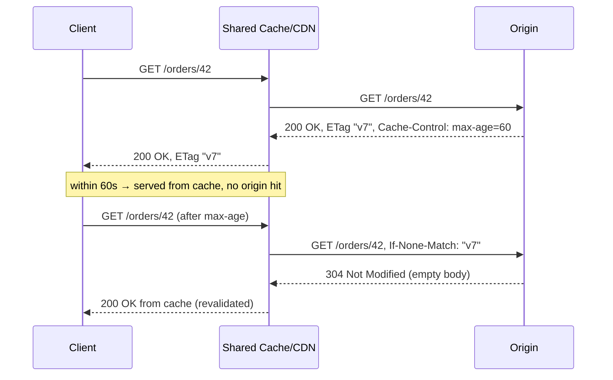
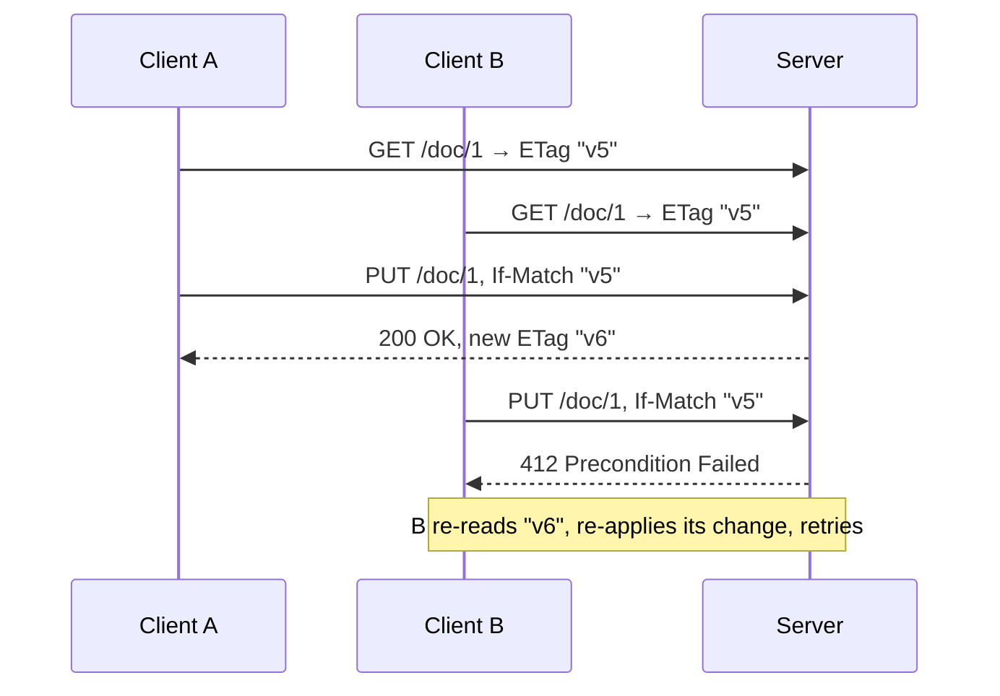
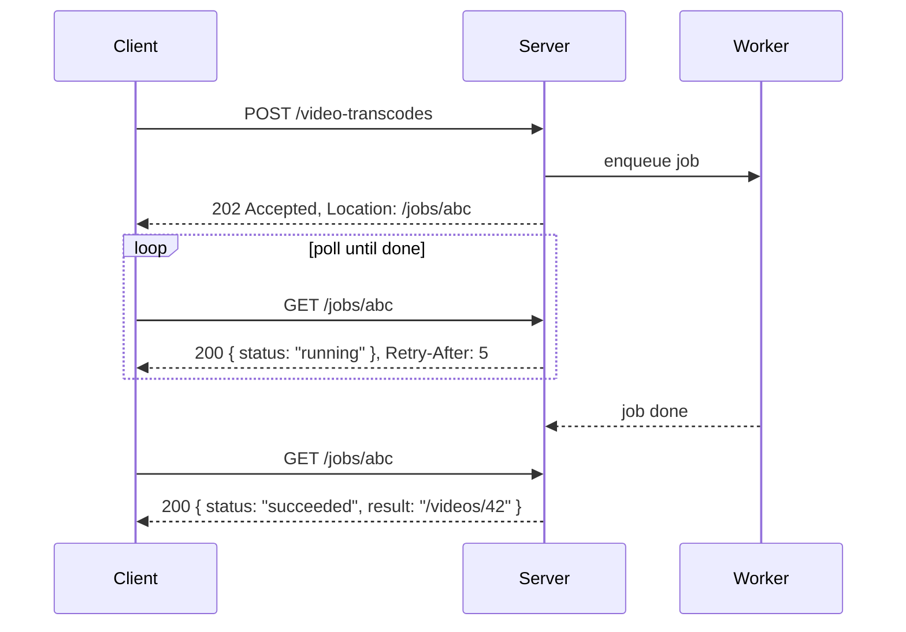

# REST Design at Scale — Interview

A tiered Q&A bank, from fundamentals to staff-level judgment. Answers are compressed to what a strong candidate would actually say in the room.

1. [What actually makes an API "RESTful"?](#q1-what-actually-makes-an-api-restful)
2. [Safe vs. idempotent methods](#q2-explain-safe-vs-idempotent-methods)
3. [How do you name resources well?](#q3-how-do-you-name-resources-well)
4. [How do you choose status codes?](#q4-how-do-you-choose-status-codes)
5. [How does HTTP caching work with ETags?](#q5-how-does-http-caching-work-with-etags)
6. [Optimistic concurrency with If-Match](#q6-how-do-you-implement-optimistic-concurrency)
7. [REST vs. GraphQL vs. RPC](#q7-when-do-you-pick-rest-vs-graphql-vs-rpc)
8. [Fixing a chatty API / N+1 over HTTP](#q8-a-mobile-client-makes-40-calls-to-render-one-screen-how-do-you-fix-it)
9. [Evolving an API without breaking clients](#q9-how-do-you-evolve-an-api-without-breaking-clients)
10. [Long-running operations over HTTP](#q10-how-do-you-model-a-long-running-operation)
11. [Error design with RFC 9457](#q11-how-should-error-responses-be-structured)
12. [API governance at org scale (staff)](#q12-how-do-you-run-api-governance-across-100-teams-staff)
13. [When is REST the wrong choice? (staff)](#q13-when-would-you-argue-against-rest-staff)

---

## Q1: What actually makes an API "RESTful"?

REST is an architectural style, not "JSON over HTTP." Its load-bearing constraints are: a **uniform interface** (resources identified by URIs, manipulated through a small fixed set of methods with agreed-upon semantics), **statelessness** (each request carries everything the server needs; no server-side session affinity), a **client-server** split, and **cacheability** as a first-class property of responses. Fielding's original definition also includes HATEOAS — responses carry links that drive the client's next moves — but almost nobody ships that in practice, and it's honest to say so.

The pragmatic value isn't purity; it's that these constraints buy you real operational properties. Statelessness lets you put any request on any server behind a load balancer and scale horizontally. Uniform semantics let intermediaries — proxies, CDNs, gateways — reason about requests without understanding your domain: a GET is cacheable, a PUT is a full replace, a 429 means back off. When someone asks "is this RESTful," the useful question is "does it respect HTTP's contract," because that contract is what the entire infrastructure ecosystem is built to exploit.

## Q2: Explain safe vs. idempotent methods.

**Safe** means the method has no observable side effects on server state — it's read-only, so it can be cached, prefetched, and retried freely. **Idempotent** means making the request N times has the same effect as making it once; the *response* may differ, but server state converges to the same place. These properties are the contract that makes retries and caching safe at the infrastructure layer, which is why they matter far more than trivia.

| Method  | Safe | Idempotent | Typical use                     | Retry on timeout?          |
|---------|------|------------|---------------------------------|----------------------------|
| GET     | Yes  | Yes        | Read a resource                 | Yes, freely                |
| HEAD    | Yes  | Yes        | Metadata / existence check      | Yes, freely                |
| PUT     | No   | Yes        | Full replace at a known URI     | Yes (converges)            |
| DELETE  | No   | Yes        | Remove a resource               | Yes (2nd call → 404, fine) |
| POST    | No   | No         | Create / trigger an action      | **No — use idempotency key** |
| PATCH   | No   | Not required | Partial update                | Only if you make it so     |

The trap is POST. Because it isn't idempotent, a client that times out can't safely retry — the create may have succeeded. The standard fix is an **idempotency key** (a client-generated ID in a header) that the server records, so a replayed POST returns the original result instead of creating a duplicate. PATCH can be made idempotent (e.g., "set field X to 5") or not ("increment X"); the semantics are up to you, so document them.

## Q3: How do you name resources well?

Model **nouns, not verbs**, and let the HTTP method supply the verb. `POST /orders` beats `POST /createOrder`; `DELETE /orders/42` beats `POST /deleteOrder`. Use plural collection names with resource IDs beneath them (`/orders`, `/orders/42`, `/orders/42/items`), keep the hierarchy shallow (two levels of nesting is usually the ceiling before URIs get unwieldy), and prefer server-opaque IDs so clients don't couple to your primary-key strategy. Keep casing and pluralization consistent across the whole surface — inconsistency is the tax clients pay forever.

Two nuances separate juniors from seniors. First, **actions that don't fit CRUD** are fine — not everything is a noun. Rather than contorting a state transition into a PATCH, expose it as a sub-resource or a controller-style endpoint (`POST /orders/42/cancellation` or `POST /orders/42/actions/cancel`), and be consistent about which convention you chose. Second, **filtering, sorting, and pagination belong in the query string**, not the path: `GET /orders?status=open&sort=-created_at`. The path identifies *what* resource; the query string refines *which representation* you want back.

## Q4: How do you choose status codes?

Use the coarse classes correctly first: **2xx** success, **3xx** redirect/not-modified, **4xx** the client did something wrong (don't retry unchanged), **5xx** the server failed (retry may help). Getting the class right matters more than the exact code, because gateways, retry libraries, and monitoring key off the class. The most common sin is returning `200 OK` with an error object in the body — that lies to every intermediary and every generic client.

Beyond the basics, the discriminating choices are: **201 Created** with a `Location` header for successful creation; **202 Accepted** when you've queued work but not completed it; **204 No Content** for a successful write with nothing to return; **409 Conflict** for state conflicts like a duplicate or a concurrent edit; **412 Precondition Failed** when an `If-Match` guard fails; **422 Unprocessable Entity** for well-formed requests that fail domain validation (vs. **400** for malformed syntax); **429 Too Many Requests** with a `Retry-After` header for rate limits. Reserve **401** for "you're not authenticated" and **403** for "authenticated but not allowed" — conflating them leaks information and confuses clients.

## Q5: How does HTTP caching work with ETags?

HTTP caching has two independent mechanisms. **Freshness** via `Cache-Control` (`max-age`, `public/private`, `no-store`) lets a cache serve a response without contacting the origin at all — the cheapest possible request is the one you never make. **Validation** via `ETag` handles what happens *after* a response goes stale: the server sends an `ETag` (an opaque version fingerprint of the representation), the client stores it, and on the next fetch sends `If-None-Match: "<etag>"`. If the resource is unchanged, the server replies **304 Not Modified** with an empty body, saving the payload and any serialization cost. `Last-Modified`/`If-Modified-Since` is the older, second-granularity variant of the same idea; ETags are more precise.



At scale, the levers are: mark truly public data `public` so shared caches and CDNs can store it; mark per-user data `private` so it never lands in a shared cache; combine a short `max-age` with ETag revalidation so you get cheap freshness *and* correctness when it expires; and use `Vary` correctly (e.g., `Vary: Accept-Encoding`) so caches don't serve the wrong representation. A well-cached API can shed the majority of read traffic before it reaches your service.

## Q6: How do you implement optimistic concurrency?

Optimistic concurrency stops the lost-update problem — two clients read the same resource, both edit, and the second write silently clobbers the first — without holding locks. Reuse the same `ETag` from caching. The client sends its write with **`If-Match: "<etag>"`**. The server compares that against the resource's current version: if they match, apply the update and return a new ETag; if they don't, the resource changed underneath the client, so return **412 Precondition Failed** and let the client re-fetch, re-apply, and retry. It's "check-and-set" implemented in the HTTP layer.



Two refinements worth mentioning. Use `If-None-Match: *` on a PUT when you want "create only if it doesn't already exist" — it fails with 412 if the resource is present, giving you a safe create-or-conflict primitive. And back the ETag with something real: a monotonic version column or a hash of the representation, not a timestamp with second granularity that can collide under burst writes.

## Q7: When do you pick REST vs. GraphQL vs. RPC?

There's no universal winner; each optimizes a different axis. REST optimizes for the HTTP infrastructure ecosystem — caching, proxies, and a resource model everyone already understands. GraphQL optimizes for **client-driven data fetching**: the client asks for exactly the fields it needs in one round trip, which is a genuine cure for over/under-fetching on rich, heterogeneous UIs. RPC (gRPC in particular) optimizes for **internal service-to-service** calls: a typed contract, binary framing, code generation, and streaming, at the cost of human-readability and browser-friendliness.

| Dimension            | REST                    | GraphQL                     | gRPC / RPC                  |
|----------------------|-------------------------|-----------------------------|-----------------------------|
| Data shaping         | Fixed per endpoint      | Client-specified query      | Fixed per method            |
| Over/under-fetching  | Common; needs tuning    | Solved by design            | Fixed shape                 |
| HTTP caching         | Native (ETag, 304, CDN) | Hard (POST, one endpoint)   | Not HTTP-cache friendly     |
| Contract / typing    | OpenAPI (optional)      | Schema (built-in)           | Protobuf (built-in, strict) |
| Best fit             | Public / partner APIs   | Aggregating BFF, rich UIs   | Internal microservices      |
| Debuggability        | High (curl, browser)    | Medium                      | Lower (binary)              |

My default heuristic: **public and partner-facing → REST**, because it's the lingua franca and the ecosystem is deepest; **a mobile/web backend-for-frontend aggregating many services → GraphQL**, because it collapses round trips and lets each screen fetch its own shape; **east-west internal traffic → gRPC**, for the performance and the strong contract. Real systems mix all three — a GraphQL gateway in front of REST or gRPC services is a very common and healthy topology.

## Q8: A mobile client makes 40 calls to render one screen. How do you fix it?

First diagnose whether the chattiness is inherent or accidental. Classic HTTP N+1 is a list call followed by one detail call per item; the fix is to let the list endpoint return enough (or support **embedding**/expansion, e.g., `GET /orders?expand=customer,items`) so the client gets what it needs in one round trip. **Batch endpoints** (`POST /users/batch-get` with a list of IDs) collapse per-item lookups. **Field selection** (`?fields=id,name,total`) trims payloads so you're not shipping bytes the screen ignores. These are pragmatic escape hatches from strict REST, and they're fine when applied deliberately.

If a *single screen* legitimately needs data from many services in a client-specific shape, that's the signal for an **aggregation layer**: a backend-for-frontend or a GraphQL gateway that fans out server-side (on a fast internal network) and returns one tailored response. The principle is to move chattiness off the high-latency mobile link and onto the low-latency internal network. What I'd resist is jamming ad-hoc "give me everything" mega-endpoints into the core REST API — that bloats the contract for every consumer to serve one client. Aggregation belongs in a layer built for that client, not smeared across the resource model.

## Q9: How do you evolve an API without breaking clients?

The governing rule is **additive, backward-compatible change by default**. Adding a new optional field, a new endpoint, or a new optional parameter is safe. Removing a field, renaming one, tightening validation, changing a type, or altering a status code is breaking. The complementary discipline on the client side is the **tolerant reader** (Postel's law): parse the fields you need and ignore everything else, never fail on unknown fields, and don't assume field ordering or that a list has a fixed length. When both sides hold up their end, the server can add freely and old clients keep working.

For genuinely breaking changes you eventually need versioning, but the goal is to make it rare. When it's unavoidable, deprecate loudly and gracefully: announce it, emit a `Deprecation` (and `Sunset`) response header, publish a migration guide, keep the old version running through a defined window, and track usage so you know who still calls it before you turn it off. (Versioning strategy — URI vs. header vs. content negotiation — is a topic of its own; the point here is that a strong evolution discipline lets you avoid a version bump most of the time.)

## Q10: How do you model a long-running operation?

Don't hold an HTTP connection open for a 30-second job — it ties up server resources, dies on any proxy timeout, and gives the client nothing to reconnect to. Use the **asynchronous request-reply** pattern. The client POSTs to start the work; the server enqueues it and immediately returns **202 Accepted** with a `Location` pointing to a **status resource**. The client then polls that resource (respecting `Retry-After`), which reports `pending`/`running`/`succeeded`/`failed`, and on completion links to the created result. This decouples the client's connection lifetime from the job's, and it survives retries and reconnects.



Refinements: make the start request idempotent with an idempotency key so a retried POST doesn't launch a second job; consider push notification (a webhook or SSE) instead of polling when the client can receive callbacks, since polling wastes requests; and keep the status resource around long enough after completion that a client which reconnects late can still read the outcome.

## Q11: How should error responses be structured?

Errors are part of your API contract and deserve the same rigor as success responses. The standard is **RFC 9457, Problem Details for HTTP APIs** (which supersedes RFC 7807), served as `application/problem+json`. It defines a small vocabulary: `type` (a URI identifying the problem class, and the stable field clients should branch on), `title` (a human-readable summary), `status` (the HTTP code, mirrored for convenience), `detail` (specifics for this occurrence), and `instance` (a URI for this particular error). You extend it with domain fields — for validation, an `errors` array pinpointing the offending fields is common.

```json
{
  "type": "https://api.example.com/problems/insufficient-funds",
  "title": "Insufficient funds",
  "status": 409,
  "detail": "Balance 20.00 is below the requested 50.00.",
  "instance": "/accounts/12345/transfers/98765",
  "balance": 20.00
}
```

The senior instincts: the HTTP status must still be correct — Problem Details complements it, never replaces it, so don't return 200 with a problem body. Clients should key off the stable `type` URI, not off parsed English in `title`, so your messages stay free to change. Include a correlation/trace ID (often as a header and an extension field) so a support ticket maps to a log line. And never leak internals — stack traces, SQL, internal hostnames — into `detail`; error bodies are attacker-readable.

## Q12: How do you run API governance across 100 teams? (staff)

Consistency across a large org isn't achieved by review heroics; it's achieved by making the paved road the path of least resistance. The foundation is a **written style guide** — an org-wide standard covering naming, pagination, error format (RFC 9457), status-code usage, versioning, and auth — but a document nobody enforces decays immediately. So you back it with **automated linting** (Spectral against OpenAPI specs, run in CI) that catches violations before merge, and you invest in **shared tooling and templates** so the correct patterns are what teams get for free: a scaffold, a shared error library, standard middleware, generated clients. Governance that a team has to opt into loses; governance baked into the generator wins.

The staff-level judgment is knowing where to be strict and where to be loose. Be rigid on the **cross-cutting contract** — error shape, auth, pagination, versioning, correlation IDs — because inconsistency there taxes every consumer and every platform tool. Be permissive on domain modeling, which teams own. Run a lightweight **design-review forum** for new public surfaces (a small API council reviewing the spec, not the code) so decisions are captured, not relitigated per team. And treat exceptions as data: a well-reasoned deviation is often a signal the standard is wrong, so make the waiver process cheap and feed it back into the guide. The failure mode to avoid is a governance body that becomes a bottleneck — its job is to make the right thing easy, not to gate every PR.

## Q13: When would you argue against REST? (staff)

REST earns its keep at boundaries with many, diverse, or external consumers — its ubiquity, HTTP-native caching, and human-debuggability are hard to beat there. But it's the wrong reflex in a few cases, and a staff engineer should name them without dogma. For **high-volume internal service-to-service** traffic, gRPC's typed contracts, binary framing, and streaming beat JSON-over-HTTP on both performance and safety. For **real-time bidirectional** flows — live chat, collaborative editing, market data — the request/response model doesn't fit; WebSockets or SSE do. For a **rich client aggregating dozens of services**, GraphQL's client-driven fetching eliminates round trips that REST would force you to hack around with expansion parameters.

The deeper point is that "REST vs. X" is usually a false binary at system scale: mature architectures run REST at the public edge, gRPC east-west, GraphQL in the BFF, and events on the async backbone — each where its constraints are assets rather than liabilities. The staff skill is matching protocol to the boundary's actual traffic shape, consumer diversity, and latency budget, and being able to defend that choice on operational grounds — cacheability, contract enforcement, debuggability, round-trip cost — rather than on style or familiarity.

---

*Next step:* [GraphQL Federation — Junior](../graphql-federation/junior.md)
