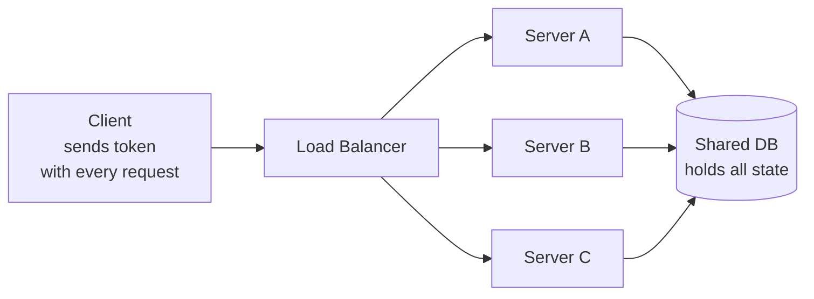
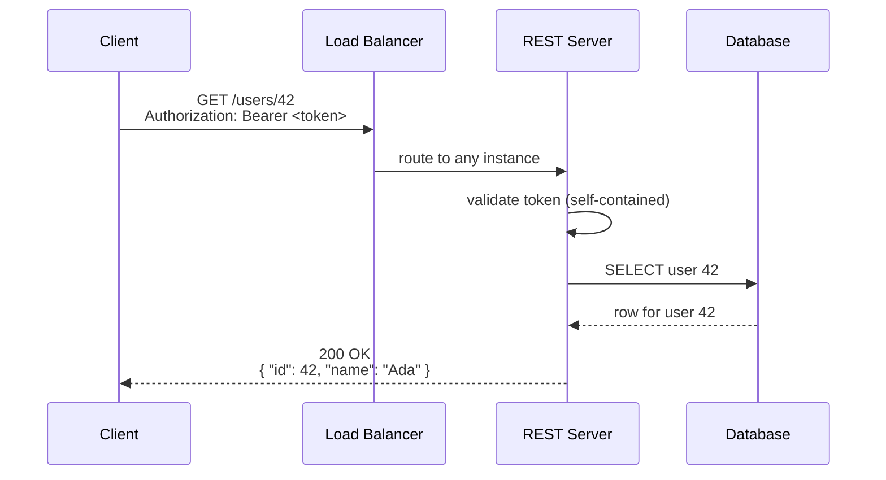

# REST Design at Scale — Junior

<!-- level-focus -->
At junior level, focus on this question:

> How can I apply **REST Design at Scale** in one small example and prove the result?

Use the smallest realistic scenario that exposes the decision and its failure behavior.
## 1. What REST actually is

REST (Representational State Transfer) is a set of constraints for designing networked APIs, described by Roy Fielding. You do not "install" REST; you follow its rules. The three that a junior engineer must internalize:

- **Resources** — everything the API exposes is modeled as a *thing* (a user, an order, a comment), identified by a URL.
- **Uniform interface** — you interact with every resource the same way: a small, fixed set of HTTP methods (GET, POST, PUT, PATCH, DELETE) plus status codes and headers. You do not invent a new verb per feature.
- **Statelessness** — each request carries everything the server needs to process it. The server does not remember anything about *you* between requests.

A REST API is "RESTful" when it leans on HTTP the way HTTP was designed, instead of tunneling a custom protocol through `POST /doEverything`.

The word *representation* matters: the client never touches the resource directly. It exchanges *representations* of it — usually JSON. `GET /orders/42` returns a JSON snapshot of order 42's current state; `PUT /orders/42` sends a new representation to replace it.

---

## 2. Resources and the uniform interface

A **resource** is any concept worth naming and addressing: a user, a product, an invoice, a single line item inside an invoice. Each resource has a stable identifier — its URL.

```
https://api.example.com/users/42
                         └─┬─┘ └┬┘
                        collection  id
```

The "uniform interface" means the *same five methods* act on every resource. You do not need to learn a bespoke API per endpoint — you learn the methods once and apply them everywhere:

| I want to…                        | Method + URL          |
| --------------------------------- | --------------------- |
| List all users                    | `GET /users`          |
| Read one user                     | `GET /users/42`       |
| Create a user                     | `POST /users`         |
| Replace a user entirely           | `PUT /users/42`       |
| Update a few fields of a user     | `PATCH /users/42`     |
| Delete a user                     | `DELETE /users/42`    |

This uniformity is why REST clients, proxies, and caches can be generic: a caching proxy knows `GET` is safe to cache without understanding your business at all.

---

## 3. HTTP methods and their semantics

Each method has an agreed-upon meaning defined in the HTTP specification (RFC 9110). Respect it — infrastructure and other developers assume you did.

- **GET** — retrieve a representation. Must not change server state. Cacheable.
- **POST** — create a new resource under a collection, or trigger a non-idempotent action. The server usually assigns the new ID.
- **PUT** — replace the resource at a known URL with the full representation the client sends. If it does not exist, it may be created.
- **PATCH** — apply a partial update: send only the fields that change.
- **DELETE** — remove the resource.

Concrete example — creating then reading an order:

```
POST /orders            → 201 Created, Location: /orders/1007
GET  /orders/1007       → 200 OK, { "id": 1007, "total": 49.90, ... }
PATCH /orders/1007      → 200 OK   (changed only the shipping address)
DELETE /orders/1007     → 204 No Content
```

Notice the client did not invent verbs like `/createOrder` or `/cancelOrder-v2`. The method *is* the verb; the URL names the *noun*.

---

## 4. Safe and idempotent — the two properties that matter

Two properties, defined in RFC 9110, tell you how a method behaves — and both matter enormously once real traffic and retries enter the picture.

- **Safe** — the method does not modify server state. Clients, crawlers, and prefetchers can call it freely. Only read methods are safe.
- **Idempotent** — making the same request *N* times has the same effect as making it once. This is what makes retries safe: if a network timeout hides whether your request landed, you can resend an idempotent request without fear of double-processing.

| Method   | Safe? | Idempotent? | Typical success status |
| -------- | ----- | ----------- | ---------------------- |
| GET      | Yes   | Yes         | 200 OK                 |
| POST     | No    | No          | 201 Created            |
| PUT      | No    | Yes         | 200 OK / 204 No Content |
| PATCH    | No    | No*         | 200 OK                 |
| DELETE   | No    | Yes         | 204 No Content         |

\* PATCH is not idempotent in general (e.g. "increment balance by 10" differs each call), though many PATCH payloads happen to be idempotent.

Why this matters at scale: `POST /orders` is not idempotent, so a naive retry after a timeout can create *two* orders. That is a real problem you will meet, and the fix (idempotency keys) is covered at the next tier. For now, just internalize which methods are safe to retry.

---

## 5. Resource naming: nouns, plurals, hierarchy

URLs name *things*, not *actions*. Use nouns, prefer plural collection names, and express containment through path hierarchy.

| Bad (verbs, singular, RPC-style) | Good (nouns, plural, resource-style) |
| -------------------------------- | ------------------------------------ |
| `POST /createUser`               | `POST /users`                        |
| `GET /getUser?id=42`             | `GET /users/42`                      |
| `POST /users/42/updateEmail`     | `PATCH /users/42`                    |
| `GET /order/getItemsForOrder/7`  | `GET /orders/7/items`                |
| `DELETE /deleteComment/9`        | `DELETE /comments/9`                 |

Rules of thumb:

- **Nouns, not verbs.** The HTTP method already supplies the verb.
- **Plural collections.** `/users` is the collection; `/users/42` is one member. Staying consistent (always plural) removes guesswork.
- **Hierarchy for containment.** `/orders/7/items` reads as "the items belonging to order 7." Keep nesting shallow — two levels is usually enough.
- **Lowercase, hyphenated, no file extensions.** `/shipping-addresses`, not `/ShippingAddresses` or `/shippingAddresses.json`.

Good naming is not cosmetic. A predictable URL scheme is easier to cache, document, log, secure, and reason about as the API grows.

---

## 6. Status codes: 2xx / 4xx / 5xx

The status code is the first, cheapest signal a client gets. Return the *right* one — clients, load balancers, and monitoring all branch on it.

**2xx — Success**

- `200 OK` — request succeeded; body contains the representation.
- `201 Created` — a new resource was created; include a `Location` header pointing to it.
- `204 No Content` — success with nothing to return (typical for DELETE).

**4xx — Client error (the caller's fault; do not retry unchanged)**

- `400 Bad Request` — malformed syntax or invalid input.
- `401 Unauthorized` — not authenticated (missing/invalid credentials).
- `403 Forbidden` — authenticated but not allowed.
- `404 Not Found` — the resource does not exist.
- `409 Conflict` — the request conflicts with current state (e.g. duplicate).

**5xx — Server error (your fault; the client may retry later)**

- `500 Internal Server Error` — an unhandled failure on the server.
- `503 Service Unavailable` — temporarily overloaded or down.

The 4xx/5xx split is a contract: 4xx means "fix your request," 5xx means "the server broke — this one might work on retry." Getting this boundary right is what lets client retry logic and dashboards behave correctly.

---

## 7. Statelessness and why it lets you scale

**Stateless** means the server keeps *no client session* in its own memory between requests. Every request is self-contained: it carries its own authentication token, its own parameters, everything needed to be understood on its own.

Where does state live, then?
- **Client state** (who you are, what page you're on) travels *with each request* — e.g. in an `Authorization` header.
- **Application state** (the actual data) lives in a shared database, not in any single server's RAM.

Why this is the key to scaling: if the server remembered your session locally, every one of your requests would have to return to *that exact server*. That server becomes a bottleneck and a single point of failure. With stateless servers, any request can go to *any* server instance, because they are interchangeable.



Because no server holds session state, you can add server C during a traffic spike and remove it afterward — no session migration, no sticky routing. Statelessness is what turns "add more servers" into a real scaling strategy instead of wishful thinking.

---

## 8. The request/response flow

Putting it together — a single stateless, resource-oriented REST call from client to server and back:



Every element of REST appears here: a **resource** (`/users/42`), the **uniform interface** (`GET`), a **safe** read, **statelessness** (the token rides along, the server holds nothing), and a correct **status code** (`200 OK`). None of the three server instances behind the load balancer needs to know anything about the client beyond what this one request carries.

---

## Apply it

1. Choose one small, known input for **REST Design at Scale**.
2. Predict the output or observable behavior.
3. Run the smallest example or probe that exercises the concept.
4. Change one input to trigger a failure or boundary case.
5. Explain the evidence using the guide's vocabulary.

## Verify your work

- Record the exact input, command or code path, and output.
- Repeat the probe and confirm the result is consistent.
- Show one expected success and one expected failure.
- Resolve any difference between the prediction and the evidence.

## Review questions

- What problem does REST Design at Scale solve in the example?
- Which input changes the observed result, and why?
- What is the smallest useful success check?
- Which beginner mistake would your evidence catch?
