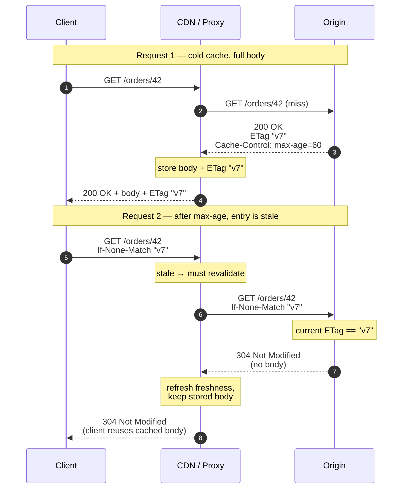

# REST Design at Scale — Middle

<!-- level-focus -->
At middle level, focus on this question:

> Where does **REST Design at Scale** belong in a maintainable component, and which trade-off selects the design?

Use the smallest realistic scenario that exposes the decision and its failure behavior.
## 1. Resource modeling and relationships

A REST API is a graph of *resources* (nouns) addressed by URLs, manipulated by a small fixed set of HTTP methods (verbs). The scaling wins come from modeling resources so that each has a stable identity and each request maps cleanly onto cache, authorization, and storage boundaries.

**Collections and items.** Two shapes recur:

- `GET /orders` — the *collection* (a list resource).
- `GET /orders/{orderId}` — a single *item* resource.

Use plural nouns for collections, opaque stable IDs for items, and never encode a verb in the path (`/orders/{id}/cancel` is tolerable as an action sub-resource, but `/cancelOrder?id=` is not REST).

**Sub-resources model containment, not every relationship.** A sub-resource is justified when the child cannot exist without the parent and you always scope reads by the parent:

```
GET  /orders/{orderId}/items            # line items belong to one order
POST /orders/{orderId}/items            # create a line item under that order
GET  /orders/{orderId}/items/{itemId}   # one line item
```

**Avoid deep nesting.** Every level you nest is a level you must repeat in every URL, every route, and every authorization check. Past two levels, nesting hurts more than it helps. When a child has its own stable identity, promote it to a top-level resource and reference the parent by ID:

```
# Avoid — brittle, deep, hard to cache and link
GET /customers/{cId}/orders/{oId}/items/{iId}/refunds/{rId}

# Prefer — flat, each resource independently addressable
GET /refunds/{rId}
GET /refunds?orderId={oId}          # filter instead of nest
```

Rule of thumb: **one level of nesting to express ownership, filtering for everything else.** A flat resource is independently cacheable, independently linkable (HATEOAS), and independently authorizable.

**Many-to-many relationships** get their own resource when the link itself carries data (e.g. `POST /teams/{id}/members` where membership has a role and joined-at), or are expressed as a filtered collection when it does not (`GET /articles?tag=rest`).

---

## 2. HTTP caching mechanics

HTTP has a built-in, standardized cache layer. Using it correctly offloads read traffic to browsers, CDNs, and reverse proxies before it ever reaches your origin — the cheapest scaling you can buy. Two orthogonal mechanisms:

- **Freshness** — `Cache-Control` tells a cache how long a response may be reused *without* re-contacting the origin.
- **Validation** — `ETag` / `Last-Modified` let a cache *revalidate* a stale copy cheaply, receiving a small `304 Not Modified` instead of the full body.

### Cache-Control directives

| Directive | Applies to | Meaning |
|---|---|---|
| `max-age=N` | request/response | Fresh for N seconds. |
| `s-maxage=N` | response | Freshness for *shared* caches (CDN/proxy); overrides `max-age` there. |
| `public` | response | Any cache may store it, even with auth present. |
| `private` | response | Only the end-user's browser cache may store it — not shared caches. |
| `no-cache` | response | May store, but MUST revalidate before reuse. |
| `no-store` | response | Never store (use for sensitive data). |
| `must-revalidate` | response | Once stale, MUST revalidate; do not serve stale on error. |
| `stale-while-revalidate=N` | response | Serve stale up to N s while revalidating in the background. |

A typical read endpoint for cacheable, user-specific data:

```
Cache-Control: private, max-age=60, stale-while-revalidate=30
ETag: "a1b2c3d4"
```

### Validators: ETag vs Last-Modified

| | `ETag` / `If-None-Match` | `Last-Modified` / `If-Modified-Since` |
|---|---|---|
| Granularity | Any change → new tag (exact) | 1-second resolution |
| Value | Opaque hash/version of the representation | HTTP date |
| Strong vs weak | `"abc"` strong, `W/"abc"` weak (semantically equal, not byte-equal) | Always weak by nature |
| Best for | Content-addressable / frequently-changing data | Cheaply timestamped data |

Prefer **`ETag`** — it is exact and independent of clock resolution. Derive it from a version column, a content hash, or a row's `updated_at` + row version. Send both if you can; the client picks.

### Conditional requests

- **Conditional GET** — client sends `If-None-Match: "<etag>"`. If the current representation still matches, origin returns **`304 Not Modified`** with headers but *no body*. This is the read-scaling workhorse.
- **Conditional write** — client sends `If-Match: "<etag>"` on `PUT`/`PATCH`/`DELETE`. If the resource changed since the client last read it, origin returns **`412 Precondition Failed`**. This gives you optimistic concurrency control and prevents lost updates — the same tag that saves reads also makes writes safe.

---

## 3. Tracing a cached conditional request

The sequence below follows one representation through a CDN across two client requests: a cold fetch that returns `200` plus an `ETag`, then a later validation that returns `304` and transfers no body.



The payoff: request 2 crosses the network twice but transfers only headers — no serialization on the origin, no body on either hop. Under read-heavy load this collapses most of your egress and CPU.

---

## 4. Content negotiation

Content negotiation lets one URL serve multiple representations, chosen by request headers rather than by forking the URL.

- **Media type** — client sends `Accept: application/json`; server responds with `Content-Type: application/json`. If the server cannot satisfy any listed type, respond **`406 Not Acceptable`**.
- **Language** — `Accept-Language: en-US, en;q=0.8` selects a localized representation.
- **Encoding** — `Accept-Encoding: gzip, br` selects compression; respond with `Content-Encoding: br`.

Because the *same URL* can now return different bytes, any response that varies by a request header **must** advertise it so caches key correctly:

```
Vary: Accept, Accept-Encoding
```

Omitting `Vary` is a classic scaling bug: a shared cache serves a gzip body to a client that cannot decompress it, or an English body to a French client. Keep the `Vary` set small — every dimension multiplies cache entries.

Media types are also where you carry **versioning** without touching the URL (`Accept: application/vnd.example.v2+json`); the trade-offs live in [Versioning and Deprecation](../versioning-and-deprecation/junior.md) — do not decide it here.

---

## 5. Partial responses and sparse fieldsets

At scale, over-fetching wastes bandwidth and serialization CPU. Let clients ask for exactly the fields they need.

**Sparse fieldsets** — a `fields` query parameter names the projection:

```
GET /orders/42?fields=id,total,status
```

```json
{ "id": 42, "total": 1999, "status": "shipped" }
```

**Expansion / embedding** — the inverse: pull related resources inline to avoid N+1 round trips, opt-in so the default stays lean:

```
GET /orders/42?expand=customer,items
```

Design notes:

- Keep the default representation small and predictable; make richness opt-in via `fields`/`expand`.
- Field selection and expansion change the response body, so they interact with caching: either include them in the cache key or `Vary` on them, or treat each distinct projection as a distinct cache entry.
- Validate the field list strictly — reject unknown fields with `400` rather than silently ignoring them, so clients cannot mask typos.
- This overlaps with GraphQL's core value proposition; sparse fieldsets are how REST gets most of the benefit without abandoning HTTP caching.

---

## 6. Error response design (RFC 9457)

Errors are part of your API contract. A consistent, machine-readable error body lets every client handle failures uniformly. The standard is **RFC 9457, Problem Details for HTTP APIs** (which obsoletes RFC 7807), served as `application/problem+json`.

```
HTTP/1.1 422 Unprocessable Content
Content-Type: application/problem+json

{
  "type": "https://api.example.com/problems/insufficient-funds",
  "title": "Insufficient funds",
  "status": 422,
  "detail": "Your balance is 30, but the order costs 50.",
  "instance": "/orders/42",
  "balance": 30,
  "cost": 50
}
```

| Field | Required | Purpose |
|---|---|---|
| `type` | Recommended | Stable URI identifying the *kind* of problem; clients branch on this, not on prose. |
| `title` | Recommended | Short, human-readable summary — constant for a given `type`. |
| `status` | Recommended | HTTP status code, duplicated in the body for convenience. |
| `detail` | Optional | Human-readable explanation specific to *this* occurrence. |
| `instance` | Optional | URI identifying the specific occurrence. |
| *extensions* | Optional | Any additional members (`balance`, `cost`, `errors[]`, `traceId`, …). |

Guidelines that make errors scale operationally:

- **Match the status code to the class of failure**: `400` malformed syntax, `401` unauthenticated, `403` authenticated-but-forbidden, `404` no such resource, `409` conflict, `412` precondition failed, `422` well-formed but semantically invalid, `429` rate-limited, `503` overloaded.
- **`type` is your stable, documented identifier.** Clients should branch on `type`, never on `title` or `detail` text.
- **Never leak internals** — no stack traces, SQL, or internal hostnames in `detail`. Attach a `traceId` extension so support can correlate to logs without exposing them.
- **Batch validation errors** into an `errors` array extension (one entry per bad field), so the client fixes everything in one round trip.

The API error-handling discipline generalizes this; the RFC 9457 shape is the concrete on-the-wire contract.

---

## 7. Bulk operations

When clients routinely need to create/update/delete many items, per-item round trips waste connections and latency. Offer a bulk endpoint — but decide its semantics deliberately.

**Batch collection write** — a single request carrying many operations:

```
POST /orders/batch
Content-Type: application/json

{ "operations": [
    { "method": "POST", "body": { "sku": "A", "qty": 2 } },
    { "method": "POST", "body": { "sku": "B", "qty": 1 } }
] }
```

The central decision is **atomicity**:

- **All-or-nothing** — the whole batch commits in one transaction, or none of it does. Return `200`/`201` on success, or a single `4xx` problem+json on failure. Simple for the client, but one bad item fails everyone.
- **Partial success** — each item succeeds or fails independently. This does not fit one HTTP status, so return **`207 Multi-Status`** (or a `200` with a per-item results array) where each entry carries its own status and, on failure, its own problem+json:

```json
{ "results": [
    { "status": 201, "id": 501 },
    { "status": 422, "problem": { "type": ".../out-of-stock", "title": "Out of stock" } }
] }
```

Additional constraints for bulk at scale:

- **Cap the batch size** and reject oversized batches with `413`/`400` — an unbounded batch is a denial-of-service vector.
- **Make bulk writes safe to retry** — a network failure mid-batch must not double-apply. The mechanism (idempotency keys) is covered in [Idempotency and Retries](../idempotency-and-retries/junior.md); just know bulk endpoints need it more than single writes.
- For very large jobs, switch to an **asynchronous job resource**: `POST` returns `202 Accepted` with a `Location` pointing at a status resource the client polls.

---

## 8. HATEOAS, practically

HATEOAS (Hypermedia as the Engine of Application State) means responses include links to the actions available *next*, so clients navigate by following server-provided URLs instead of hard-coding them. Full-strength HATEOAS is rare; a *pragmatic* version pays off at scale.

```json
{
  "id": 42,
  "status": "pending",
  "total": 5000,
  "_links": {
    "self":   { "href": "/orders/42" },
    "items":  { "href": "/orders/42/items" },
    "cancel": { "href": "/orders/42/cancel", "method": "POST" },
    "pay":    { "href": "/orders/42/pay",    "method": "POST" }
  }
}
```

Where it earns its keep:

- **State-dependent actions.** Only include `cancel`/`pay` when the order is actually cancellable/payable. The client's UI reflects available transitions without re-implementing the state machine — the server stays the single source of truth.
- **Decoupling clients from URL structure.** Clients follow `_links.next` for pagination or `_links.self` for revalidation instead of constructing URLs, so you can restructure paths without breaking them.
- **Discoverability.** A root document links to top-level collections, giving a self-describing entry point.

Keep it light: a `_links` object (HAL-style) is enough. Do not force clients to parse hypermedia to do basic operations — treat links as a convenience layer over a resource model that is already sensible on its own.

---

## 9. Checklist

- Plural collections, opaque item IDs, verbs expressed by HTTP methods.
- At most one level of nesting for ownership; use filtering, not nesting, for the rest.
- Send `ETag` on every cacheable representation; support conditional `GET` (`304`) and conditional writes (`If-Match` → `412`).
- Set `Cache-Control` deliberately (`private`/`public`, `max-age`/`s-maxage`); pair with `Vary` on every negotiated dimension.
- Support content negotiation via `Accept`/`Accept-Language`/`Accept-Encoding`; return `406` when unsatisfiable.
- Offer `fields`/`expand` for projection and embedding; validate field names strictly.
- Return errors as `application/problem+json` (RFC 9457) with a stable `type`; batch field errors; never leak internals.
- Provide bulk endpoints with an explicit atomicity contract (`207` for partial success); cap batch size.
- Include `_links` for state-dependent actions and navigation, but keep the resource model usable without them.

---

*Next step:* [REST Design at Scale — Senior](senior.md)

---

## Apply it

1. Find a real component where **REST Design at Scale** affects an interface or dependency.
2. Write two plausible choices and the constraint that favors each one.
3. Make the smallest reversible change at that boundary.
4. Exercise the component alone, then exercise the integrated flow.
5. Keep the decision note with the evidence that selected the option.

## Verify your work

- A focused check proves the local behavior.
- An integrated check proves callers and dependencies still agree.
- Logs, traces, compiler output, or benchmarks expose the boundary.
- Reverting the change restores the previous behavior without unrelated edits.

## Review questions

- Which boundary is most affected by REST Design at Scale?
- What constraint would make you choose the alternative design?
- How would you isolate a local defect from an integration defect?
- What evidence shows that the change remains maintainable?
