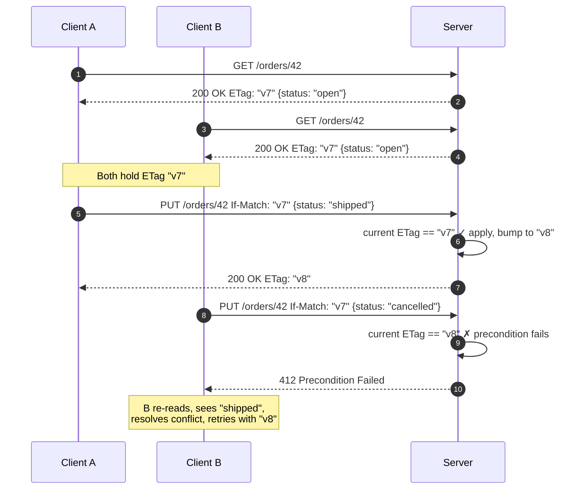

# REST Design at Scale — Professional

<!-- level-focus -->
At professional level, focus on this question:

> How should teams adopt and operate **REST Design at Scale** with measurable outcomes and limited coordination?

Use the smallest realistic scenario that exposes the decision and its failure behavior.
---

## 1. The protocol you are actually designing for

The normative source of truth changed in 2022. RFC 7230–7235 were obsoleted by a cleaner set:

- **RFC 9110 — HTTP Semantics.** Methods, status codes, header field semantics, conditional requests, range requests, content negotiation. Version-independent.
- **RFC 9111 — HTTP Caching.** Freshness, validation, the `Cache-Control` and `Age` machinery.
- **RFC 9112 — HTTP/1.1.** The wire syntax for one specific version.

When this document cites "the spec" it means RFC 9110/9111 unless noted. If a design decision cannot be justified against those documents, it is a local convention, not REST — say so explicitly so future maintainers know it is negotiable.

The mental model that unlocks the rest of this tier: **HTTP semantics are defined on messages between a client, zero or more intermediaries, and a server.** Caches, proxies, and CDNs are first-class participants. Every header you emit is being read by machines you do not control. Designing "at scale" means designing for *that* audience, not just the frontend team.

---

## 2. The HTTP caching model in rigor

A cache stores a response and reuses it for later requests *without contacting the origin*, as long as the stored response is **fresh**. RFC 9111 defines freshness precisely, and getting the arithmetic right is what separates a working cache tier from a source of subtle staleness bugs.

### Freshness lifetime vs current age

A stored response is fresh while:

```
response_is_fresh = (freshness_lifetime > current_age)
```

**Freshness lifetime** is computed in priority order:

1. `s-maxage` (shared caches only), else
2. `max-age`, else
3. an `Expires` header minus the response `Date`, else
4. a **heuristic** (see below).

**Current age** is not just "now minus Date". The spec accounts for time the response already spent in upstream caches and network transit:

```
apparent_age   = max(0, response_time - date_value)
corrected_age  = age_value + response_delay        // Age header + request round-trip
current_age    = max(apparent_age, corrected_age) + resident_time
```

The practical consequence: the `Age` header is load-bearing. A CDN edge node adds the seconds a response sat in a parent cache, so a response with `max-age=60` that arrives already carrying `Age: 55` is fresh for only 5 more seconds. If you debug "why did the CDN serve stale," read `Age` first.

### Directives that actually matter at scale

| Directive | Applies to | Meaning |
|---|---|---|
| `max-age=N` | all caches | Fresh for N seconds. |
| `s-maxage=N` | shared caches only | Overrides `max-age` for CDNs/proxies; lets you cache long at the edge, short in the browser. |
| `public` | shared caches | Explicitly cacheable by shared caches even if normally not (e.g. authenticated responses). |
| `private` | browser only | Must **not** be stored by a shared cache. Use for per-user data. |
| `no-cache` | all caches | May store, but must **revalidate** with origin before reuse. Not "do not cache." |
| `no-store` | all caches | Must not store at all. The only true opt-out. |
| `must-revalidate` | all caches | Once stale, must not be served without successful revalidation (forbids stale-serving fallbacks). |
| `immutable` | all caches | Body will never change during its freshness lifetime; suppresses conditional revalidation on reload. |

The single most common production mistake is confusing `no-cache` (store, but revalidate) with `no-store` (never store). `no-cache` + `ETag` is exactly the "always check, but usually get a cheap 304" pattern you want for frequently-read, occasionally-changed resources.

### Heuristic freshness

If a response is cacheable but carries **no explicit freshness** (`max-age`, `s-maxage`, or `Expires`), a cache **may** compute a heuristic lifetime. The common heuristic (from `Last-Modified`) is:

```
heuristic_lifetime ≈ (Date - Last-Modified) × 0.1     // e.g. 10% of the resource's age
```

This is why a 200 with no `Cache-Control` is *not* uncached — an intermediary may silently cache it for an interval you never chose. At scale this manifests as "we deployed a fix but a fraction of clients still see the old body for hours." **Always emit an explicit freshness directive** (even `no-store` or `max-age=0`) so a heuristic can never fire.

---

## 3. Vary and negotiated caches

A cache keys stored responses by URL *plus* the request headers named in the response's **`Vary`** header. If you serve different bodies to different `Accept-Encoding`, `Accept`, or `Accept-Language` values, you must declare it:

```
Vary: Accept-Encoding, Accept-Language
```

Omitting `Vary` when the representation depends on a request header is a correctness bug: a shared cache may hand a `gzip` body to a client that did not send `Accept-Encoding: gzip`, or a French body to an English client.

Two failure modes at scale:

- **`Vary: *`** — the response is effectively uncacheable by shared caches (every request is a unique key). Sometimes intended, usually accidental.
- **High-cardinality vary keys** — `Vary: User-Agent` explodes the cache into near-unique entries and destroys hit rate. Never vary on a header with unbounded values; normalize at the edge instead (e.g. collapse `Accept-Encoding` to a small set before it reaches the cache key).

Authentication interacts here: a response to a request with an `Authorization` header is, by default, **not** stored by shared caches unless you explicitly opt in with `public` (or `s-maxage`, `must-revalidate`). This default exists to stop one user's private data leaking to another via a shared cache — override it only with full understanding.

---

## 4. Revalidation, stale-while-revalidate, stale-if-error

When a stored response becomes stale, the cache **revalidates**: it sends a **conditional request** to the origin using validators from the stored response.

- `If-None-Match: "<etag>"` — the strong/weak entity tag validator (preferred).
- `If-Modified-Since: <http-date>` — the weaker timestamp validator (1-second granularity; can't detect sub-second edits).

If the representation is unchanged the origin returns **`304 Not Modified`** with no body, and the cache refreshes the stored response's freshness and serves it. This is the cheap path: full validation of correctness, near-zero payload.

### stale-while-revalidate and stale-if-error (RFC 5861)

Two `Cache-Control` extensions turn revalidation from a latency tax into a background task:

```
Cache-Control: max-age=600, stale-while-revalidate=60, stale-if-error=86400
```

- **`stale-while-revalidate=60`** — for 60 seconds after the response goes stale, the cache may serve the **stale** copy *immediately* to the client while revalidating in the background. The user never waits on the origin round-trip; the next user gets the fresh copy. This is the single highest-leverage directive for read-heavy APIs behind a CDN.
- **`stale-if-error=86400`** — if the origin is unreachable or returns 5xx during revalidation, the cache may serve the stale copy for up to 24 hours. This is a cheap, protocol-level resilience layer: the CDN shields users from an origin outage using content it already holds.

Together they let you set aggressive freshness *and* keep tail latency and availability high — the cache absorbs both slow revalidation and origin failure.

---

## 5. Cache invalidation: the hard reality

Phil Karlton's line ("there are only two hard things...") is a design constraint, not a joke. HTTP gives you *almost no* out-of-band invalidation. Understand the three real levers:

1. **Expiry-based (TTL).** The default and most reliable at scale. You do not invalidate; you set freshness short enough that staleness is tolerable, and let it lapse. Combine with `stale-while-revalidate` so short TTLs don't cost latency. This is the only invalidation model that works across caches you don't control (client browsers, corporate proxies).

2. **Validation-based.** `no-cache` + `ETag`: the object is always revalidated, so an origin change is picked up on the next request via a 304→200 transition. Zero staleness, at the cost of a round-trip per read (cheap, since 304s are tiny).

3. **Explicit purge — only on caches you own.** CDNs offer purge/ban APIs (by URL, by surrogate key/tag). These do **not** propagate to downstream browser caches. The standardized building block is **`Cache-Control: no-store`** for never-cache, and **surrogate keys** (a CDN feature, e.g. tagging a response `Surrogate-Key: product-42` and purging that tag when product 42 changes) for targeted origin-side invalidation.

The rule that saves teams: **you cannot recall a response once it leaves your infrastructure.** A body cached in a browser with `max-age=86400` is out of your reach for a day. Design freshness windows around "how wrong can this be for how long," and reserve long TTLs for content you version in the URL (fingerprinted assets, immutable representations) so a *new* URL is the invalidation.

---

## 6. Conditional requests and optimistic concurrency

The same validators that power revalidation also give you **optimistic concurrency control** for writes — the lost-update problem solved without pessimistic locks.

The mechanism (RFC 9110 §13):

- **`If-Match: "<etag>"`** on an unsafe method (`PUT`, `PATCH`, `DELETE`) means: *apply this only if the resource's current entity tag still matches.* If it does not, the resource changed since the client read it, and the server returns **`412 Precondition Failed`** — the write is rejected, no lost update.
- **`If-None-Match: *`** on `PUT`/`POST` means: *create only if it does not already exist* — an atomic "create-if-absent" that returns `412` if the resource exists.

Flow: `GET` returns the resource plus its current `ETag`; the client edits; the client `PUT`s with `If-Match` echoing that ETag. If another writer committed in between, the server's ETag has moved, the precondition fails, and the client re-reads and retries (or surfaces a merge conflict).



Strong vs weak ETags matter here. A **strong** validator (`"v8"`) guarantees byte-for-byte identity and is required for `If-Match` on ranged/conditional writes. A **weak** validator (`W/"v8"`) only guarantees semantic equivalence and is acceptable for cache revalidation but not for concurrency-critical writes where you need exact-representation matching. Generate ETags from a version column or a content hash — never from a wall-clock timestamp, whose 1-second resolution loses concurrent edits.

Require `If-Match` on mutating endpoints of any resource with concurrent writers, and return **`428 Precondition Required`** when a client omits it, so the client is forced to opt into safe concurrency rather than silently racing.

---

## 7. Method semantics: safe, idempotent, cacheable

RFC 9110 §9.2 defines three orthogonal properties. Designing at scale means honoring them, because caches, proxies, and retry logic *assume* them.

| Method | Safe | Idempotent | Cacheable | Notes |
|---|---|---|---|---|
| `GET` | yes | yes | yes | No side effects; freely retried and cached. |
| `HEAD` | yes | yes | yes | Metadata only; useful for cheap validator/`Content-Length` checks. |
| `PUT` | no | **yes** | no | Full replacement; repeating it yields the same final state. |
| `DELETE` | no | **yes** | no | Repeating yields "gone" (2nd call may 404 — still idempotent in effect). |
| `POST` | no | **no** | conditionally | Not idempotent by default; this is why create-endpoints need idempotency keys (own topic). |
| `PATCH` | no | **not guaranteed** | no | Idempotent only if the patch document is (e.g. a JSON Merge Patch of absolute values usually is; a relative "increment" is not). |

- **Safe** methods must have no client-visible side effects on the resource state. A `GET` that mutates is a latent disaster: prefetchers, crawlers, and link-preview bots issue GETs speculatively and will trigger your side effect at random.
- **Idempotent** means N identical requests have the same effect as one. This is what makes network retries safe. A load balancer or client library will retry an idempotent request on a timeout; retrying a non-idempotent `POST` can double-charge. The formal treatment of idempotency keys is a dedicated later topic — here the point is: *the method's declared idempotency governs whether the transport layer is allowed to retry for you.*
- **Cacheable** is a property of the *response*, gated by the method and status code. `POST` responses are cacheable only if they carry explicit freshness and the endpoint is designed for it (rare); treat `POST` as uncacheable unless proven otherwise.

---

## 8. Content negotiation internals

Content negotiation (RFC 9110 §12) lets one URL serve multiple representations. Proactive (server-driven) negotiation is the common case: the client sends preference headers, the server selects.

### q-values

The `Accept`, `Accept-Encoding`, and `Accept-Language` headers carry **quality values** (`q`, 0–1, default 1) expressing relative preference:

```
Accept: application/json;q=1.0, application/xml;q=0.8, */*;q=0.1
Accept-Language: en-US, en;q=0.9, fr;q=0.5
```

The server ranks its available representations against these weights and picks the highest. `q=0` explicitly *rejects* a type. Specificity breaks ties: `application/json` outranks `application/*` outranks `*/*` at equal `q`. If nothing acceptable can be produced, the correct response is **`406 Not Acceptable`** (though many APIs pragmatically fall back to their default type rather than 406 — a defensible choice, but document it).

### Practical constraints at scale

- **Negotiation is a cache key.** Every dimension you negotiate on must appear in `Vary` (§3), and each multiplies cache entries. Prefer *few* negotiable dimensions; a JSON-only API with `Accept-Encoding` as the only real variable caches far better than one juggling XML/JSON × 5 languages.
- **Media-type parameters** carry structured versioning and profiles: `Accept: application/json;profile="https://example.com/schema/v2"`. This is one legitimate versioning vector (own topic), and it lives in the negotiation layer rather than the URL.
- Prefer **explicit, small vocabularies**. Accepting arbitrary media types you don't actually serve invites 406 storms and confusing cache behavior.

---

## 9. Compression and partial content

### Compression

Transfer/content coding is negotiated via `Accept-Encoding` / `Content-Encoding` (RFC 9110 §8.4). For JSON APIs, compression is close to free bandwidth: `gzip` on a typical JSON payload cuts wire size by 60–80%, and `br` (Brotli) usually beats it. Rules that matter:

- Emit `Vary: Accept-Encoding` so a cache never serves a compressed body to a client that can't decode it.
- Beware compression + secrets in one response over TLS (BREACH-class attacks); don't reflect attacker-controlled input alongside secrets in a compressed body.
- Compress at the edge/CDN when possible so the origin isn't re-compressing identical bodies on every request.

### Range requests (206 Partial Content)

RFC 9110 §14 defines byte-range requests, letting a client fetch part of a representation — essential for resumable downloads, video seeking, and large exports.

- Advertise support with `Accept-Ranges: bytes`.
- A client sends `Range: bytes=0-1023`; the server responds **`206 Partial Content`** with `Content-Range: bytes 0-1023/10000`.
- If the range is unsatisfiable (start beyond the resource length), return **`416 Range Not Satisfiable`**.
- **`If-Range: "<etag>"`** guards a resumed download: the server sends the range *only if the resource is unchanged*, otherwise it sends the full `200` — preventing a client from stitching together bytes from two different versions.

For a JSON REST API, ranges rarely apply to resource documents (pagination — a dedicated topic — is the right tool there), but they are indispensable for binary sub-resources: exports, attachments, media.

---

## 10. Problem Details (RFC 9457)

Ad-hoc error bodies (`{"error": "bad"}` in twelve shapes across twelve endpoints) are a scaling liability: every client writes bespoke parsing. **RFC 9457** (which obsoletes RFC 7807) standardizes a machine-readable error format, served as `Content-Type: application/problem+json`:

```http
HTTP/1.1 409 Conflict
Content-Type: application/problem+json

{
  "type": "https://api.example.com/problems/order-already-shipped",
  "title": "Order already shipped",
  "status": 409,
  "detail": "Order 42 was shipped at 2026-06-30T14:03Z and cannot be cancelled.",
  "instance": "/orders/42",
  "shippedAt": "2026-06-30T14:03:22Z"
}
```

The registered members:

- **`type`** — a URI identifying the *problem class* (the stable, machine-matchable key clients branch on). It need not resolve, but a resolvable doc page is good practice. Default `"about:blank"`.
- **`title`** — short, human-readable, stable per `type`.
- **`status`** — the HTTP status, duplicated in the body so it survives logging/proxies.
- **`detail`** — human-readable, *specific to this occurrence*.
- **`instance`** — URI of the specific occurrence.
- **Extension members** — arbitrary domain fields (`shippedAt`, `balance`, `retryAfter`). This is where you put structured data a client can act on.

Design guidance: clients should key error handling off **`type`**, never off `detail` (which is prose and may be localized/changed). Keep a registry of your `type` URIs as part of the API contract. Problem Details composes with everything above — a `412` from optimistic concurrency, a `406` from negotiation, a `416` from a bad range should all carry a problem+json body so clients get a uniform error surface.

---

## 11. The Richardson Maturity Model and HATEOAS mechanics

Leonard Richardson's model grades how much of the web's architecture an API actually uses. It's a diagnostic ladder, not a scorecard to maximize blindly.

| Level | Name | What it uses | Reality |
|---|---|---|---|
| **0** | The Swamp of POX | One URI, one method (usually `POST`), RPC-over-HTTP. | SOAP-style; HTTP is a tunnel. |
| **1** | Resources | Many URIs, still mostly one method. | Nouns exist, verbs don't. |
| **2** | HTTP Verbs | Proper methods + status codes + headers (caching, conditional requests). | Where most "good REST APIs" correctly sit. |
| **3** | Hypermedia Controls | Responses embed links/actions (**HATEOAS**) telling the client what it can do next. | Rare in practice; high cost, situational payoff. |

Almost everything in §2–§10 is the mechanics of **Level 2** — and Level 2, done rigorously, is where the scale wins live (caching, concurrency, negotiation). Be honest that most production "REST at scale" is excellent Level 2.

### True HATEOAS mechanics

Level 3 means the server drives the client through application state via **hypermedia**: the response doesn't just carry data, it carries the *affordances* — the links and actions currently available.

- **Link relations** name the *meaning* of a link, decoupling the client from URL structure. Use IANA-registered relations (`self`, `next`, `prev`, `first`, `last`, `collection`, `edit`) where they exist, and namespaced extension relations (a URI like `https://api.example.com/rels/cancel`) for domain-specific ones. The client follows `rel: "cancel"`, never a hardcoded `/orders/42/cancel` path.
- **State-driven affordances**: an order in state `open` includes a `cancel` link; once `shipped`, that link is *absent*. The client discovers "can I cancel this?" from the presence of the affordance, not from replicating server-side business rules. This is the real payoff — the server owns the state machine, clients don't hardcode it.
- **The cost**: clients must be written to *follow* hypermedia rather than construct URLs, tooling and codegen support is weaker, and payloads grow. It pays off for long-lived, loosely-coupled, evolvable APIs (public platforms with many independent clients); it's often over-engineering for a single first-party frontend you deploy in lockstep.

The honest position: adopt Level 2 fully and non-negotiably; adopt Level 3 selectively, where independent client evolution justifies the cost.

---

## 12. Hypermedia formats: HAL vs JSON:API vs Siren

If you do go hypermedia, don't invent a bespoke link format — every client would need custom code. Three standardized media types dominate:

| Aspect | HAL (`application/hal+json`) | JSON:API (`application/vnd.api+json`) | Siren (`application/vnd.siren+json`) |
|---|---|---|---|
| Philosophy | Minimal: links + embedded resources. | Opinionated, full spec: resources, relationships, includes, pagination, sparse fieldsets. | Entities + links + **actions** (with methods/fields). |
| Links | `_links` object, keyed by rel. | `links` + typed `relationships`. | `links` array with `rel`. |
| Embedded resources | `_embedded`. | Compound docs via `included` + resource linkage. | Sub-`entities`. |
| Actions/affordances | None (links only). | None first-class (implied by relationships). | **First-class `actions`** — name, method, href, fields. |
| Client can drive writes | No — GET-navigation only. | Partially (conventions). | Yes — actions describe *how* to mutate. |
| Spec weight | Very light. | Heavy, prescriptive. | Medium. |
| Best fit | Read-oriented navigable APIs wanting minimal ceremony. | Data-heavy APIs wanting a full off-the-shelf contract (pagination, filtering, includes standardized). | APIs that want the client to discover *actions*, not just links (closest to true Level 3). |

Guidance:

- **HAL** if you want lightweight discoverability with the least commitment; it standardizes links and nothing else, which is often exactly enough.
- **JSON:API** if you want a batteries-included contract — it standardizes pagination, sorting, sparse fieldsets, and compound documents, so your clients and server agree on far more than links. The cost is its rigidity; you adopt its worldview wholesale.
- **Siren** if the point of going hypermedia is *actions* — it's the only one of the three that describes how to perform a state transition (method + fields), which is what genuine HATEOAS needs.

Whatever you choose, pick **one** and register its media type in your `Content-Type`/`Accept` handling so caches and clients negotiate correctly (§3, §8). Mixing formats across endpoints defeats the entire purpose of a uniform hypermedia contract.

---

## 13. Checklist

- Every cacheable response carries an **explicit** freshness directive; no response relies on heuristic freshness by accident.
- `s-maxage` / `private` / `public` are used deliberately to separate edge caching from browser caching, and authenticated responses opt into shared caching only when intended.
- Every negotiated dimension (`Accept*`, encoding) is declared in `Vary`, and no `Vary` key has unbounded cardinality.
- Read-heavy endpoints use `stale-while-revalidate` (latency) and `stale-if-error` (resilience).
- Mutating endpoints require `If-Match`, return `412` on conflict and `428` when the precondition header is missing; ETags come from a version/hash, never a timestamp.
- Method semantics (safe/idempotent/cacheable) are honored so intermediaries and retry logic behave correctly; `GET` never mutates.
- Errors use RFC 9457 `application/problem+json` with a stable `type` registry; clients branch on `type`, not prose.
- The API's Richardson level is a *conscious* decision, documented — full Level 2, with Level 3 adopted only where independent client evolution justifies it and via a single standardized hypermedia format.

---


---

## Apply it

1. Define the user or business outcome that **REST Design at Scale** should improve.
2. Assign one owner for code, contracts, operations, and incidents.
3. Split delivery into reversible increments that produce evidence early.
4. Publish responsibilities, escalation paths, and compatibility windows.
5. Stop or expand only when the agreed measures support that decision.

## Verify your work

- Each increment has an owner, rollback path, and observable exit condition.
- Adoption, reliability, delivery time, and coordination cost are measured.
- Incident and migration exercises prove that responsibility is executable.
- The old path is removed only after telemetry proves it is unused.

## Review questions

- Which measurable outcome justifies investing in REST Design at Scale?
- Which team owns the full lifecycle and incident response?
- What reversible increment produces the earliest useful evidence?
- Which exit condition proves that migration or adoption is complete?
