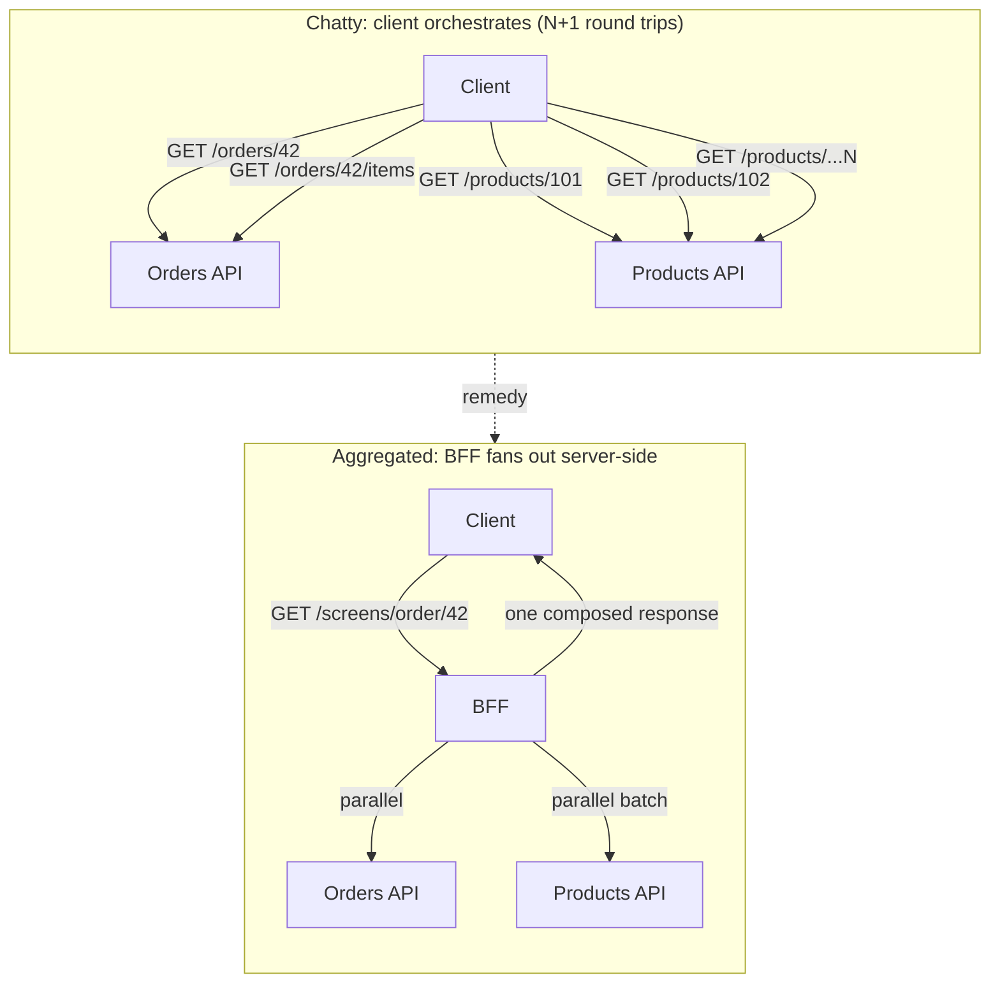
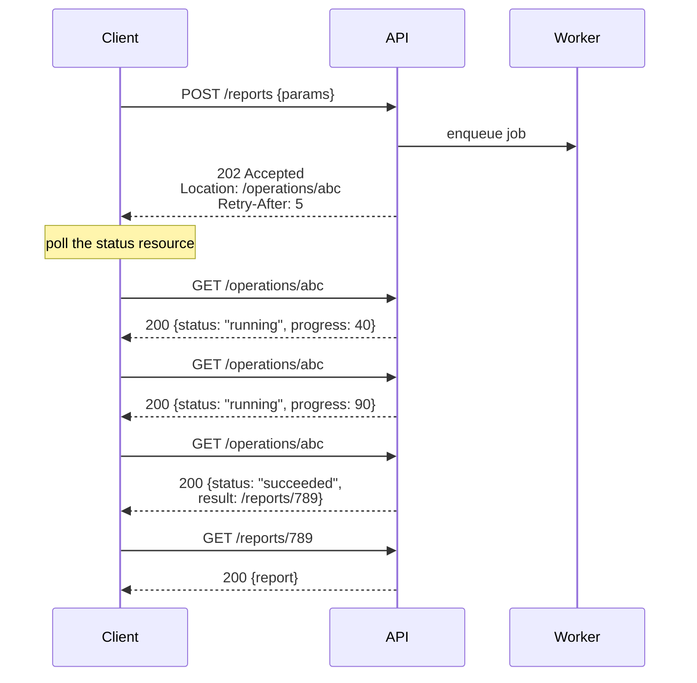

# REST Design at Scale — Senior

<!-- level-focus -->
At senior level, focus on this question:

> Which system invariant is affected by **REST Design at Scale** under failure, load, and change?

Use the smallest realistic scenario that exposes the decision and its failure behavior.
## 1. REST vs RPC vs GraphQL — choosing the style

There is no universally correct API style, only a style that matches your **coupling tolerance, caching needs, and client diversity**. The mistake juniors make is treating the choice as aesthetic; the senior treats it as an architectural commitment that is expensive to reverse.

REST's core strength is that it leans on HTTP's existing machinery. Because a `GET` on a resource URL is a uniform, side-effect-free, cacheable operation, every layer between client and origin — browser cache, CDN, reverse proxy — can participate without understanding your domain. That uniform interface is exactly what RPC gives up (its calls are opaque verbs that intermediaries can't cache or reason about) and what GraphQL complicates (a single `POST /graphql` body is invisible to HTTP caches).

| Dimension | REST | RPC (gRPC/JSON-RPC) | GraphQL |
|---|---|---|---|
| **Interface shape** | Resources + uniform verbs | Custom methods/functions | Single endpoint, client-specified query |
| **Client/server coupling** | Low — resource contract | High — method signatures | Medium — schema, but flexible selection |
| **HTTP caching** | First-class (GET, ETag, CDN) | None (opaque POST) | Poor (POST body); needs persisted queries |
| **Over/under-fetching** | Common; needs BFF/expansion | Tight per-method payloads | Solved — client picks fields |
| **Chattiness for rich UIs** | High without aggregation | High without batch methods | Low — one round trip |
| **Schema/tooling** | OpenAPI (optional, add-on) | IDL-first (Protobuf), strict | Schema-first, strong introspection |
| **Backpressure/streaming** | Weak (SSE bolt-on) | Strong (bidi streaming) | Subscriptions (transport-dependent) |
| **Best fit** | Public/partner APIs, cacheable reads, many unknown clients | Internal service-to-service, low-latency, typed | Aggregating many sources for varied front-ends |

Read this as a decision tool, not a scoreboard:

- **Choose REST** when you have many, diverse, or *unknown* clients (public and partner APIs), when reads dominate and caching is your cheapest scaling lever, and when you want intermediaries to do work for free. REST's evolvability and cache friendliness are worth its chattiness.
- **Choose RPC** for internal, high-throughput, tightly-versioned service-to-service calls where both ends deploy together, latency matters, and a typed IDL prevents drift. You are trading intermediary caching for speed and type safety — a good trade *inside* the mesh.
- **Choose GraphQL** when a single product surface aggregates many back-ends and clients need to shape their own payloads to kill over-fetching. You accept losing HTTP caching and taking on query-cost governance (depth limits, complexity budgets, the N+1-in-resolvers problem) in exchange for front-end velocity.

These are not exclusive. A mature platform often runs **REST at the edge** (cacheable, public, stable) and **gRPC behind it** (fast, internal), and may expose a **GraphQL BFF** for one demanding front-end. The senior skill is drawing those boundaries deliberately, not letting them emerge by accident.

## 2. Chattiness, N+1 over the network, and the BFF remedy

REST's uniform, resource-per-URL model has a failure mode that only shows up at scale: **chattiness**. A screen that shows an order, its line items, and each item's product detail can turn into `GET /orders/42`, then `GET /orders/42/items`, then one `GET /products/{id}` per item. That is the **N+1 problem promoted to the network layer** — and where an in-process N+1 costs microseconds, a network N+1 costs a full round trip each, so a 30-item order becomes 30+ sequential RTTs. On mobile, over high-latency links, this is the difference between a snappy screen and a spinner.

The remedy is to move orchestration off the high-latency client link and onto the fast server-side network. Three levers, in increasing weight:

1. **Field expansion / embedding.** Let the client opt into related data: `GET /orders/42?expand=items,items.product`. One request, one response, cost paid on the server side where fan-out is cheap. This keeps the API RESTful while cutting round trips — but guard it: unbounded `expand` becomes a denial-of-service and an over-fetch machine, so allow-list the expandable paths.
2. **Purpose-built collection endpoints.** For a known access pattern, expose a coarser resource that returns the composed view directly.
3. **Backend-for-Frontend (BFF).** A thin service owned by (or close to) a client team that composes calls to many back-ends and returns exactly what one screen needs. The BFF absorbs the chattiness, batches downstream calls (turning N+1 into a single batched fetch), and shields the client from back-end topology.

The trade-off is coupling and ownership. A BFF that serves *every* client re-creates the god-service you were avoiding; a BFF *per client type* (web, iOS, Android, partner) keeps each one focused but multiplies services to run. The senior default: keep the underlying domain APIs clean, resource-oriented, and reusable; add a BFF only where a specific client's latency or shaping needs justify a dedicated composition layer. Do not let the BFF leak business logic that belongs in the domain services — it is a *composition* tier, not a second home for rules.

## 3. A coherent resource model across many teams

One team can hold a consistent style in its head. Twenty teams cannot — left alone, you get `createdAt` here and `created_time` there, `404` for a missing user in one service and `200 {"user": null}` in another, plural collections in one API and singular in the next. Every inconsistency is a tax the *client* pays, and it compounds. The remedy is an explicit, enforced **API style guide** — the connective tissue that makes many services feel like one platform.

A useful style guide standardizes at minimum:

- **Resource naming and URL structure** — plural nouns for collections, nesting depth limits, canonical identifiers.
- **Casing and shared field conventions** — pick `snake_case` or `camelCase` once; standard names and formats for timestamps (RFC 3339 / ISO 8601), money, IDs, and enums.
- **Standard semantics** — which status codes mean what, how filtering/sorting query params are shaped, and the *shape* of pagination and error responses (details deferred to their own topics, but the *contract shape* is a platform decision, not a per-team one).
- **Common representations** — shared envelopes, link relations, and a house error format so clients write one parser, not twenty.

Governance decides how much variance you tolerate. Two anti-patterns bracket the choice: a **central API-review board** that gates every endpoint (safe, consistent, and a throughput bottleneck that teams route around), versus **total autonomy** (fast, and it produces the inconsistent sprawl above). The scalable middle is **guardrails, not gates**: publish the standard as machine-checkable rules (an OpenAPI linter such as Spectral in CI), let it auto-review the 90% mechanical concerns, and reserve human review for genuinely novel resource models. Standards that live only in a wiki are decoration; standards enforced in the pipeline are architecture.

## 4. Cache strategy trade-offs

Caching is REST's highest-leverage scaling tool, and the design of your *resources* determines how much of it you can actually use. There are two families, and the choice between them is a freshness-versus-load trade-off.

- **TTL / expiration** (`Cache-Control: max-age=...`) — the intermediary serves a stored copy without contacting the origin until it expires. Maximum origin offload, minimum freshness control: for the whole TTL window, clients may see stale data. Right for data that is either genuinely static or where bounded staleness is acceptable (a product catalog, a public config).
- **Validation** (`ETag` + `If-None-Match`, or `Last-Modified` + `If-Modified-Since`) — the client still asks the origin, but the origin answers `304 Not Modified` with an empty body when nothing changed. You pay a round trip and a cheap origin check, but save the payload transfer and get near-real-time freshness. Right for data that changes unpredictably but is often re-requested unchanged.

The two combine: a short `max-age` for cheap local hits plus an `ETag` for cheap revalidation after expiry is a common, strong default. `stale-while-revalidate` lets an intermediary serve slightly stale content instantly while refreshing in the background — trading a sliver of freshness for latency and origin-smoothing.

The deeper senior point is **designing resources to be CDN-cacheable in the first place**:

- **Separate the cacheable from the personalized.** A response that mixes public product data with a per-user "in your cart" flag cannot be shared across users. Split them — a cacheable public resource plus a small personalized one — so the expensive-to-compute, high-traffic part rides the CDN.
- **Keep cache keys clean.** Vary intentionally (`Vary: Accept, Accept-Encoding`), avoid embedding auth tokens or volatile query params in the cache key, and be deliberate about `Authorization` (it makes responses private by default).
- **Design for targeted invalidation.** A resource-per-URL model lets a write to `/products/42` purge exactly that key. Coarse, composite resources force coarse invalidation — you dump large swaths of cache on any change, and hit rate collapses.
- **`GET` must stay side-effect-free and safe**, or intermediaries will cache and replay it in ways you did not intend.

The invalidation trade-off is the classic one: long TTLs maximize hit rate but risk serving stale data; validation and short TTLs keep data fresh but push load back to the origin. Pick per resource based on how much staleness that data can tolerate — there is no single right answer for the whole API.

## 5. Evolvability without breaking clients

At scale you cannot redeploy every client on your schedule — partners, mobile apps in the field, and internal teams all move independently. So the contract must evolve *without a coordinated flag day*. The governing distinction:

| Change | Breaking? | Examples | Client impact |
|---|---|---|---|
| **Additive** | No | New optional field; new endpoint; new optional query param; new enum value *only if clients tolerate unknowns* | None, if clients ignore the unknown |
| **Breaking** | Yes | Remove/rename a field; change a type; make an optional field required; tighten validation; change status-code semantics | Existing clients fail |

Two disciplines make additive evolution safe:

1. **Additive-only change on a given version.** Add fields and endpoints; never remove or repurpose within the same contract. A response can grow new fields forever; the moment you *remove* one or *change its meaning*, you have broken someone.
2. **The tolerant reader (robustness principle).** Clients should ignore fields they don't recognize and not assume a field is the only field. A client that deserializes into a strict schema and rejects unknown properties turns *your* additive change into *its* breakage. Documenting and evangelizing tolerant-reader behavior is part of the API contract, not an implementation detail.

When you genuinely must make a breaking change, that is where versioning and deprecation strategy (its own topic) enter: introduce the new shape alongside the old, publish a deprecation timeline with `Deprecation`/`Sunset` signals, measure who is still on the old path, and only then retire it. The senior instinct is to make breaking changes *rare* by designing for additive evolution up front — nullable-friendly fields, extensible enums, envelopes with room to grow — so most changes never require a new version at all.

## 6. Rich errors and partial failure

A `500` with an empty body is a support ticket. At scale, errors are a first-class part of the contract because clients — retry loops, other services, dashboards — make decisions based on them. Two levels of maturity:

**Rich, structured errors.** Return a machine-readable, consistent error body (the RFC 7807 "problem details" shape is the common house standard) carrying a stable error *code* clients can branch on, a human-readable message for logs, and enough context to act: which field failed validation, whether a retry is safe, and a correlation/trace ID for support. Reserve the HTTP status for its coarse HTTP meaning (`400` vs `404` vs `409` vs `503`) and put the domain-specific detail in the body. Consistency across every service — one error envelope, one code taxonomy — is exactly the style-guide concern from §3.

**Partial failure.** In an aggregated or batch API, one downstream can fail while others succeed. All-or-nothing (`500` the whole thing) is often wrong — it discards good data and hammers healthy dependencies with retries meant for the sick one. Better designs surface partial success:

- **Per-item status in batch responses** — return each sub-result with its own status so the client can act on what succeeded and retry only what failed.
- **Partial responses with a warnings/errors block** — a BFF that composes five services and loses one returns the four it has, plus a structured note that the fifth is unavailable, so the UI degrades gracefully instead of blanking.
- **Explicit degraded signaling** — `503` with `Retry-After` when a dependency is down beats a bare `500`; it tells the client *how* to behave.

The through-line: the API should let the client make a *good decision*. That means being honest about what failed, what a retry will do (which is where idempotency, its own topic, becomes load-bearing), and how long to wait.

## 7. Read/write split and eventual consistency through the API

Scaling reads independently of writes — read replicas, CQRS, cache tiers — means a write and an immediately following read can hit different data, and the read can be **stale**. This is not a bug to hide; it is a property to surface, because a client that assumes strong consistency will show a user their own just-submitted change as *missing* and file a bug.

Design choices that make eventual consistency livable through a REST interface:

- **Return the created/updated representation on write.** A `POST` or `PUT` that echoes back the resulting resource (or a `Location` to it) lets the client render the new state from its own write without a read-back that might hit a lagging replica — the cheapest fix for "I created it but the list doesn't show it."
- **Read-your-writes where it matters.** For flows where staleness is unacceptable, route the immediate follow-up read to the primary, or carry a consistency token (a version/sequence returned on write and passed on read) so the system waits for the replica to catch up. Offer strong consistency as an explicit, opt-in cost rather than a silent default.
- **Expose version/state so clients can reason.** ETags and version fields let a client detect it is looking at an older revision and reconcile, and they power optimistic concurrency (`If-Match`) so two writers don't silently clobber each other.
- **Be explicit in the contract.** Document which endpoints are eventually consistent and roughly how stale they can be. Silent eventual consistency is a trap; *documented* eventual consistency is a design a client can build around.

## 8. Long-running operations

Some work — rendering a report, provisioning infrastructure, a bulk import — takes longer than a request should block. Holding an HTTP connection open for 90 seconds burns server resources, dies to proxy timeouts, and gives the client nothing to poll or resume. The REST idiom is the **asynchronous operation pattern**: accept the work, hand back a resource that represents the *operation*, and let the client poll it.

The moving parts:

- **`202 Accepted`** — "I took the request but haven't finished it." The response carries a `Location` header pointing at the **operation status resource**, and optionally `Retry-After` to steer polling cadence.
- **A first-class operation resource** (`/operations/{id}`) — `GET` returns a `status` (`pending` / `running` / `succeeded` / `failed`), progress if you have it, an error body on failure (§6), and, on success, a link to the *result* resource. Making the operation itself a resource is what keeps this RESTful: it is inspectable, cacheable-with-care, and survives client restarts.
- **The result is a separate resource.** When the operation succeeds, the client follows the link to the finished artifact. Keeping "how the work went" (the operation) separate from "what the work produced" (the result) is cleaner than overloading one resource with both.

Trade-offs to decide: **polling vs. push.** Polling is simple, firewall-friendly, and stateless, but wastes calls and adds latency between completion and discovery; a webhook or SSE notification (their own topics) removes the poll loop at the cost of infrastructure and delivery-reliability concerns. A common hybrid: return `202` for polling *and* let clients register a webhook, so simple clients poll and sophisticated ones get pushed. Also make the operation resource **outlive** the work briefly, so a client that reconnects after the job finished can still read the terminal status — a status resource that 404s the moment the job completes defeats the pattern.

## 9. Senior takeaways

- **Style is a coupling/caching decision, not a taste.** REST for cacheable, diverse, evolvable public surfaces; RPC for fast internal typed calls; GraphQL for client-shaped aggregation. Mix them at deliberate boundaries.
- **The network is where N+1 hurts most.** Kill chattiness with expansion, coarse endpoints, or a per-client BFF — but keep the domain APIs clean and push composition, not business logic, into the aggregation tier.
- **Consistency across teams is enforced, not hoped for.** A machine-checked style guide (naming, casing, errors, envelopes) is what makes many services feel like one platform; use guardrails in CI, not a review-board bottleneck.
- **Design resources to be cacheable.** Split public from personalized, keep cache keys clean, and enable targeted invalidation. TTL trades freshness for offload; validation trades a round trip for freshness — choose per resource.
- **Evolve additively and read tolerantly.** Additive-only changes plus tolerant-reader clients let both sides move independently; make breaking changes rare, and version deliberately when they're unavoidable.
- **Be honest about failure and consistency.** Rich structured errors, partial-success responses, echoed writes, documented eventual consistency, and `202`-based async operations all serve one goal: give the client enough truth to make a good decision.

*Next step:* [REST Design at Scale — Professional](professional.md)

---

## Apply it

1. State the system invariant that **REST Design at Scale** must protect.
2. Mark ownership, state, and failure propagation at each boundary.
3. Compare two designs under load, dependency failure, and future change.
4. Define recovery and compatibility behavior before implementation.
5. Test the riskiest assumption with a focused experiment.

## Verify your work

- The experiment supports the design with evidence, not preference.
- Failure injection shows the blast radius and recovery path.
- Compatibility checks cover old and new callers or data.
- Operational signals reveal invariant violations and recovery progress.

## Review questions

- Which invariant must remain true when REST Design at Scale fails?
- Where should recovery responsibility live, and why?
- Which assumption deserves an experiment before implementation?
- How can the design evolve without changing every consumer at once?
